# 1.手册简介


NVIDIA® TensorRT™ 是一个促进高性能机器学习推理的 SDK。 它旨在与 TensorFlow、PyTorch 和 MXNet 等训练框架以互补的方式工作。 它特别专注于在 NVIDIA 硬件上快速高效地运行已经训练好的网络。
有关如何安装 TensorRT 的说明，请参阅 [NVIDIA TensorRT 安装指南](https://docs.nvidia.com/deeplearning/sdk/tensorrt-install-guide/index.html)。

[NVIDIA TensorRT 快速入门指南](https://docs.nvidia.com/deeplearning/tensorrt/quick-start-guide/index.html)适用于想要试用 TensorRT SDK 的用户； 具体来说，您将学习如何快速构建应用程序以在 TensorRT 引擎上运行推理。

## 1.1. Structure of this Guide

第 1 章提供了有关如何打包和支持 TensorRT 以及它如何融入开发者生态系统的信息。

第 2 章提供了对 TensorRT 功能的广泛概述。

第 3 章和第 4 章分别介绍了 C++ 和 Python API。

后续章节提供有关高级功能的更多详细信息。

附录包含网络层参考和常见问题解答。

## 1.2. Samples

[NVIDIA TensorRT 示例支持指南](https://docs.nvidia.com/deeplearning/tensorrt/sample-support-guide/index.html)说明了本手册中讨论的许多主题。可在此处找到其他侧重于嵌入式应用程序的示例。

## 1.3. Complementary GPU Features

[多实例 GPU](https://docs.nvidia.com/datacenter/tesla/mig-user-guide/index.html)或 MIG 是具有 NVIDIA Ampere 架构或更高架构的 NVIDIA GPU 的一项功能，可实现用户控制的将单个 GPU 划分为多个较小 GPU 的功能。物理分区提供具有 QoS 的专用计算和内存切片，并在 GPU 的一部分上独立执行并行工作负载。对于 GPU 利用率低的 TensorRT 应用程序，MIG 可以在对延迟影响很小或没有影响的情况下产生更高的吞吐量。最佳分区方案是特定于应用程序的。

## 1.4. Complementary Software

[NVIDIA Triton™](https://docs.nvidia.com/deeplearning/triton-inference-server/user-guide/index.html)推理服务器是一个更高级别的库，可提供跨 CPU 和 GPU 的优化推理。它提供了启动和管理多个模型的功能，以及用于服务推理的 REST 和 gRPC 端点。

[NVIDIA DALI ®](https://docs.nvidia.com/deeplearning/dali/user-guide/docs/#nvidia-dali-documentation)为预处理图像、音频和视频数据提供高性能原语。 TensorRT 推理可以作为自定义算子集成到 DALI 管道中。可以在[此处](https://github.com/NVIDIA/DL4AGX)找到作为 DALI 的一部分集成的 TensorRT 推理的工作示例。

[TensorFlow-TensorRT (TF-TRT)](https://docs.nvidia.com/deeplearning/frameworks/tf-trt-user-guide/index.html)是将 TensorRT 直接集成到 TensorFlow 中。它选择 TensorFlow 图的子图由 TensorRT 加速，同时让图的其余部分由 TensorFlow 本地执行。结果仍然是您可以照常执行的 TensorFlow 图。有关 TF-TRT 示例，请参阅[TensorFlow 中的 TensorRT 示例](https://github.com/tensorflow/tensorrt)。

[PyTorch 量化工具包](https://docs.nvidia.com/deeplearning/tensorrt/pytorch-quantization-toolkit/docs/userguide.html)提供了以降低精度训练模型的工具，然后可以将其导出以在 TensorRT 中进行优化。

此外， [PyTorch Automatic SParsity (ASP)](https://github.com/NVIDIA/apex/tree/master/apex/contrib/sparsity)工具提供了用于训练具有结构化稀疏性的模型的工具，然后可以将其导出并允许 TensorRT 在 NVIDIA Ampere GPU 上利用更快的稀疏策略。

TensorRT 与 NVIDIA 的分析工具、 [NVIDIA Nsight™ Systems](https://developer.nvidia.com/nsight-systems)和[NVIDIA® Deep Learning Profiler (DLProf)](https://docs.nvidia.com/deeplearning/frameworks/dlprof-user-guide/)集成。

TensorRT 的一个受限子集经过认证可用于[NVIDIA DRIVE ®](https://developer.nvidia.com/drive)产品。某些 API 被标记为仅在 NVIDIA DRIVE 中使用，不支持一般用途。

## 1.5. ONNX

TensorRT 从框架中导入训练模型的主要方式是通过[ONNX](https://onnx.ai/)交换格式。 TensorRT 附带一个 ONNX 解析器库来帮助导入模型。在可能的情况下，解析器向后兼容 opset 7； ONNX模型[ Opset 版本转换器](https://github.com/onnx/onnx/blob/master/docs/VersionConverter.md)可以帮助解决不兼容问题。

[GitHub 版本](https://github.com/onnx/onnx-tensorrt/)可能支持比 TensorRT 附带的版本更高的 opset，请参阅 ONNX-TensorRT[运算符支持矩阵](https://github.com/onnx/onnx-tensorrt/blob/master/docs/operators.md)以获取有关受支持的 opset 和运算符的最新信息。

TensorRT 的 ONNX 算子支持列表可在[此处](https://github.com/onnx/onnx-tensorrt/blob/master/docs/operators.md)找到。

PyTorch 原生支持[ONNX 导出](https://pytorch.org/docs/stable/onnx.html)。对于 TensorFlow，推荐的方法是[tf2onnx](https://github.com/onnx/tensorflow-onnx) 。

将模型导出到 ONNX 后的第一步是使用[Polygraphy](https://docs.nvidia.com/deeplearning/tensorrt/developer-guide/index.html#polygraphy-ovr)运行常量折叠。这通常可以解决 ONNX 解析器中的 TensorRT 转换问题，并且通常可以简化工作流程。有关详细信息，请参阅[此示例](https://github.com/NVIDIA/TensorRT/tree/main/tools/Polygraphy/examples/cli/surgeon/02_folding_constants)。在某些情况下，可能需要进一步修改 ONNX 模型，例如，用插件替换子图或根据其他操作重新实现不受支持的操作。为了简化此过程，您可以使用[ONNX-GraphSurgeon](https://github.com/NVIDIA/TensorRT/tree/main/tools/onnx-graphsurgeon) 。

## 1.6. Code Analysis Tools

有关在 TensorRT 中使用 valgrind 和 clang sanitizer 工具的指导，请参阅[故障排除](https://docs.nvidia.com/deeplearning/tensorrt/developer-guide/index.html#troubleshooting)章节。

## 1.7. API Versioning

TensorRT 版本号 (MAJOR.MINOR.PATCH) 遵循Semantic Versioning 2.0.0的公共 API 和库 ABI。版本号变化如下：

1. 进行不兼容的 API 或 ABI 更改时的主要版本
2. 以向后兼容的方式添加功能时的次要版本
3. 进行向后兼容的错误修复时的 PATCH 版本

请注意，语义版本控制不会扩展到序列化对象。要重用计划文件和时序缓存，版本号必须在主要、次要、补丁和构建版本之间匹配。校准缓存通常可以在主要版本中重复使用，但不保证兼容性。

## 1.8. Deprecation Policy

弃用用于通知开发人员不再推荐使用某些 API 和工具。从 8.0 版本开始，TensorRT 具有以下弃用政策：

* 弃用通知在发行说明中传达。已弃用的 API 元素在可能的情况下使用 `TRT_DEPRECATED`宏进行标记。
* TensorRT 在弃用后提供 12 个月的迁移期。
* API 和工具在迁移期间继续工作。
* 迁移期结束后，API 和工具会以符合语义版本控制的方式移除。

对于在 TensorRT 7.x 中明确弃用的任何 API 和工具，12 个月的迁移期从 TensorRT 8.0 GA 发布日期开始。

## 1.9. Support

可以在 [https://developer.nvidia.com/tensorrt](https://developer.nvidia.com/tensorrt)在线找到有关 TensorRT 的支持、资源和信息。这包括博客、示例等。
此外，您可以在[https://devtalk.nvidia.com/default/board/304/tensorrt/](https://devtalk.nvidia.com/default/board/304/tensorrt/) 访问 NVIDIA DevTalk TensorRT 论坛，了解与 TensorRT 相关的所有内容。该论坛提供了寻找答案、建立联系以及参与与客户、开发人员和 TensorRT 工程师讨论的可能性。

## 1.10. How Do I Report A Bug?

我们感谢所有类型的反馈。如果您遇到任何问题，请按照以下步骤进行报告。

1. 注册NVIDIA 开发者网站。
2. 登录开发者网站。
3. 点击右上角你的名字。
4. 单击我的帐户>我的错误并选择提交新错误。
5. 填写错误报告页面。具有描述性，如果可能，请提供您正在遵循的步骤以帮助重现问题。
6. 单击提交错误。

# 2.TensorRT的功能

本章概述了您可以使用 TensorRT 做什么。它旨在对所有 TensorRT 用户有用。

## 2.1. C++ and Python APIs

TensorRT 的 API 具有 C++ 和 Python 的语言绑定，具有几乎相同的功能。 Python API 促进了与 Python 数据处理工具包和库（如 NumPy 和 SciPy）的互操作性。 C++ API 可以更高效，并且可以更好地满足某些合规性要求，例如在汽车应用中。
**注意： Python API 并非适用于所有平台。有关详细信息，请参阅[NVIDIA TensorRT 支持矩阵](https://docs.nvidia.com/deeplearning/sdk/tensorrt-support-matrix/index.html)。**

## 2.2. The Programming Model

TensorRT 构建阶段的最高级别接口是Builder （ C++ 、 Python ）。构建器负责优化模型并生成Engine 。

为了构建引擎，您需要：

* 创建网络定义
* 为builder指定配置
* 调用builder创建引擎

`NetworkDefinition`接口（ [C++](https://docs.nvidia.com/deeplearning/tensorrt/api/c_api/classnvinfer1_1_1_i_network_definition.html) 、 [Python](https://docs.nvidia.com/deeplearning/tensorrt/api/python_api/infer/Graph/Network.html#inetworkdefinition) ）用于定义模型。将模型传输到 TensorRT 的最常见途径是以 ONNX 格式从框架中导出模型，并使用 TensorRT 的 ONNX 解析器来填充网络定义。但是，您也可以使用 TensorRT 的Layer ( [C++](https://docs.nvidia.com/deeplearning/tensorrt/api/c_api/classnvinfer1_1_1_i_layer.html) , [Python](https://docs.nvidia.com/deeplearning/tensorrt/api/python_api/infer/Graph/LayerBase.html#ilayer) ) 和Tensor ( [C++](https://docs.nvidia.com/deeplearning/tensorrt/api/c_api/classnvinfer1_1_1_i_tensor.html) , [Python](https://docs.nvidia.com/deeplearning/tensorrt/api/python_api/infer/Graph/LayerBase.html#itensor) ) 接口逐步构建定义。

无论您选择哪种方式，您还必须定义哪些张量是网络的输入和输出。未标记为输出的张量被认为是可以由构建器优化掉的瞬态值。输入和输出张量必须命名，以便在运行时，TensorRT 知道如何将输入和输出缓冲区绑定到模型。

`BuilderConfig`接口（ [C++](https://docs.nvidia.com/deeplearning/tensorrt/api/c_api/classnvinfer1_1_1_i_builder_config.html) 、 [Python](https://docs.nvidia.com/deeplearning/tensorrt/api/python_api/infer/Core/BuilderConfig.html) ）用于指定TensorRT如何优化模型。在可用的配置选项中，您可以控制 TensorRT 降低计算精度的能力，控制内存和运行时执行速度之间的权衡，以及限制对 CUDA ®内核的选择。由于构建器可能需要几分钟或更长时间才能运行，因此您还可以控制构建器搜索内核的方式，以及缓存搜索结果以供后续运行使用。

一旦有了网络定义和构建器配置，就可以调用构建器来创建引擎。构建器消除了无效计算、折叠常量、重新排序和组合操作以在 GPU 上更高效地运行。它可以选择性地降低浮点计算的精度，方法是简单地在 16 位浮点中运行它们，或者通过量化浮点值以便可以使用 8 位整数执行计算。它还使用不同的数据格式对每一层的多次实现进行计时，然后计算执行模型的最佳时间表，从而最大限度地降低内核执行和格式转换的综合成本。

构建器以称为计划的序列化形式创建引擎，该计划可以立即反序列化，或保存到磁盘以供以后使用。

**注意：**

* TensorRT 创建的引擎特定于创建它们的 TensorRT 版本和创建它们的 GPU。
* TensorRT 的网络定义不会深度复制参数数组（例如卷积的权重）。因此，在构建阶段完成之前，您不得释放这些阵列的内存。使用 ONNX 解析器导入网络时，解析器拥有权重，因此在构建阶段完成之前不得将其销毁。
* 构建器时间算法以确定最快的。与其他 GPU 工作并行运行构建器可能会扰乱时序，导致优化不佳。

### 2.2.2. The Runtime Phase

TensorRT 执行阶段的最高级别接口是 `Runtime`（ [C++](https://docs.nvidia.com/deeplearning/tensorrt/api/c_api/classnvinfer1_1_1_i_runtime.html) 、 [Python](https://docs.nvidia.com/deeplearning/tensorrt/api/python_api/infer/Core/Runtime.html) ）。
使用运行时时，您通常会执行以下步骤：

* 反序列化创建引擎的计划(plan 文件)
* 从引擎创建执行上下文(context)
  然后，反复：
* 填充输入缓冲区以进行推理
* 调用enqueue()或execute()以运行推理

`Engine`接口（ [C++](https://docs.nvidia.com/deeplearning/tensorrt/api/c_api/classnvinfer1_1_1_i_cuda_engine.html) 、 [Python](https://docs.nvidia.com/deeplearning/tensorrt/api/python_api/infer/Core/Engine.html) ）代表一个优化模型。您可以查询引擎以获取有关网络输入和输出张量的信息——预期的维度、数据类型、数据格式等。

`ExecutionContext`接口（ [C++](https://docs.nvidia.com/deeplearning/tensorrt/api/c_api/classnvinfer1_1_1_i_cuda_engine.html) 、 [Python](https://docs.nvidia.com/deeplearning/tensorrt/api/python_api/infer/Core/Engine.html) ）是调用推理的主要接口。执行上下文包含与特定调用关联的所有状态 - 因此您可以拥有与单个引擎关联的多个上下文，并并行运行它们。

调用推理时，您必须在适当的位置设置输入和输出缓冲区。根据数据的性质，这可能在 CPU 或 GPU 内存中。如果根据您的模型不明显，您可以查询引擎以确定在哪个内存空间中提供缓冲区。

设置缓冲区后，可以同步（执行）或异步（入队）调用推理。在后一种情况下，所需的内核在 CUDA 流上排队，并尽快将控制权返回给应用程序。一些网络需要在 CPU 和 GPU 之间进行多次控制传输，因此控制可能不会立即返回。要等待异步执行完成，请使用 `cudaStreamSynchronize`在流上同步。

## 2.3. Plugins

TensorRT 有一个 `Plugin`接口，允许应用程序提供 TensorRT 本身不支持的操作的实现。在转换网络时，ONNX 解析器可以找到使用 TensorRT 的 `PluginRegistry`创建和注册的插件。

TensorRT 附带一个插件库，其中许多插件和一些附加插件的源代码可以在此处找到。

请参阅[使用自定义层扩展 TensorRT](https://docs.nvidia.com/deeplearning/tensorrt/developer-guide/index.html#extending)一章。

## 2.4. Types and Precision

TensorRT 支持使用 `FP32`、`FP16`、`INT8`、`Bool` 和 `INT32` 数据类型的计算。
当 TensorRT 选择 CUDA 内核在网络中实现浮点运算时，它默认为 `FP32` 实现。有两种方法可以配置不同的精度级别：

* 为了在模型级别控制精度， BuilderFlag选项（ [C++](https://docs.nvidia.com/deeplearning/tensorrt/api/c_api/namespacenvinfer1.html#abdc74c40fe7a0c3d05d2caeccfbc29c1) 、 [Python](https://docs.nvidia.com/deeplearning/tensorrt/api/python_api/infer/Core/BuilderConfig.html#tensorrt.BuilderFlag) ）可以向 TensorRT 指示它在搜索最快时可能会选择较低精度的实现（并且因为较低的精度通常更快，如果允许的话，它通常会）。
  因此，您可以轻松地指示 TensorRT 为您的整个模型使用 FP16 计算。对于输入动态范围约为 1 的正则化模型，这通常会产生显着的加速，而准确度的变化可以忽略不计。
* 对于更细粒度的控制，由于网络的一部分对数值敏感或需要高动态范围，因此层必须以更高的精度运行，可以为该层指定算术精度。

请参阅[降低精度](https://docs.nvidia.com/deeplearning/tensorrt/developer-guide/index.html#reduced-precision)部分。

## 2.5. Quantization

TensorRT 支持量化浮点，其中浮点值被线性压缩并四舍五入为 8 位整数。这显着提高了算术吞吐量，同时降低了存储要求和内存带宽。在量化浮点张量时，TensorRT 需要知道它的动态范围——即表示什么范围的值很重要——量化时会钳制超出该范围的值。

动态范围信息可由构建器根据代表性输入数据计算（这称为校准--`calibration`）。或者，您可以在框架中执行量化感知训练，并将模型与必要的动态范围信息一起导入到 TensorRT。

请参阅[使用 INT8](https://docs.nvidia.com/deeplearning/tensorrt/developer-guide/index.html#working-with-int8)章节。

## 2.6. Tensors and Data Formats

在定义网络时，TensorRT 假设张量由多维 C 样式数组表示。每一层对其输入都有特定的解释：例如，2D 卷积将假定其输入的最后三个维度是 CHW 格式 - 没有选项可以使用，例如 WHC 格式。有关每个层如何解释其输入，请参阅[TensorRT 网络层](https://docs.nvidia.com/deeplearning/tensorrt/developer-guide/index.html#layers)一章。

请注意，张量最多只能包含 2^31-1 个元素。
在优化网络的同时，TensorRT 在内部执行转换（包括到 HWC，但也包括更复杂的格式）以使用尽可能快的 CUDA 内核。通常，选择格式是为了优化性能，而应用程序无法控制这些选择。然而，底层数据格式暴露在 I/O 边界（网络输入和输出，以及将数据传入和传出插件），以允许应用程序最大限度地减少不必要的格式转换。

请参阅[I/O 格式](https://docs.nvidia.com/deeplearning/tensorrt/developer-guide/index.html#reformat-free-network-tensors)部分

## 2.7. Dynamic Shapes

默认情况下，TensorRT 根据定义时的输入形状（批量大小、图像大小等）优化模型。但是，可以将构建器配置为允许在运行时调整输入维度。为了启用此功能，您可以在构建器配置中指定一个或多个 `OptimizationProfile` （ [C++](https://docs.nvidia.com/deeplearning/tensorrt/api/c_api/classnvinfer1_1_1_i_optimization_profile.html) 、 [Python](https://docs.nvidia.com/deeplearning/tensorrt/api/python_api/infer/Core/OptimizationProfile.html?highlight=optimizationprofile) ）实例，其中包含每个输入的最小和最大形状，以及该范围内的优化点。

TensorRT 为每个配置文件创建一个优化的引擎，选择适用于 [最小、最大] 范围内的所有形状的 CUDA 内核，并且对于优化点来说是最快的——通常每个配置文件都有不同的内核。然后，您可以在运行时在配置文件中进行选择。

请参阅[使用动态形状](https://docs.nvidia.com/deeplearning/tensorrt/developer-guide/index.html#work_dynamic_shapes)一章。

## 2.8. DLA

TensorRT 支持 NVIDIA 的深度学习加速器 (DLA)，这是许多 NVIDIA SoC 上的专用推理处理器，支持 TensorRT 层的子集。 TensorRT 允许您在 DLA 上执行部分网络，而在 GPU 上执行其余部分；对于可以在任一设备上执行的层，您可以在构建器配置中逐层选择目标设备。

请参阅使用 [DLA](https://docs.nvidia.com/deeplearning/tensorrt/developer-guide/index.html#refitting-engine-c)章节。

## 2.9. Updating Weights

在构建引擎时，您可以指定它可能需要稍后更新其权重。如果您经常在不更改结构的情况下更新模型的权重，例如在强化学习中或在保留相同结构的同时重新训练模型时，这将很有用。权重更新是通过 `Refitter` ( [C++ ](https://docs.nvidia.com/deeplearning/tensorrt/api/c_api/classnvinfer1_1_1_i_refitter.html), [Python](https://docs.nvidia.com/deeplearning/tensorrt/api/python_api/infer/Core/Refitter.html) ) 接口执行的。

请参阅[Refitting An Engine](https://docs.nvidia.com/deeplearning/tensorrt/developer-guide/index.html#refitting-engine-c) 部分。

## 2.10. trtexec

示例目录中包含一个名为 `trtexec`的命令行包装工具。 `trtexec`是一种无需开发自己的应用程序即可快速使用 TensorRT 的工具。 trtexec工具有三个主要用途：

* 在随机或用户提供的输入数据上对网络进行基准测试。
* 从模型生成序列化引擎。
* 从构建器生成序列化时序缓存。

请参阅[trtexec](https://docs.nvidia.com/deeplearning/tensorrt/developer-guide/index.html#trtexec)部分。

2.11. Polygraphy

Polygraphy 是一个工具包，旨在帮助在 TensorRT 和其他框架中运行和调试深度学习模型。它包括一个Python API和一个使用此 API 构建的命令行界面 (CLI) 。

除此之外，使用 Polygraphy，您可以：

* 在多个后端之间运行推理，例如 TensorRT 和 ONNX-Runtime，并比较结果（例如[API](https://github.com/NVIDIA/TensorRT/blob/main/tools/Polygraphy/examples/api/01_comparing_frameworks) 、 [CLI](https://github.com/NVIDIA/TensorRT/blob/main/tools/Polygraphy/examples/cli/run/01_comparing_frameworks) ）
* 将模型转换为各种格式，例如具有训练后量化的 TensorRT 引擎（例如[API](https://github.com/NVIDIA/TensorRT/blob/main/tools/Polygraphy/examples/api/04_int8_calibration_in_tensorrt) 、 [CLI](https://github.com/NVIDIA/TensorRT/blob/main/tools/Polygraphy/examples/cli/convert/01_int8_calibration_in_tensorrt) ）
* 查看有关各种类型模型的信息（例如[CLI](https://github.com/NVIDIA/TensorRT/blob/main/tools/Polygraphy/examples/cli/inspect) ）
* 在命令行上修改 ONNX 模型：
  * 提取子图（例如[CLI](https://github.com/NVIDIA/TensorRT/blob/main/tools/Polygraphy/examples/cli/surgeon/01_isolating_subgraphs) ）
  * 简化和清理（例如[CLI](https://github.com/NVIDIA/TensorRT/blob/main/tools/Polygraphy/examples/cli/surgeon/02_folding_constants) ）
* 隔离 TensorRT 中的错误策略（例如[CLI](https://github.com/NVIDIA/TensorRT/blob/main/tools/Polygraphy/examples/cli/debug/01_debugging_flaky_trt_tactics) ）

有关更多详细信息，请参阅[Polygraphy](https://github.com/NVIDIA/TensorRT/tree/main/tools/Polygraphy) 存储库。

# 3.TensorRT的C++接口解析

本章说明 C++ API 的基本用法，假设您从 ONNX 模型开始。 [sampleOnnxMNIST](https://github.com/NVIDIA/TensorRT/tree/main/samples/sampleOnnxMNIST)更详细地说明了这个用例。

C++ API 可以通过头文件 `NvInfer.h`访问，并且位于 `nvinfer1`命名空间中。例如，一个简单的应用程序可能以：

```C++
#include “NvInfer.h”

using namespace nvinfer1;
```

TensorRT C++ API 中的接口类以前缀 `I`开头，例如 `ILogger` 、 `IBuilder`等。

CUDA 上下文会在 TensorRT 第一次调用 CUDA 时自动创建，如果在该点之前不存在。通常最好在第一次调用 TensoRT 之前自己创建和配置 CUDA 上下文。
为了说明对象的生命周期，本章中的代码不使用智能指针；但是，建议将它们与 TensorRT 接口一起使用。

## 3.1. The Build Phase

要创建构建器，首先需要实例化ILogger接口。此示例捕获所有警告消息，但忽略信息性消息：

```C++
class Logger : public ILogger       
{
    void log(Severity severity, const char* msg) noexcept override
    {
        // suppress info-level messages
        if (severity <= Severity::kWARNING)
            std::cout << msg << std::endl;
    }
} logger;
```

然后，您可以创建构建器的实例：

```C++
IBuilder* builder = createInferBuilder(logger);
```

### 3.1.1. Creating a Network Definition

创建构建器后，优化模型的第一步是创建网络定义：

```C++
uint32_t flag = 1U <<static_cast<uint32_t>
    (NetworkDefinitionCreationFlag::kEXPLICIT_BATCH); 

INetworkDefinition* network = builder->createNetworkV2(flag);
```

为了使用 ONNX 解析器导入模型，需要 `kEXPLICIT_BATCH`标志。有关详细信息，请参阅[显式与隐式批处理](https://docs.nvidia.com/deeplearning/tensorrt/developer-guide/index.html#explicit-implicit-batch)部分。

### 3.1.2. Importing a Model using the ONNX Parser

现在，需要从 ONNX 表示中填充网络定义。 ONNX 解析器 API 位于文件NvOnnxParser.h中，解析器位于 `nvonnxparser` C++ 命名空间中。

```C++
#include “NvOnnxParser.h”

using namespace nvonnxparser;
```

您可以创建一个 ONNX 解析器来填充网络，如下所示：

```C++
IParser*  parser = createParser(*network, logger);
```

然后，读取模型文件并处理任何错误。

```C++
parser->parseFromFile(modelFile, 
    static_cast<int32_t>(ILogger::Severity::kWARNING));
for (int32_t i = 0; i < parser.getNbErrors(); ++i)
{
std::cout << parser->getError(i)->desc() << std::endl;
}
```

TensorRT 网络定义的一个重要方面是它包含指向模型权重的指针，这些指针由构建器复制到优化的引擎中。由于网络是通过解析器创建的，解析器拥有权重占用的内存，因此在构建器运行之前不应删除解析器对象。

### 3.1.3. Building an Engine

下一步是创建一个构建配置，指定 TensorRT 应该如何优化模型。

```C++
IBuilderConfig* config = builder->createBuilderConfig();
```

这个接口有很多属性，你可以设置这些属性来控制 TensorRT 如何优化网络。一个重要的属性是最大工作空间大小。层实现通常需要一个临时工作空间，并且此参数限制了网络中任何层可以使用的最大大小。如果提供的工作空间不足，TensorRT 可能无法找到层的实现。默认情况下，工作区设置为给定设备的总全局内存大小；必要时限制它，例如，在单个设备上构建多个引擎时。

```C++
config->setMemoryPoolLimit(MemoryPoolType::kWORKSPACE, 1U << 20);

```

一旦指定了配置，就可以构建引擎。

```C++
IHostMemory*  serializedModel = builder->buildSerializedNetwork(*network, *config);

```

由于序列化引擎包含权重的必要拷贝，因此不再需要解析器、网络定义、构建器配置和构建器，可以安全地删除：

```C++
delete parser;
delete network;
delete config;
delete builder;
```

然后可以将引擎保存到磁盘，并且可以删除它被序列化到的缓冲区。

```C++
delete serializedModel
```

**注意：序列化引擎不能跨平台或 TensorRT 版本移植。引擎特定于它们构建的确切 GPU 模型（除了平台和 TensorRT 版本）。**

## 3.2. Deserializing a Plan

假设您之前已经序列化了一个优化模型并希望执行推理，您将需要创建一个运行时接口的实例。与构建器一样，运行时需要一个记录器实例：

```C++
IRuntime* runtime = createInferRuntime(logger);
```

假设您已将模型从缓冲区中读取，然后可以对其进行反序列化以获得引擎：

```C++
ICudaEngine* engine = 
  runtime->deserializeCudaEngine(modelData, modelSize);
```

## 3.3. Performing Inference

引擎拥有优化的模型，但要执行推理，我们需要管理中间激活的额外状态。这是通过 `ExecutionContext`接口完成的：

```C++
IExecutionContext *context = engine->createExecutionContext();
```

一个引擎可以有多个执行上下文，允许一组权重用于多个重叠的推理任务。 （当前的一个例外是使用动态形状时，每个优化配置文件只能有一个执行上下文。）

要执行推理，您必须为输入和输出传递 TensorRT 缓冲区，TensorRT 要求您在指针数组中指定。您可以使用为输入和输出张量提供的名称查询引擎，以在数组中找到正确的位置：

```C++
int32_t inputIndex = engine->getBindingIndex(INPUT_NAME);
int32_t outputIndex = engine->getBindingIndex(OUTPUT_NAME);
```

使用这些索引，设置一个缓冲区数组，指向 GPU 上的输入和输出缓冲区：

```C++
void* buffers[2];
buffers[inputIndex] = inputBuffer;
buffers[outputIndex] = outputBuffer;
```

然后，您可以调用 TensorRT 的 enqueue 方法以使用CUDA 流异步启动推理：

```C++
context->enqueueV2(buffers, stream, nullptr);

```

通常在内核之前和之后将 `cudaMemcpyAsync()` 排入队列以从 GPU 中移动数据（如果数据尚不存在）。 `enqueueV2()`的最后一个参数是一个可选的 CUDA 事件，当输入缓冲区被消耗时发出信号，并且可以安全地重用它们的内存。

要确定内核（可能还有 `memcpy()` ）何时完成，请使用标准 CUDA 同步机制，例如事件或等待流。

如果您更喜欢同步推理，请使用 `executeV2`方法而不是 `enqueueV2 `。

# 4. TensorRT的Python接口解析

本章说明 Python API 的基本用法，假设您从 ONNX 模型开始。 [onnx_resnet50.py](https://github.com/NVIDIA/TensorRT/blob/main/samples/python/introductory_parser_samples/onnx_resnet50.py)示例更详细地说明了这个用例。

Python API 可以通过tensorrt模块访问：

```Python
import tensorrt as trt
```

## 4.1. The Build Phase

要创建构建器，您需要首先创建一个记录器。 Python 绑定包括一个简单的记录器实现，它将高于特定严重性的所有消息记录到 `stdout` 。

```Python
logger = trt.Logger(trt.Logger.WARNING)
```

或者，可以通过从 `ILogger`类派生来定义您自己的记录器实现：

```Python
class MyLogger(trt.ILogger):
    def __init__(self):
       trt.ILogger.__init__(self)

    def log(self, severity, msg):
        pass # Your custom logging implementation here

logger = MyLogger()
```

然后，您可以创建一个构建器：

```Python
builder = trt.Builder(logger)
```

### 4.1.1. Creating a Network Definition in Python

创建构建器后，优化模型的第一步是创建网络定义：

```Python
network = builder.create_network(1 << int(trt.NetworkDefinitionCreationFlag.EXPLICIT_BATCH))

```

为了使用 ONNX 解析器导入模型，需要 `EXPLICIT_BATCH`标志。有关详细信息，请参阅[显式与隐式批处理](https://docs.nvidia.com/deeplearning/tensorrt/developer-guide/index.html#explicit-implicit-batch)部分。

### 4.1.2. Importing a Model using the ONNX Parser

现在，需要从 ONNX 表示中填充网络定义。您可以创建一个 ONNX 解析器来填充网络，如下所示：

```Python
parser = trt.OnnxParser(network, logger)
```

然后，读取模型文件并处理任何错误：

```Python
success = parser.parse_from_file(model_path)
for idx in range(parser.num_errors):
    print(parser.get_error(idx))

if not success:
    pass # Error handling code here
```

### 4.1.3. Building an Engine

下一步是创建一个构建配置，指定 TensorRT 应该如何优化模型：

```Python
config = builder.create_builder_config()

```

这个接口有很多属性，你可以设置这些属性来控制 TensorRT 如何优化网络。一个重要的属性是最大工作空间大小。层实现通常需要一个临时工作空间，并且此参数限制了网络中任何层可以使用的最大大小。如果提供的工作空间不足，TensorRT 可能无法找到层的实现：

```Python
config.set_memory_pool_limit(trt.MemoryPoolType.WORKSPACE, 1 << 20) # 1 MiB

```

指定配置后，可以使用以下命令构建和序列化引擎：

```Python
serialized_engine = builder.build_serialized_network(network, config)

```

将引擎保存到文件以供将来使用可能很有用。你可以这样做：

```Python
with open(“sample.engine”, “wb”) as f:
    f.write(serialized_engine)
```

## 4.2. Deserializing a Plan

要执行推理，您首先需要使用Runtime接口反序列化引擎。与构建器一样，运行时需要记录器的实例。

```Python
runtime = trt.Runtime(logger)

```

然后，您可以从内存缓冲区反序列化引擎：

```Python
engine = runtime.deserialize_cuda_engine(serialized_engine)

```

如果您需要首先从文件加载引擎，请运行：

```Python
with open(“sample.engine”, “rb”) as f:
    serialized_engine = f.read()
```

## 4.3. Performing Inference

引擎拥有优化的模型，但要执行推理需要额外的中间激活状态。这是通过 `IExecutionContext`接口完成的：

```Python
context = engine.create_execution_context()
```

一个引擎可以有多个执行上下文，允许一组权重用于多个重叠的推理任务。 （当前的一个例外是使用动态形状时，每个优化配置文件只能有一个执行上下文。）

要执行推理，您必须为输入和输出传递 TensorRT 缓冲区，TensorRT 要求您在 GPU 指针列表中指定。您可以使用为输入和输出张量提供的名称查询引擎，以在数组中找到正确的位置：

```Python
input_idx = engine[input_name]
output_idx = engine[output_name]
```

使用这些索引，为每个输入和输出设置 GPU 缓冲区。多个 Python 包允许您在 GPU 上分配内存，包括但不限于 PyTorch、Polygraphy CUDA 包装器和 PyCUDA。

然后，创建一个 GPU 指针列表。例如，对于 PyTorch CUDA 张量，您可以使用 `data_ptr()`方法访问 GPU 指针；对于 Polygraphy `DeviceArray` ，使用 `ptr`属性：

```Python
buffers = [None] * 2 # Assuming 1 input and 1 output
buffers[input_idx] = input_ptr
buffers[output_idx] = output_ptr
```

填充输入缓冲区后，您可以调用 TensorRT 的 `execute_async`方法以使用 CUDA 流异步启动推理。

首先，创建 CUDA 流。如果您已经有 CUDA 流，则可以使用指向现有流的指针。例如，对于 PyTorch CUDA 流，即 `torch.cuda.Stream() `，您可以使用 `cuda_stream`属性访问指针；对于 Polygraphy CUDA 流，使用 `ptr`属性。
接下来，开始推理：

```Python
context.execute_async_v2(buffers, stream_ptr)

```

通常在内核之前和之后将异步 `memcpy()`排入队列以从 GPU 中移动数据（如果数据尚不存在）。

要确定内核（可能还有memcpy() ）何时完成，请使用标准 CUDA 同步机制，例如事件或等待流。例如，对于 Polygraphy，使用：

```Python
stream.synchronize()

```

如果您更喜欢同步推理，请使用 `execute_v2`方法而不是 `execute_async_v2` 。

# 5.TensorRT如何工作

本章提供了有关 TensorRT 工作原理的更多详细信息。

## 5.1. Object Lifetimes

TensorRT 的 API 是基于类的，其中一些类充当其他类的工厂。对于用户拥有的对象，工厂对象的生命周期必须跨越它创建的对象的生命周期。例如， `NetworkDefinition`和 `BuilderConfig`类是从构建器类创建的，这些类的对象应该在构建器工厂对象之前销毁。

此规则的一个重要例外是从构建器创建引擎。创建引擎后，您可以销毁构建器、网络、解析器和构建配置并继续使用引擎。

## 5.2. Error Handling and Logging

创建 TensorRT 顶级接口（`builder`、`runtime` 或 `refitter`）时，您必须提供 `Logger` （ [C++](https://docs.nvidia.com/deeplearning/tensorrt/api/c_api/classnvinfer1_1_1_i_logger.html) 、 [Python](https://docs.nvidia.com/deeplearning/tensorrt/api/python_api/infer/Core/Logger.html) ）接口的实现。记录器用于诊断和信息性消息；它的详细程度是可配置的。由于记录器可用于在 TensorRT 生命周期的任何时间点传回信息，因此它的生命周期必须跨越应用程序中对该接口的任何使用。实现也必须是线程安全的，因为 TensorRT 可以在内部使用工作线程。

对对象的 API 调用将使用与相应顶级接口关联的记录器。例如，在对 `ExecutionContext::enqueue()`的调用中，执行上下文是从引擎创建的，该引擎是从运行时创建的，因此 TensorRT 将使用与该运行时关联的记录器。

错误处理的主要方法是 `ErrorRecorde` ( [C++ ](https://docs.nvidia.com/deeplearning/tensorrt/api/c_api/classnvinfer1_1_1_i_error_recorder.html), [Python](https://docs.nvidia.com/deeplearning/tensorrt/api/python_api/infer/Core/ErrorRecorder.html) ) 接口。您可以实现此接口，并将其附加到 API 对象以接收与该对象关联的错误。对象的记录器也将传递给它创建的任何其他记录器 - 例如，如果您将错误记录器附加到引擎，并从该引擎创建执行上下文，它将使用相同的记录器。如果您随后将新的错误记录器附加到执行上下文，它将仅接收来自该上下文的错误。如果生成错误但没有找到错误记录器，它将通过关联的记录器发出。

请注意，CUDA 错误通常是**异步**的 - 因此，当执行多个推理或其他 CUDA 流在单个 CUDA 上下文中异步工作时，可能会在与生成它的执行上下文不同的执行上下文中观察到异步 GPU 错误。

## 5.3 Memory

TensorRT 使用大量设备内存，即 GPU 可直接访问的内存，而不是连接到 CPU 的主机内存。由于设备内存通常是一种受限资源，因此了解 TensorRT 如何使用它很重要。

### 5.3.1. The Build Phase

在构建期间，TensorRT 为时序层实现分配设备内存。一些实现可能会消耗大量临时内存，尤其是在使用大张量的情况下。您可以通过构建器的 `maxWorkspace`属性控制最大临时内存量。这默认为设备全局内存的完整大小，但可以在必要时进行限制。如果构建器发现由于工作空间不足而无法运行的适用内核，它将发出一条日志消息来指示这一点。

然而，即使工作空间相对较小，计时也需要为输入、输出和权重创建缓冲区。 TensorRT 对操作系统因此类分配而返回内存不足是稳健的，但在某些平台上，操作系统可能会成功提供内存，随后内存不足killer进程观察到系统内存不足，并终止 TensorRT .如果发生这种情况，请在重试之前尽可能多地释放系统内存。

在构建阶段，通常在主机内存中至少有两个权重拷贝：来自原始网络的权重拷贝，以及在构建引擎时作为引擎一部分包含的权重拷贝。此外，当 TensorRT 组合权重（例如卷积与批量归一化）时，将创建额外的临时权重张量。

### 5.3.2. The Runtime Phase

在运行时，TensorRT 使用相对较少的主机内存，但可以使用大量的设备内存。

引擎在反序列化时分配设备内存来存储模型权重。由于序列化引擎几乎都是权重，因此它的大小非常接近权重所需的设备内存量。

`ExecutionContext`使用两种设备内存：

* 一些层实现所需的持久内存——例如，一些卷积实现使用边缘掩码，并且这种状态不能像权重那样在上下文之间共享，因为它的大小取决于层输入形状，这可能因上下文而异。该内存在创建执行上下文时分配，并在其生命周期内持续。
* 暂存内存，用于在处理网络时保存中间结果。该内存用于中间激活张量。它还用于层实现所需的临时存储，其边界由 `IBuilderConfig::setMaxWorkspaceSize()`控制。

您可以选择通过 `ICudaEngine::createExecutionContextWithoutDeviceMemory()`创建一个没有暂存内存的执行上下文，并在网络执行期间自行提供该内存。这允许您在未同时运行的多个上下文之间共享它，或者在推理未运行时用于其他用途。 `ICudaEngine::getDeviceMemorySize()`返回所需的暂存内存量。

构建器在构建网络时发出有关执行上下文使用的持久内存和暂存内存量的信息，严重性为 `kINFO` 。检查日志，消息类似于以下内容：

```Python
[08/12/2021-17:39:11] [I] [TRT] Total Host Persistent Memory: 106528
[08/12/2021-17:39:11] [I] [TRT] Total Device Persistent Memory: 29785600
[08/12/2021-17:39:11] [I] [TRT] Total Scratch Memory: 9970688
```

默认情况下，TensorRT 直接从 CUDA 分配设备内存。但是，您可以将 TensorRT 的 `IGpuAllocator` （ [C++](https://docs.nvidia.com/deeplearning/tensorrt/api/c_api/classnvinfer1_1_1_i_gpu_allocator.html) 、 [Python](https://docs.nvidia.com/deeplearning/tensorrt/api/python_api/infer/Core/GpuAllocator.html) ）接口的实现附加到构建器或运行时，并自行管理设备内存。如果您的应用程序希望控制所有 GPU 内存并子分配给 TensorRT，而不是让 TensorRT 直接从 CUDA 分配，这将非常有用。

TensorRT 的依赖项（ [cuDNN](https://developer.nvidia.com/cudnn)和[cuBLAS](https://developer.nvidia.com/cublas) ）会占用大量设备内存。 TensorRT 允许您通过构建器配置中的 `TacticSources` （ [C++](https://docs.nvidia.com/deeplearning/tensorrt/api/c_api/namespacenvinfer1.html#a999ab7be02c9acfec0b2c9cc3673abb4) 、 [Python](https://docs.nvidia.com/deeplearning/tensorrt/api/python_api/infer/Core/BuilderConfig.html?highlight=tactic_sources#tensorrt.IBuilderConfig.set_tactic_sources) ）属性控制这些库是否用于推理。请注意，某些层实现需要这些库，因此当它们被排除时，网络可能无法编译。

CUDA 基础设施和 TensorRT 的设备代码也会消耗设备内存。内存量因平台、设备和 TensorRT 版本而异。您可以使用 `cudaGetMemInfo`来确定正在使用的设备内存总量。

**注意：由于 CUDA 无法控制统一内存设备上的内存，因此 `cudaGetMemInfo`返回的结果在这些平台上可能不准确。**

## 5.4. Threading

一般来说，TensorRT 对象不是线程安全的。预期的运行时并发模型是不同的线程将在不同的执行上下文上操作。上下文包含执行期间的网络状态（激活值等），因此在不同线程中同时使用上下文会导致未定义的行为。
为了支持这个模型，以下操作是线程安全的：

* 运行时或引擎上的非修改操作。
* 从 TensorRT 运行时反序列化引擎。
* 从引擎创建执行上下文。
* 注册和注销插件。

在不同线程中使用多个构建器没有线程安全问题；但是，构建器使用时序来确定所提供参数的最快内核，并且使用具有相同 GPU 的多个构建器将扰乱时序和 TensorRT 构建最佳引擎的能力。使用多线程使用不同的 GPU 构建不存在此类问题。

## 5.5. Determinism

TensorRT `builder` 使用时间来找到最快的内核来实现给定的运算符。时序内核会受到噪声的影响——GPU 上运行的其他工作、GPU 时钟速度的波动等。时序噪声意味着在构建器的连续运行中，可能不会选择相同的实现。

`AlgorithmSelector` ( [C++](https://docs.nvidia.com/deeplearning/tensorrt/api/c_api/classnvinfer1_1_1_i_algorithm_selector.html) , [Python](https://docs.nvidia.com/deeplearning/tensorrt/api/python_api/infer/AlgorithmSelector/pyAlgorithmSelector.html) )接口允许您强制构建器为给定层选择特定实现。您可以使用它来确保构建器从运行到运行选择相同的内核。有关更多信息，请参阅[算法选择和可重现构建](https://docs.nvidia.com/deeplearning/tensorrt/developer-guide/index.html#algorithm-select)部分。

一旦构建了引擎，它就是确定性的：在相同的运行时环境中提供相同的输入将产生相同的输出。

# 6.TensorRT 进阶用法


[点击此处加入NVIDIA开发者计划](https://developer.nvidia.com/zh-cn/developer-program)

## 6.1. The Timing Cache

为了减少构建器时间，TensorRT 创建了一个层时序缓存，以在构建器阶段保存层分析信息。它包含的信息特定于目标构建器设备、CUDA 和 TensorRT 版本，以及可以更改层实现的 `BuilderConfig` 参数，例如 `BuilderFlag::kTF32或BuilderFlag::kREFIT` 。

如果有其他层具有相同的输入/输出张量配置和层参数，则 TensorRT 构建器会跳过分析并重用重复层的缓存结果。如果缓存中的计时查询未命中，则构建器会对该层计时并更新缓存。

时序缓存可以被序列化和反序列化。您可以通过 `IBuilderConfig::createTimingCache`从缓冲区加载序列化缓存：

```C++
ITimingCache* cache = 
 config->createTimingCache(cacheFile.data(), cacheFile.size());
```

将缓冲区大小设置为0会创建一个新的空时序缓存。

然后，在构建之前将缓存附加到构建器配置。

```C++
config->setTimingCache(*cache, false);
```

在构建期间，由于缓存未命中，时序缓存可以增加更多信息。在构建之后，它可以被序列化以与另一个构建器一起使用。

```C++
IHostMemory* serializedCache = cache->serialize();
```

如果构建器没有附加时间缓存，构建器会创建自己的临时本地缓存并在完成时将其销毁。

缓存与算法选择不兼容（请参阅[算法选择和可重现构建部分](https://docs.nvidia.com/deeplearning/tensorrt/developer-guide/index.html#algorithm-select)）。可以通过设置 `BuilderFlag`来禁用它。

## 6.2. Refitting An Engine

TensorRT 可以用新的权重改装引擎而无需重建它，但是，在构建时必须指定这样做的选项：

```C++
...
config->setFlag(BuilderFlag::kREFIT) 
builder->buildSerializedNetwork(network, config);
```

稍后，您可以创建一个 `Refitter`对象：

```C++
ICudaEngine* engine = ...;
IRefitter* refitter = createInferRefitter(*engine,gLogger)
```

然后更新权重。例如，要更新名为“`MyLayer`”的卷积层的内核权重：

```C++
Weights newWeights = ...;
refitter->setWeights("MyLayer",WeightsRole::kKERNEL,
                    newWeights);
```

新的权重应该与用于构建引擎的原始权重具有相同的计数。如果出现问题，例如错误的层名称或角色或权重计数发生变化， `setWeights`返回 `false`。

由于引擎优化的方式，如果您更改一些权重，您可能还必须提供一些其他权重。该界面可以告诉您需要提供哪些额外的权重。

您可以使用 `INetworkDefinition::setWeightsName()`在构建时命名权重 - ONNX 解析器使用此 API 将权重与 ONNX 模型中使用的名称相关联。然后，您可以使用 `setNamedWeights`更新权重：

```C++
Weights newWeights = ...;
refitter->setNamedWeights("MyWeights", newWeights);
```

`setNamedWeights`和 `setWeights`可以同时使用，即，您可以通过 `setNamedWeights`更新具有名称的权重，并通过 `setWeights`更新那些未命名的权重。

这通常需要两次调用 `IRefitter::getMissing` ，首先获取必须提供的权重对象的数量，然后获取它们的层和角色。

```C++
const int32_t n = refitter->getMissing(0, nullptr, nullptr);
std::vector<const char*> layerNames(n);
std::vector<WeightsRole> weightsRoles(n);
refitter->getMissing(n, layerNames.data(), 
                        weightsRoles.data());
```

或者，要获取所有缺失权重的名称，请运行：

```C++
const int32_t n = refitter->getMissingWeights(0, nullptr);
std::vector<const char*> weightsNames(n);
refitter->getMissingWeights(n, weightsNames.data());
```

您可以按任何顺序提供缺失的权重：

```C++
for (int32_t i = 0; i < n; ++i)
    refitter->setWeights(layerNames[i], weightsRoles[i],
                         Weights{...});
```

返回的缺失权重集是完整的，从某种意义上说，仅提供缺失的权重不会产生对任何更多权重的需求。

提供所有权重后，您可以更新引擎：

```C++
bool success = refitter->refitCudaEngine();
assert(success);
```

如果 `refit` 返回 `false`，请检查日志以获取诊断信息，可能是关于仍然丢失的权重。
然后，您可以删除 `refitter`：

```C++
delete refitter;
```

更新后的引擎的行为就像它是从使用新权重更新的网络构建的一样。

要查看引擎中的所有可改装权重，请使用 `refitter->getAll(...)`或 `refitter->getAllWeights(...)` ；类似于上面使用 `getMissing`和 `getMissingWeights`的方式。

## 6.3. Algorithm Selection and Reproducible Builds

TensorRT 优化器的默认行为是选择全局最小化引擎执行时间的算法。它通过定时每个实现来做到这一点，有时，当实现具有相似的时间时，系统噪声可能会决定在构建器的任何特定运行中将选择哪个。不同的实现通常会使用不同的浮点值累加顺序，两种实现可能使用不同的算法，甚至以不同的精度运行。因此，构建器的不同调用通常不会导致引擎返回位相同的结果。

有时，确定性构建或重新创建早期构建的算法选择很重要。通过提供 `IAlgorithmSelector`接口的实现并使用 `setAlgorithmSelector`将其附加到构建器配置，您可以手动指导算法选择。

方法 `IAlgorithmSelector::selectAlgorithms`接收一个 `AlgorithmContext` ，其中包含有关层算法要求的信息，以及一组满足这些要求的算法选择。它返回 TensorRT 应该为层考虑的算法集。

构建器将从这些算法中选择一种可以最小化网络全局运行时间的算法。如果未返回任何选项并且 `BuilderFlag::kREJECT_EMPTY_ALGORITHMS`未设置，则 TensorRT 将其解释为意味着任何算法都可以用于该层。要覆盖此行为并在返回空列表时生成错误，请设置 `BuilderFlag::kREJECT_EMPTY_ALGORITHMSS`标志。

在 TensorRT 完成对给定配置文件的网络优化后，它会调用 `reportAlgorithms` ，它可用于记录为每一层做出的最终选择。

`selectAlgorithms`返回一个选项。要重播早期构建中的选择，请使用 `reportAlgorithms`记录该构建中的选择，并在 `selectAlgorithms`中返回它们。

`sampleAlgorithmSelector`演示了如何使用算法选择器在构建器中实现确定性和可重复性。

注意：

* 算法选择中的“层”概念与 `INetworkDefinition`中的 `ILayer`不同。由于融合优化，前者中的“层”可以等同于多个网络层的集合。
* `selectAlgorithms`中选择最快的算法可能不会为整个网络产生最佳性能，因为它可能会增加重新格式化的开销。
* 如果 TensorRT 发现该层是空操作，则 `IAlgorithm`的时间在 `selectAlgorithms`中为0 。
* `reportAlgorithms`不提供提供给 `selectAlgorithms`的 `IAlgorithm`的时间和工作空间信息。

## 6.4. Creating A Network Definition From Scratch

除了使用解析器，您还可以通过网络定义 API 将网络直接定义到 TensorRT。此场景假设每层权重已在主机内存中准备好在网络创建期间传递给 TensorRT。

以下示例创建了一个简单的网络，其中包含 `Input`、`Convolution`、`Pooling`、 `MatrixMultiply`、`Shuffle` 、`Activation` 和 `Softmax` 层。

## 6.4.1. C++

本节对应的代码可以在 `sampleMNISTAPI`中找到。在此示例中，权重被加载到以下代码中使用的 `weightMap`数据结构中。

首先创建构建器和网络对象。请注意，在以下示例中，记录器通过所有 C++ 示例通用的 `logger.cpp`文件进行初始化。 C++ 示例帮助程序类和函数可以在 `common.h`头文件中找到。

```C++
    auto builder = SampleUniquePtr<nvinfer1::IBuilder>(nvinfer1::createInferBuilder(sample::gLogger.getTRTLogger()));
    const auto explicitBatchFlag = 1U << static_cast<uint32_t>(nvinfer1::NetworkDefinitionCreationFlag::kEXPLICIT_BATCH);
    auto network = SampleUniquePtr<nvinfer1::INetworkDefinition>(builder->createNetworkV2(explicitBatchFlag));
```

`kEXPLICIT_BATCH`标志的更多信息，请参阅[显式与隐式批处理](https://docs.nvidia.com/deeplearning/tensorrt/developer-guide/index.html#explicit-implicit-batch)部分。

通过指定输入张量的名称、数据类型和完整维度，将输入层添加到网络。一个网络可以有多个输入，尽管在这个示例中只有一个：

```C++
auto data = network->addInput(INPUT_BLOB_NAME, datatype, Dims4{1, 1, INPUT_H, INPUT_W});
```

添加带有隐藏层输入节点、步幅和权重的卷积层，用于过滤器和偏差。

```C++
auto conv1 = network->addConvolution(
*data->getOutput(0), 20, DimsHW{5, 5}, weightMap["conv1filter"], weightMap["conv1bias"]);
conv1->setStride(DimsHW{1, 1});
```

注意：传递给 TensorRT 层的权重在主机内存中。

添加池化层；请注意，前一层的输出作为输入传递。

```C++
auto pool1 = network->addPooling(*conv1->getOutput(0), PoolingType::kMAX, DimsHW{2, 2});
pool1->setStride(DimsHW{2, 2});
```

添加一个 Shuffle 层来重塑输入，为矩阵乘法做准备：

```C++
int32_t const batch = input->getDimensions().d[0];
int32_t const mmInputs = input.getDimensions().d[1] * input.getDimensions().d[2] * input.getDimensions().d[3]; 
auto inputReshape = network->addShuffle(*input);
inputReshape->setReshapeDimensions(Dims{2, {batch, mmInputs}});
```

现在，添加一个 `MatrixMultiply` 层。在这里，模型导出器提供了转置权重，因此为这些权重指定了 `kTRANSPOSE`选项。

```C++
IConstantLayer* filterConst = network->addConstant(Dims{2, {nbOutputs, mmInputs}}, mWeightMap["ip1filter"]);
auto mm = network->addMatrixMultiply(*inputReshape->getOutput(0), MatrixOperation::kNONE, *filterConst->getOutput(0), MatrixOperation::kTRANSPOSE);
```

添加偏差，它将在批次维度上广播。

```C++
auto biasConst = network->addConstant(Dims{2, {1, nbOutputs}}, mWeightMap["ip1bias"]);
auto biasAdd = network->addElementWise(*mm->getOutput(0), *biasConst->getOutput(0), ElementWiseOperation::kSUM);
```

添加 ReLU 激活层：

```C++
auto relu1 = network->addActivation(*ip1->getOutput(0), ActivationType::kRELU);

```

添加 SoftMax 层以计算最终概率：

```C++
auto prob = network->addSoftMax(*relu1->getOutput(0));
```

为 SoftMax 层的输出添加一个名称，以便在推理时可以将张量绑定到内存缓冲区：

```C++
prob->getOutput(0)->setName(OUTPUT_BLOB_NAME);
```

将其标记为整个网络的输出：

```C++
network->markOutput(*prob->getOutput(0));
```

代表 MNIST 模型的网络现已完全构建。请参阅[构建引擎](https://docs.nvidia.com/deeplearning/tensorrt/developer-guide/index.html#build_engine_c)和[反序列化文件](https://docs.nvidia.com/deeplearning/tensorrt/developer-guide/index.html#perform_inference_c)部分，了解如何构建引擎并使用此网络运行推理。

### 6.4.2. Python

此部分对应的代码可以在[network_api_pytorch_mnist](https://github.com/NVIDIA/TensorRT/tree/main/samples/python/network_api_pytorch_mnist)中找到。

这个例子使用一个帮助类来保存一些关于模型的元数据：

```Python
class ModelData(object):
    INPUT_NAME = "data"
    INPUT_SHAPE = (1, 1, 28, 28)
    OUTPUT_NAME = "prob"
    OUTPUT_SIZE = 10
    DTYPE = trt.float32
```

在此示例中，权重是从 Pytorch MNIST 模型导入的。

```Python
weights = mnist_model.get_weights()
```

创建记录器、构建器和网络类。

```Python
TRT_LOGGER = trt.Logger(trt.Logger.ERROR)
builder = trt.Builder(TRT_LOGGER)
EXPLICIT_BATCH = 1 << (int)(trt.NetworkDefinitionCreationFlag.EXPLICIT_BATCH)
network = builder.create_network(common.EXPLICIT_BATCH)
```

`kEXPLICIT_BATCH`标志的更多信息，请参阅[显式与隐式批处理](https://docs.nvidia.com/deeplearning/tensorrt/developer-guide/index.html#explicit-implicit-batch)部分。

接下来，为网络创建输入张量，指定张量的名称、数据类型和形状。

```Python
input_tensor = network.add_input(name=ModelData.INPUT_NAME, dtype=ModelData.DTYPE, shape=ModelData.INPUT_SHAPE)

```

添加一个卷积层，指定输入、输出图的数量、内核形状、权重、偏差和步幅：

```Python
conv1_w = weights['conv1.weight'].numpy()
    conv1_b = weights['conv1.bias'].numpy()
    conv1 = network.add_convolution(input=input_tensor, num_output_maps=20, kernel_shape=(5, 5), kernel=conv1_w, bias=conv1_b)
    conv1.stride = (1, 1)
```

添加一个池化层，指定输入（前一个卷积层的输出）、池化类型、窗口大小和步幅：

```Python
pool1 = network.add_pooling(input=conv1.get_output(0), type=trt.PoolingType.MAX, window_size=(2, 2))
    pool1.stride = (2, 2)
```

添加下一对卷积和池化层：

```Python
    conv2_w = weights['conv2.weight'].numpy()
    conv2_b = weights['conv2.bias'].numpy()
    conv2 = network.add_convolution(pool1.get_output(0), 50, (5, 5), conv2_w, conv2_b)
    conv2.stride = (1, 1)

    pool2 = network.add_pooling(conv2.get_output(0), trt.PoolingType.MAX, (2, 2))
    pool2.stride = (2, 2)
```

添加一个 Shuffle 层来重塑输入，为矩阵乘法做准备：

```Python
batch = input.shape[0]
mm_inputs = np.prod(input.shape[1:])
input_reshape = net.add_shuffle(input)
input_reshape.reshape_dims = trt.Dims2(batch, mm_inputs)
```

现在，添加一个 `MatrixMultiply` 层。在这里，模型导出器提供了转置权重，因此为这些权重指定了 `kTRANSPOSE`选项。

```Python
filter_const = net.add_constant(trt.Dims2(nbOutputs, k), weights["fc1.weight"].numpy())
mm = net.add_matrix_multiply(input_reshape.get_output(0), trt.MatrixOperation.NONE, filter_const.get_output(0), trt.MatrixOperation.TRANSPOSE);
```

添加将在批次维度广播的偏差添加：

```Python
bias_const = net.add_constant(trt.Dims2(1, nbOutputs), weights["fc1.bias"].numpy())
bias_add = net.add_elementwise(mm.get_output(0), bias_const.get_output(0), trt.ElementWiseOperation.SUM)
```

添加 Relu 激活层：

```Python
    relu1 = network.add_activation(input=fc1.get_output(0), type=trt.ActivationType.RELU)
```

添加最后的全连接层，并将该层的输出标记为整个网络的输出：

```Python
    fc2_w = weights['fc2.weight'].numpy()
    fc2_b = weights['fc2.bias'].numpy()
    fc2 = network.add_fully_connected(relu1.get_output(0), ModelData.OUTPUT_SIZE, fc2_w, fc2_b)

    fc2.get_output(0).name = ModelData.OUTPUT_NAME
    network.mark_output(tensor=fc2.get_output(0))
```

代表 MNIST 模型的网络现已完全构建。请参阅[构建引擎](https://docs.nvidia.com/deeplearning/tensorrt/developer-guide/index.html#build_engine_python)和[执行推理](https://docs.nvidia.com/deeplearning/tensorrt/developer-guide/index.html#perform_inference_python)部分，了解如何构建引擎并使用此网络运行推理。

## 6.5. Reduced Precision

### 6.5.1. Network-level Control of Precision

默认情况下，TensorRT 以 32 位精度工作，但也可以使用 16 位浮点和 8 位量化浮点执行操作。使用较低的精度需要更少的内存并实现更快的计算。

降低精度支持取决于您的硬件（请参阅NVIDIA TensorRT 支持矩阵中的[硬件和精度](https://docs.nvidia.com/deeplearning/tensorrt/support-matrix/index.html#hardware-precision-matrix)部分）。您可以查询构建器以检查平台上支持的精度支持：
**C++**

```C++
if (builder->platformHasFastFp16()) { … };
```

**Python**

```Python
if builder.platform_has_fp16:
```

在构建器配置中设置标志会通知 TensorRT 它可能会选择较低精度的实现：
**C++**

```C++
config->setFlag(BuilderFlag::kFP16);
```

**Python**

```Python
config.set_flag(trt.BuilderFlag.FP16)
```

共有三个精度标志：`FP16`、`INT8` 和 `TF32`，它们可以独立启用。请注意，如果 TensorRT 导致整体运行时间较短，或者不存在低精度实现，TensorRT 仍将选择更高精度的内核。

当 TensorRT 为层选择精度时，它会根据需要自动转换权重以运行层。

[sampleGoogleNet](https://github.com/NVIDIA/TensorRT/tree/main/samples/sampleGoogleNet)和[sampleMNIST](https://github.com/NVIDIA/TensorRT/tree/main/samples/sampleMNIST)提供了使用这些标志的示例。

虽然使用 `FP16` 和 `TF32` 精度相对简单，但使用 `INT8` 时会有额外的复杂性。有关详细信息，请参阅[使用 INT8](https://docs.nvidia.com/deeplearning/tensorrt/developer-guide/index.html#working-with-int8)章节。

### 6.5.2. Layer-level Control of Precision

`builder-flags` 提供了允许的、粗粒度的控制。然而，有时网络的一部分需要更高的动态范围或对数值精度敏感。您可以限制每层的输入和输出类型：
**C++**

```C++
layer->setPrecision(DataType::kFP16)
```

**Python**

```Python
layer.precision = trt.fp16
```

这为输入和输出提供了首选类型（此处为D `ataType::kFP16` ）。

您可以进一步设置图层输出的首选类型：

**C++**

```C++
layer->setOutputType(out_tensor_index, DataType::kFLOAT)
```

**Python**

```Python
layer.set_output_type(out_tensor_index, trt.fp16)
```

计算将使用与输入首选相同的浮点类型。大多数 TensorRT 实现具有相同的输入和输出浮点类型；但是，`Convolution`、`Deconvolution` 和 `FullyConnected` 可以支持量化的 `INT8` 输入和未量化的 `FP16` 或 `FP32` 输出，因为有时需要使用来自量化输入的更高精度输出来保持准确性。

设置精度约束向 TensorRT 提示它应该选择一个输入和输出与首选类型匹配的层实现，如果前一层的输出和下一层的输入与请求的类型不匹配，则插入重新格式化操作。请注意，只有通过构建器配置中的标志启用了这些类型，TensorRT 才能选择具有这些类型的实现。

默认情况下，TensorRT 只有在产生更高性能的网络时才会选择这样的实现。如果另一个实现更快，TensorRT 会使用它并发出警告。您可以通过首选构建器配置中的类型约束来覆盖此行为。

*C++*

```c++
config->setFlag(BuilderFlag::kPREFER_PRECISION_CONSTRAINTS)
```

**Python**

```Python
config.set_flag(trt.BuilderFlag.PREFER_PRECISION_CONSTRAINTS)
```

如果约束是首选的，TensorRT 会服从它们，除非没有具有首选精度约束的实现，在这种情况下，它会发出警告并使用最快的可用实现。

要将警告更改为错误，请使用 `OBEY`而不是 `PREFER` ：

**C++**

```C++
config->setFlag(BuilderFlag::kOBEY_PRECISION_CONSTRAINTS);
```

**Python**

```Python
config.set_flag(trt.BuilderFlag.OBEY_PRECISION_CONSTRAINTS);
```

[sampleINT8API](https://github.com/NVIDIA/TensorRT/tree/main/samples/sampleINT8API)说明了使用这些 API 降低精度。

精度约束是可选的 - 您可以查询以确定是否已使用C++ 中的 `layer->precisionIsSet()`或 Python 中的 `layer.precision_is_set`设置了约束。如果没有设置精度约束，那么从 C++ 中的l `ayer->getPrecision()`返回的结果，或者在 Python 中读取精度属性，是没有意义的。输出类型约束同样是可选的。

`layer->getOutput(i)->setType()`和 `layer->setOutputType()`之间存在区别——前者是一种可选类型，它限制了 TensorRT 将为层选择的实现。后者是强制性的（默认为 FP32）并指定网络输出的类型。如果它们不同，TensorRT 将插入一个强制转换以确保两个规范都得到尊重。因此，如果您为产生网络输出的层调用 `setOutputType()` ，通常还应该将相应的网络输出配置为具有相同的类型。

### 6.5.3. Enabling TF32 Inference Using C++

TensorRT 默认允许使用 TF32 Tensor Cores。在计算内积时，例如在卷积或矩阵乘法期间，TF32 执行执行以下操作：

* 将 FP32 被乘数舍入到 FP16 精度，但保持 FP32 动态范围。
* 计算四舍五入的被乘数的精确乘积。
* 将乘积累加到 FP32 总和中。

TF32 Tensor Cores 可以使用 FP32 加速网络，通常不会损失准确性。对于需要高动态范围的权重或激活的模型，它比 FP16 更强大。

不能保证 TF32 Tensor Cores 会被实际使用，也没有办法强制实现使用它们 - TensorRT 可以随时回退到 FP32，如果平台不支持 TF32，则总是回退。但是，您可以通过清除 TF32 builder 标志来禁用它们。

**C++**

**config->clearFlag(BuilderFlag::kTF32);**

**Python**

**config.clear_flag(trt.BuilderFlag.TF32)**

尽管设置了 `BuilderFlag::kTF32` ，但在构建引擎时设置环境变量 `NVIDIA_TF32_OVERRIDE=0`会禁用 `TF32` 。此环境变量在设置为0时会覆盖 NVIDIA 库的任何默认值或编程配置，因此它们永远不会使用 **TF32 Tensor Cores** 加速 FP32 计算。这只是一个调试工具，NVIDIA 库之外的任何代码都不应更改基于此环境变量的行为。除0以外的任何其他设置都保留供将来使用。

**警告：在引擎运行时将环境变量 `NVIDIA_TF32_OVERRIDE`设置为不同的值可能会导致无法预测的精度/性能影响。引擎运转时最好不要设置。**

**注意：除非您的应用程序需要 TF32 提供的更高动态范围，否则 `FP16` 将是更好的解决方案，因为它几乎总能产生更快的性能。**

## 6.6. I/O Formats

TensorRT 使用许多不同的数据格式优化网络。为了允许在 TensorRT 和客户端应用程序之间有效传递数据，这些底层数据格式在网络 I/O 边界处公开，即用于标记为网络输入或输出的张量，以及在将数据传入和传出插件时。对于其他张量，TensorRT 选择导致最快整体执行的格式，并可能插入重新格式化以提高性能。

您可以通过分析可用的 I/O 格式以及对 TensorRT 之前和之后的操作最有效的格式来组装最佳数据管道。

要指定 I/O 格式，请以位掩码的形式指定一种或多种格式。
以下示例将输入张量格式设置为 `TensorFormat::kHWC8` 。请注意，此格式仅适用于 `DataType::kHALF` ，因此必须相应地设置数据类型。

**C++**

```C++
auto formats = 1U << TensorFormat::kHWC8;
network->getInput(0)->setAllowedFormats(formats);
network->getInput(0)->setType(DataType::kHALF);
```

**Python**

```Python
formats = 1 << int(tensorrt.TensorFormat.HWC8)
network.get_input(0).allowed_formats = formats
network.get_input(0).dtype = tensorrt.DataType.HALF
```

通过设置构建器配置标志 `DIRECT_IO` ，可以使 TensorRT 避免在网络边界插入重新格式化。这个标志通常会适得其反，原因有两个：

* 如果允许 TensorRT 插入重新格式化，则生成的引擎可能会更慢。重新格式化可能听起来像是浪费工作，但它可以允许最有效的内核耦合。
* 如果 TensorRT 在不引入此类重新格式化的情况下无法构建引擎，则构建将失败。故障可能仅发生在某些目标平台上，因为这些平台的内核支持哪些格式。

该标志的存在是为了希望完全控制重新格式化是否发生在 I/O 边界的用户，例如构建仅在 DLA 上运行而不回退到 GPU 进行重新格式化的引擎。

[sampleIOFormats](https://github.com/NVIDIA/TensorRT/tree/main/samples/sampleIOFormats)说明了如何使用 C++ 指定 IO 格式。

下表显示了支持的格式。

<div class="tablenoborder"><a name="reformat-free-network-tensors__table_h4y_l5m_4qb" shape="rect">
                                 <!-- --></a><table cellpadding="4" cellspacing="0" summary="" id="reformat-free-network-tensors__table_h4y_l5m_4qb" class="table" frame="border" border="1" rules="all">
                                 <caption><span class="tablecap">Table 1. Supported I/O formats</span></caption>
                                 <thead class="thead" align="left">
                                    <tr class="row">
                                       <th class="entry" valign="top" width="20%" id="d54e3268" rowspan="1" colspan="1">Format</th>
                                       <th class="entry" valign="top" width="20%" id="d54e3271" rowspan="1" colspan="1"><samp class="ph codeph">kINT32</samp></th>
                                       <th class="entry" valign="top" width="20%" id="d54e3275" rowspan="1" colspan="1"><samp class="ph codeph">kFLOAT</samp></th>
                                       <th class="entry" valign="top" width="20%" id="d54e3279" rowspan="1" colspan="1"><samp class="ph codeph">kHALF</samp></th>
                                       <th class="entry" valign="top" width="20%" id="d54e3283" rowspan="1" colspan="1"><samp class="ph codeph">kINT8</samp></th>
                                    </tr>
                                 </thead>
                                 <tbody class="tbody">
                                    <tr class="row">
                                       <td class="entry" valign="top" width="20%" headers="d54e3268" rowspan="1" colspan="1"><samp class="ph codeph">kLINEAR</samp></td>
                                       <td class="entry" valign="top" width="20%" headers="d54e3271" rowspan="1" colspan="1">Only for GPU</td>
                                       <td class="entry" valign="top" width="20%" headers="d54e3275" rowspan="1" colspan="1">Supported</td>
                                       <td class="entry" valign="top" width="20%" headers="d54e3279" rowspan="1" colspan="1">Supported</td>
                                       <td class="entry" valign="top" width="20%" headers="d54e3283" rowspan="1" colspan="1">Supported</td>
                                    </tr>
                                    <tr class="row">
                                       <td class="entry" valign="top" width="20%" headers="d54e3268" rowspan="1" colspan="1"><samp class="ph codeph">kCHW2</samp></td>
                                       <td class="entry" valign="top" width="20%" headers="d54e3271" rowspan="1" colspan="1">N/A</td>
                                       <td class="entry" valign="top" width="20%" headers="d54e3275" rowspan="1" colspan="1">N/A</td>
                                       <td class="entry" valign="top" width="20%" headers="d54e3279" rowspan="1" colspan="1">Only for GPU</td>
                                       <td class="entry" valign="top" width="20%" headers="d54e3283" rowspan="1" colspan="1">N/A</td>
                                    </tr>
                                    <tr class="row">
                                       <td class="entry" valign="top" width="20%" headers="d54e3268" rowspan="1" colspan="1"><samp class="ph codeph">kCHW4</samp></td>
                                       <td class="entry" valign="top" width="20%" headers="d54e3271" rowspan="1" colspan="1">N/A</td>
                                       <td class="entry" valign="top" width="20%" headers="d54e3275" rowspan="1" colspan="1">N/A</td>
                                       <td class="entry" valign="top" width="20%" headers="d54e3279" rowspan="1" colspan="1">Supported</td>
                                       <td class="entry" valign="top" width="20%" headers="d54e3283" rowspan="1" colspan="1">Supported</td>
                                    </tr>
                                    <tr class="row">
                                       <td class="entry" valign="top" width="20%" headers="d54e3268" rowspan="1" colspan="1"><samp class="ph codeph">kHWC8</samp></td>
                                       <td class="entry" valign="top" width="20%" headers="d54e3271" rowspan="1" colspan="1">N/A</td>
                                       <td class="entry" valign="top" width="20%" headers="d54e3275" rowspan="1" colspan="1">N/A</td>
                                       <td class="entry" valign="top" width="20%" headers="d54e3279" rowspan="1" colspan="1">Only for GPU</td>
                                       <td class="entry" valign="top" width="20%" headers="d54e3283" rowspan="1" colspan="1">N/A</td>
                                    </tr>
                                    <tr class="row">
                                       <td class="entry" valign="top" width="20%" headers="d54e3268" rowspan="1" colspan="1"><samp class="ph codeph">kCHW16</samp></td>
                                       <td class="entry" valign="top" width="20%" headers="d54e3271" rowspan="1" colspan="1">N/A</td>
                                       <td class="entry" valign="top" width="20%" headers="d54e3275" rowspan="1" colspan="1">N/A</td>
                                       <td class="entry" valign="top" width="20%" headers="d54e3279" rowspan="1" colspan="1">Supported</td>
                                       <td class="entry" valign="top" width="20%" headers="d54e3283" rowspan="1" colspan="1">N/A</td>
                                    </tr>
                                    <tr class="row">
                                       <td class="entry" valign="top" width="20%" headers="d54e3268" rowspan="1" colspan="1"><samp class="ph codeph">kCHW32</samp></td>
                                       <td class="entry" valign="top" width="20%" headers="d54e3271" rowspan="1" colspan="1">N/A</td>
                                       <td class="entry" valign="top" width="20%" headers="d54e3275" rowspan="1" colspan="1">Only for GPU</td>
                                       <td class="entry" valign="top" width="20%" headers="d54e3279" rowspan="1" colspan="1">Only for GPU</td>
                                       <td class="entry" valign="top" width="20%" headers="d54e3283" rowspan="1" colspan="1">Supported</td>
                                    </tr>
                                    <tr class="row">
                                       <td class="entry" valign="top" width="20%" headers="d54e3268" rowspan="1" colspan="1"><samp class="ph codeph">kDHWC8</samp></td>
                                       <td class="entry" valign="top" width="20%" headers="d54e3271" rowspan="1" colspan="1">N/A</td>
                                       <td class="entry" valign="top" width="20%" headers="d54e3275" rowspan="1" colspan="1">N/A</td>
                                       <td class="entry" valign="top" width="20%" headers="d54e3279" rowspan="1" colspan="1">Only for GPU</td>
                                       <td class="entry" valign="top" width="20%" headers="d54e3283" rowspan="1" colspan="1">N/A</td>
                                    </tr>
                                    <tr class="row">
                                       <td class="entry" valign="top" width="20%" headers="d54e3268" rowspan="1" colspan="1"><samp class="ph codeph">kCDHW32</samp></td>
                                       <td class="entry" valign="top" width="20%" headers="d54e3271" rowspan="1" colspan="1">N/A</td>
                                       <td class="entry" valign="top" width="20%" headers="d54e3275" rowspan="1" colspan="1">N/A</td>
                                       <td class="entry" valign="top" width="20%" headers="d54e3279" rowspan="1" colspan="1">Only for GPU</td>
                                       <td class="entry" valign="top" width="20%" headers="d54e3283" rowspan="1" colspan="1">Only for GPU</td>
                                    </tr>
                                    <tr class="row">
                                       <td class="entry" valign="top" width="20%" headers="d54e3268" rowspan="1" colspan="1"><samp class="ph codeph">kHWC</samp></td>
                                       <td class="entry" valign="top" width="20%" headers="d54e3271" rowspan="1" colspan="1">N/A</td>
                                       <td class="entry" valign="top" width="20%" headers="d54e3275" rowspan="1" colspan="1">Only for GPU</td>
                                       <td class="entry" valign="top" width="20%" headers="d54e3279" rowspan="1" colspan="1">N/A</td>
                                       <td class="entry" valign="top" width="20%" headers="d54e3283" rowspan="1" colspan="1">N/A</td>
                                    </tr>
                                    <tr class="row">
                                       <td class="entry" valign="top" width="20%" headers="d54e3268" rowspan="1" colspan="1"><samp class="ph codeph">kDLA_LINEAR</samp></td>
                                       <td class="entry" valign="top" width="20%" headers="d54e3271" rowspan="1" colspan="1">N/A</td>
                                       <td class="entry" valign="top" width="20%" headers="d54e3275" rowspan="1" colspan="1">N/A</td>
                                       <td class="entry" valign="top" width="20%" headers="d54e3279" rowspan="1" colspan="1">Only for DLA</td>
                                       <td class="entry" valign="top" width="20%" headers="d54e3283" rowspan="1" colspan="1">Only for DLA</td>
                                    </tr>
                                    <tr class="row">
                                       <td class="entry" valign="top" width="20%" headers="d54e3268" rowspan="1" colspan="1"><samp class="ph codeph">kDLA_HWC4</samp></td>
                                       <td class="entry" valign="top" width="20%" headers="d54e3271" rowspan="1" colspan="1">N/A</td>
                                       <td class="entry" valign="top" width="20%" headers="d54e3275" rowspan="1" colspan="1">N/A</td>
                                       <td class="entry" valign="top" width="20%" headers="d54e3279" rowspan="1" colspan="1">Only for DLA</td>
                                       <td class="entry" valign="top" width="20%" headers="d54e3283" rowspan="1" colspan="1">Only for DLA</td>
                                    </tr>
                                    <tr class="row">
                                       <td class="entry" valign="top" width="20%" headers="d54e3268" rowspan="1" colspan="1"><samp class="ph codeph">kHWC16</samp></td>
                                       <td class="entry" valign="top" width="20%" headers="d54e3271" rowspan="1" colspan="1">N/A</td>
                                       <td class="entry" valign="top" width="20%" headers="d54e3275" rowspan="1" colspan="1">N/A</td>
                                       <td class="entry" valign="top" width="20%" headers="d54e3279" rowspan="1" colspan="1">Only for NVIDIA Ampere GPUs and later</td>
                                       <td class="entry" valign="top" width="20%" headers="d54e3283" rowspan="1" colspan="1">N/A</td>
                                    </tr>
                                 </tbody>
                              </table>
                           </div>

请注意，对于矢量化格式，通道维度必须补零到矢量大小的倍数。例如，如果输入绑定的维度为[16,3,224,224] 、 `kHALF`数据类型和 `kHWC8`格式，则绑定缓冲区的实际所需大小将为1 `6* 8 *224*224*sizeof(half)`字节，甚至尽管 `engine->getBindingDimension()` API 将张量维度返回为 `[16,3,224,224]` 。填充部分中的值（即本例中的C=3,4,…,7 ）必须用零填充。

有关这些格式的数据在内存中的实际布局方式，请参阅[数据格式](https://docs.nvidia.com/deeplearning/tensorrt/developer-guide/index.html#data-format-desc)说明。

## 6.7.Compatibility of Serialized Engines

仅当与用于序列化引擎的相同操作系统、CPU 架构、GPU 模型和 TensorRT 版本一起使用时，序列化引擎才能保证正常工作。

TensorRT 检查引擎的以下属性，如果它们与引擎被序列化的环境不匹配，将无法反序列化：

* TensorRT 的主要、次要、补丁和构建版本
* 计算能力（主要和次要版本）

这确保了在构建阶段选择的内核存在并且可以运行。此外，TensorRT 用于从 cuDNN 和 cuBLAS 中选择和配置内核的 API 不支持跨设备兼容性，因此在构建器配置中禁用这些策略源的使用。
TensorRT 还会检查以下属性，如果它们不匹配，则会发出警告：

* 全局内存总线带宽
* 二级缓存大小
* 每个块和每个多处理器的最大共享内存
* 纹理对齐要求
* 多处理器数量
* GPU 设备是集成的还是分立的

如果引擎序列化和运行时系统之间的 GPU 时钟速度不同，则从序列化系统中选择的策略对于运行时系统可能不是最佳的，并且可能会导致一些性能下降。

如果反序列化过程中可用的设备内存小于序列化过程中的数量，反序列化可能会由于内存分配失败而失败。

在大型设备上构建小型模型时，TensorRT 可能会选择效率较低但可在可用资源上更好地扩展的内核。因此，如果优化单个TensorRT 引擎以在同一架构中的多个设备上使用，最好的方法是在最小的设备上运行构建器。或者，您可以在计算资源有限的大型设备上构建引擎（请参阅[限制计算资源](https://docs.nvidia.com/deeplearning/tensorrt/developer-guide/index.html#limit-compute-resources)部分）。

## 6.8. Explicit vs Implicit Batch

TensorRT 支持两种指定网络的模式：显式批处理和隐式批处理。

在隐式批处理模式下，每个张量都有一个隐式批处理维度，所有其他维度必须具有恒定长度。此模式由 TensoRT 的早期版本使用，现在已弃用，但继续支持以实现向后兼容性。
在显式批处理模式下，所有维度都是显式的并且可以是动态的，即它们的长度可以在执行时改变。许多新功能（例如动态形状和循环）仅在此模式下可用。 ONNX 解析器也需要它。

例如，考虑一个处理 NCHW 格式的具有 3 个通道的大小为 HxW 的 N 个图像的网络。在运行时，输入张量的维度为 [N,3,H,W]。这两种模式在 `INetworkDefinition`指定张量维度的方式上有所不同：

* 在显式批处理模式下，网络指定 [N,3,H,W]。
* 在隐式批处理模式下，网络仅指定 [3,H,W]。批次维度 N 是隐式的。

“跨批次对话”的操作无法在隐式批次模式下表达，因为无法在网络中指定批次维度。隐式批处理模式下无法表达的操作示例：

* 减少整个批次维度
* 重塑批次维度
* 用另一个维度转置批次维度

例外是张量可以在整个批次中广播，通过方法 `ITensor::setBroadcastAcrossBatch`用于网络输入，并通过隐式广播用于其他张量。

显式批处理模式消除了限制 - 批处理轴是轴 0。显式批处理的更准确术语是“`batch oblivious`”，因为在这种模式下，TensorRT 对引导轴没有特殊的语义含义，除非特定操作需要. 实际上，在显式批处理模式下，甚至可能没有批处理维度（例如仅处理单个图像的网络），或者可能存在多个长度不相关的批处理维度（例如比较从两个批处理中提取的所有可能对）。

`INetworkDefinition` 时，必须通过标志指定显式与隐式批处理的选择。这是显式批处理模式的 C++ 代码：

```C++
IBuilder* builder = ...;
INetworkDefinition* network = builder->createNetworkV2(1U << static_cast<uint32_t>(NetworkDefinitionCreationFlag::kEXPLICIT_BATCH)));
```

对于隐式批处理，使用 `createNetwork`或将 0 传递给 `createNetworkV2` 。

这是显式批处理模式的 Python 代码：

```Python
builder = trt.Builder(...)
builder.create_network(1 << int(trt.NetworkDefinitionCreationFlag.EXPLICIT_BATCH)
```

对于隐式批处理，省略参数或传递 0。

## 6.9. Sparsity

NVIDIA 安培架构 GPU 支持结构化稀疏性。为了利用该特性获得更高的推理性能，卷积核权重和全连接权重必须满足以下要求：

对于每个输出通道和内核权重中的每个空间像素，每 4 个输入通道必须至少有 2 个零。换句话说，假设内核权重的形状为[K, C, R, S]和C % 4 == 0 ，那么要求是：

```Python
for k in K:
    for r in R:
        for s in S:
            for c_packed in range(0, C // 4):
                num_zeros(weights[k, c_packed*4:(c_packed+1)*4, r, s]) >= 2
```

要启用稀疏特性，请在构建器配置中设置 `kSPARSE_WEIGHTS`标志，并确保启用 `kFP16` 或 `kINT8` 模式。例如

**C++**

**config->setFlag(BuilderFlag::kSPARSE_WEIGHTS);**

**Python**

**config.set_flag(trt.BuilderFlag.SPARSE_WEIGHTS)**

在构建 TensorRT 引擎时，在 TensorRT 日志的末尾，TensorRT 会报告哪些层包含满足结构稀疏性要求的权重，以及 TensorRT 在哪些层中选择了利用结构化稀疏性的策略。在某些情况下，具有结构化稀疏性的策略可能比正常策略慢，TensorRT 在这些情况下会选择正常策略。以下输出显示了一个显示有关稀疏性信息的 TensorRT 日志示例：

```Python
[03/23/2021-00:14:05] [I] [TRT] (Sparsity) Layers eligible for sparse math: conv1, conv2, conv3
[03/23/2021-00:14:05] [I] [TRT] (Sparsity) TRT inference plan picked sparse implementation for layers: conv2, conv3

```

强制内核权重具有结构化的稀疏模式可能会导致准确性损失。要通过进一步微调恢复丢失的准确性，请参阅[PyTorch 中的 Automatic SParsity 工具](https://github.com/NVIDIA/apex/tree/master/apex/contrib/sparsity)。

要使用 `trtexec`测量结构化稀疏性的推理性能，请参阅[trtexec](https://docs.nvidia.com/deeplearning/tensorrt/developer-guide/index.html#trtexec)部分。

## 6.10. Empty Tensors

TensorRT 支持空张量。如果张量具有一个或多个长度为零的维度，则它是一个空张量。零长度尺寸通常不会得到特殊处理。如果一条规则适用于长度为 L 的任意正值 L 的维度，它通常也适用于 L=0。

例如，当沿最后一个轴连接两个维度为 `[x,y,z] `和 `[x,y,w]` 的张量时，结果的维度为 `[x,y,z+w]`，无论 `x,y, z，`或者 `w` 为零。

隐式广播规则保持不变，因为只有单位长度维度对广播是特殊的。例如，给定两个维度为 `[1,y,z]` 和 `[x,1,z]` 的张量，它们由 `IElementWiseLayer`计算的总和具有维度 ` [x,y,z]`，无论 `x、y 或 z` 是否为零.

如果一个引擎绑定是一个空的张量，它仍然需要一个非空的内存地址，并且不同的张量应该有不同的地址。这与C++中每个对象都有唯一地址的规则是一致的，例如 `new float[0]`返回一个非空指针。如果使用可能返回零字节空指针的内存分配器，请改为请求至少一个字节。

有关空张量的任何每层特殊处理，请参阅[TensorRT 层](https://docs.nvidia.com/deeplearning/tensorrt/developer-guide/index.html#layers)。

## 6.11. Reusing Input Buffers

TensorRT 还包括一个可选的 CUDA 事件作为 `enqueue`方法的参数，一旦输入缓冲区可以重用，就会发出信号。这允许应用程序在完成当前推理的同时立即开始重新填充输入缓冲区以进行下一次推理。例如：

**C++**

**context->enqueueV2(&buffers[0], stream, &inputReady);**

**Python**

**context.execute_async_v2(buffers, stream_ptr, inputReady)**

## 6.12. Engine Inspector

TensorRT 提供 `IEngineInspector` API 来检查 TensorRT 引擎内部的信息。从反序列化的引擎中调用 `createEngineInspector()`创建引擎 `inspector`，然后调用 `getLayerInformation()`或 `getEngineInformation() inspector` API分别获取引擎中特定层或整个引擎的信息。可以打印出给定引擎的第一层信息，以及引擎的整体信息，如下：

**C++**

```C++
auto inspector = std::unique_ptr<IEngineInspector>(engine->createEngineInspector());
inspector->setExecutionContext(context); // OPTIONAL
std::cout << inspector->getLayerInformation(0, LayerInformationFormat::kJSON); // Print the information of the first layer in the engine.
std::cout << inspector->getEngineInformation(LayerInformationFormat::kJSON); // Print the information of the entire engine.
```

**Python**

```Python

inspector = engine.create_engine_inspector();
inspector.execution_context = context; # OPTIONAL
print(inspector.get_layer_information(0, LayerInformationFormat.JSON); # Print the information of the first layer in the engine.
print(inspector.get_engine_information(LayerInformationFormat.JSON); # Print the information of the entire engine.
```

请注意，引擎/层信息中的详细程度取决于构建引擎时的 `ProfilingVerbosity`构建器配置设置。默认情况下， `ProfilingVerbosity`设置为 `kLAYER_NAMES_ONLY` ，因此只会打印层名称。如果 `ProfilingVerbosity`设置为 `kNONE` ，则不会打印任何信息；如果设置为 `kDETAILED` ，则会打印详细信息。

`getLayerInformation()` API 根据 `ProfilingVerbosity`设置打印的层信息的一些示例：

**kLAYER_NAMES_ONLY**

```
node_of_gpu_0/res4_0_branch2a_1 + node_of_gpu_0/res4_0_branch2a_bn_1 + node_of_gpu_0/res4_0_branch2a_bn_2
```

**kDETAILED**

```C++
{
  "Name": "node_of_gpu_0/res4_0_branch2a_1 + node_of_gpu_0/res4_0_branch2a_bn_1 + node_of_gpu_0/res4_0_branch2a_bn_2",
  "LayerType": "CaskConvolution",
  "Inputs": [
  {
    "Name": "gpu_0/res3_3_branch2c_bn_3",
    "Dimensions": [16,512,28,28],
    "Format/Datatype": "Thirty-two wide channel vectorized row major Int8 format."
  }],
  "Outputs": [
  {
    "Name": "gpu_0/res4_0_branch2a_bn_2",
    "Dimensions": [16,256,28,28],
    "Format/Datatype": "Thirty-two wide channel vectorized row major Int8 format."
  }],
  "ParameterType": "Convolution",
  "Kernel": [1,1],
  "PaddingMode": "kEXPLICIT_ROUND_DOWN",
  "PrePadding": [0,0],
  "PostPadding": [0,0],
  "Stride": [1,1],
  "Dilation": [1,1],
  "OutMaps": 256,
  "Groups": 1,
  "Weights": {"Type": "Int8", "Count": 131072},
  "Bias": {"Type": "Float", "Count": 256},
  "AllowSparse": 0,
  "Activation": "RELU",
  "HasBias": 1,
  "HasReLU": 1,
  "TacticName": "sm80_xmma_fprop_implicit_gemm_interleaved_i8i8_i8i32_f32_nchw_vect_c_32kcrs_vect_c_32_nchw_vect_c_32_tilesize256x128x64_stage4_warpsize4x2x1_g1_tensor16x8x32_simple_t1r1s1_epifadd",
  "TacticValue": "0x11bde0e1d9f2f35d"
}
```

另外，当引擎使用动态形状构建时，引擎信息中的动态维度将显示为-1 ，并且不会显示张量格式信息，因为这些字段取决于推理阶段的实际形状。要获取特定推理形状的引擎信息，请创建一个 `IExecutionContext` ，将所有输入尺寸设置为所需的形状，然后调用 `inspector->setExecutionContext(context)` 。设置上下文后，检查器将打印上下文中设置的特定形状的引擎信息。

trtexec工具提供了 `--profilingVerbosity` 、 `--dumpLayerInfo`和 `--exportLayerInfo`标志，可用于获取给定引擎的引擎信息。有关详细信息，请参阅[trtexec](https://docs.nvidia.com/deeplearning/tensorrt/developer-guide/index.html#trtexec)部分。

目前，引擎信息中只包含绑定信息和层信息，包括中间张量的维度、精度、格式、策略指标、层类型和层参数。在未来的 TensorRT 版本中，更多信息可能会作为输出 JSON 对象中的新键添加到引擎检查器输出中。还将提供有关检查器输出中的键和字段的更多规范。

# 7. 如何使用TensorRT中的INT8

## 7.1. Introduction to Quantization

TensorRT 支持使用 8 位整数来表示量化的浮点值。量化方案是对称均匀量化 - 量化值以有符号 INT8 表示，从量化到非量化值的转换只是一个乘法。在相反的方向上，量化使用倒数尺度，然后是舍入和钳位。

要启用任何量化操作，必须在构建器配置中设置 INT8 标志。

### 7.1.1. Quantization Workflows

创建量化网络有两种工作流程：

训练后量化(PTQ: Post-training quantization) 在网络经过训练后得出比例因子。 TensorRT 为 PTQ 提供了一个工作流程，称为校准(`calibration`)，当网络在代表性输入数据上执行时，它测量每个激活张量内的激活分布，然后使用该分布来估计张量的尺度值。

量化感知训练(QAT: Quantization-aware training) 在训练期间计算比例因子。这允许训练过程补偿量化和去量化操作的影响。

TensorRT 的[量化工具包](https://github.com/NVIDIA/TensorRT/tree/main/tools/pytorch-quantization)是一个 PyTorch 库，可帮助生成可由 TensorRT 优化的 QAT 模型。您还可以利用工具包的 PTQ 方式在 PyTorch 中执行 PTQ 并导出到 ONNX。

### 7.1.2. Explicit vs Implicit Quantization

量化网络可以用两种方式表示：

在隐式量化网络中，每个量化张量都有一个相关的尺度。在读写张量时，尺度用于隐式量化和反量化值。

在处理隐式量化网络时，TensorRT 在应用图形优化时将模型视为浮点模型，并适时的使用 INT8 来优化层执行时间。如果一个层在 INT8 中运行得更快，那么它在 INT8 中执行。否则，使用 FP32 或 FP16。在这种模式下，TensorRT 仅针对性能进行优化，您几乎无法控制 INT8 的使用位置——即使您在 API 级别明确设置层的精度，TensorRT 也可能在图优化期间将该层与另一个层融合，并丢失它必须在 INT8 中执行的信息。 TensorRT 的 PTQ 功能可生成隐式量化网络。

在显式量化的网络中，在量化和未量化值之间转换的缩放操作由图中的 `IQuantizeLayer` ( [C++](https://docs.nvidia.com/deeplearning/sdk/tensorrt-api/c_api/classnvinfer1_1_1_i_quantize_layer.html) , [Python](https://docs.nvidia.com/deeplearning/sdk/tensorrt-api/python_api/infer/Graph/Layers.html#iquantizelayer))和 `IDequantizeLayer` ( [C++](https://docs.nvidia.com/deeplearning/sdk/tensorrt-api/c_api/classnvinfer1_1_1_i_dequantize_layer.html) , [Python](https://docs.nvidia.com/deeplearning/sdk/tensorrt-api/python_api/infer/Graph/Layers.html#idequantizelayer) ) 节点显式表示 - 这些节点此后将被称为 Q/DQ 节点。与隐式量化相比，显式形式精确地指定了与 INT8 之间的转换在何处执行，并且优化器将仅执行由模型语义规定的精度转换，即使：

* 添加额外的转换可以提高层精度（例如，选择 FP16 内核实现而不是 INT8 实现）
* 添加额外的转换会导致引擎执行得更快（例如，选择 INT8 内核实现来执行指定为具有浮点精度的层，反之亦然）

ONNX 使用显式量化表示 - 当 PyTorch 或 TensorFlow 中的模型导出到 ONNX 时，框架图中的每个伪量化操作都导出为 Q，然后是 DQ。由于 TensorRT 保留了这些层的语义，因此您可以期望任务准确度非常接近框架中看到的准确度。虽然优化保留了量化和去量化的位置，但它们可能会改变模型中浮点运算的顺序，因此结果不会按位相同。
请注意，与 TensorRT 的 PTQ 相比，在框架中执行 QAT 或 PTQ 然后导出到 ONNX 将产生一个明确量化的模型。

<div class="tablenoborder"><a name="explicit-implicit-quantization__table_tyj_kjm_sqb" shape="rect">
                                    <!-- --></a><table cellpadding="4" cellspacing="0" summary="" id="explicit-implicit-quantization__table_tyj_kjm_sqb" class="table" frame="border" border="1" rules="all">
                                    <caption><span class="tablecap">Table 2. Implicit vs Explicit Quantization</span></caption>
                                    <thead class="thead" align="left">
                                       <tr class="row">
                                          <th class="entry" valign="top" width="33.33333333333333%" id="d54e4235" rowspan="1" colspan="1"> </th>
                                          <th class="entry" valign="top" width="33.33333333333333%" id="d54e4237" rowspan="1" colspan="1">Implicit Quantization</th>
                                          <th class="entry" valign="top" width="33.33333333333333%" id="d54e4240" rowspan="1" colspan="1">Explicit Quantization</th>
                                       </tr>
                                    </thead>
                                    <tbody class="tbody">
                                       <tr class="row">
                                          <td class="entry" valign="top" width="33.33333333333333%" headers="d54e4235" rowspan="1" colspan="1">User control over precision</td>
                                          <td class="entry" valign="top" width="33.33333333333333%" headers="d54e4237" rowspan="1" colspan="1">Little control: INT8 is used in all kernels for which it
                                             accelerates performance.
                                          </td>
                                          <td class="entry" valign="top" width="33.33333333333333%" headers="d54e4240" rowspan="1" colspan="1">Full control over quantization/dequantization boundaries.</td>
                                       </tr>
                                       <tr class="row">
                                          <td class="entry" valign="top" width="33.33333333333333%" headers="d54e4235" rowspan="1" colspan="1">Optimization criterion</td>
                                          <td class="entry" valign="top" width="33.33333333333333%" headers="d54e4237" rowspan="1" colspan="1">Optimize for performance.</td>
                                          <td class="entry" valign="top" width="33.33333333333333%" headers="d54e4240" rowspan="1" colspan="1">Optimize for performance while maintaining arithmetic precision
                                             (accuracy).
                                          </td>
                                       </tr>
                                       <tr class="row">
                                          <td class="entry" valign="top" width="33.33333333333333%" headers="d54e4235" rowspan="1" colspan="1">API</td>
                                          <td class="entry" valign="top" width="33.33333333333333%" headers="d54e4237" rowspan="1" colspan="1"><a name="explicit-implicit-quantization__ul_qp2_pjm_sqb" shape="rect">
                                                <!-- --></a><ul class="ul" id="explicit-implicit-quantization__ul_qp2_pjm_sqb">
                                                <li class="li">Model + Scales (dynamic range API)</li>
                                                <li class="li">Model + Calibration data</li>
                                             </ul>
                                          </td>
                                          <td class="entry" valign="top" width="33.33333333333333%" headers="d54e4240" rowspan="1" colspan="1">Model with Q/DQ layers.</td>
                                       </tr>
                                       <tr class="row">
                                          <td class="entry" valign="top" width="33.33333333333333%" headers="d54e4235" rowspan="1" colspan="1">Quantization scales</td>
                                          <td class="entry" valign="top" width="33.33333333333333%" headers="d54e4237" rowspan="1" colspan="1">
                                             <div class="p">Weights:<a name="explicit-implicit-quantization__ul_kmk_rjm_sqb" shape="rect">
                                                   <!-- --></a><ul class="ul" id="explicit-implicit-quantization__ul_kmk_rjm_sqb">
                                                   <li class="li">Set by TensorRT (internal)</li>
                                                   <li class="li">Range <samp class="ph codeph">[-127, 127]</samp></li>
                                                </ul>
                                             </div>
                                             <div class="p">Activations:<a name="explicit-implicit-quantization__ul_xj5_sjm_sqb" shape="rect">
                                                   <!-- --></a><ul class="ul" id="explicit-implicit-quantization__ul_xj5_sjm_sqb">
                                                   <li class="li">Set by calibration or specified by the user</li>
                                                   <li class="li">Range <samp class="ph codeph">[-128, 127]</samp></li>
                                                </ul>
                                             </div>
                                          </td>
                                          <td class="entry" valign="top" width="33.33333333333333%" headers="d54e4240" rowspan="1" colspan="1">Weights and activations:<a name="explicit-implicit-quantization__ul_z2h_5jm_sqb" shape="rect">
                                                <!-- --></a><ul class="ul" id="explicit-implicit-quantization__ul_z2h_5jm_sqb">
                                                <li class="li">Specified using Q/DQ ONNX operators</li>
                                                <li class="li">Range <samp class="ph codeph">[-128, 127]</samp></li>
                                             </ul>
                                          </td>
                                       </tr>
                                    </tbody>
                                 </table>
                              </div>

有关量化的更多背景信息，请参阅深度学习推理的整数量化：[原理和实证评估](https://arxiv.org/abs/2004.09602)论文。

### 7.1.3. Per-Tensor and Per-Channel Quantization

有两种常见的量化尺度粒度：

* 每张量量化：其中使用单个比例值（标量）来缩放整个张量。
* 每通道量化：沿给定轴广播尺度张量 - 对于卷积神经网络，这通常是通道轴。

通过显式量化，权重可以使用每张量量化进行量化，也可以使用每通道量化进行量化。在任何一种情况下，比例精度都是 FP32。激活只能使用每张量量化来量化。

当使用每通道量化时，量化轴必须是输出通道轴。例如，当使用 `KCRS`表示法描述 2D 卷积的权重时， K是输出通道轴，权重量化可以描述为：

```Python
For each k in K:
    For each c in C:
        For each r in R:
            For each s in S:
                output[k,c,r,s] := clamp(round(input[k,c,r,s] / scale[k]))
```

比例尺是一个系数向量，必须与量化轴具有相同的大小。量化尺度必须由所有正浮点系数组成。四舍五入方法是四舍五入到最近的关系到偶数，并且钳位在[-128, 127]范围内。

除了定义为的逐点操作外，反量化的执行方式类似：

```Python
output[k,c,r,s] := input[k,c,r,s] * scale[k]
```

TensorRT 仅支持激活张量的每张量量化，但支持卷积、反卷积、全连接层和 MatMul 的每通道权重量化，其中第二个输入是常数且两个输入矩阵都是二维的。

## 7.2. Setting Dynamic Range

TensorRT 提供 API 来直接设置动态范围（必须由量化张量表示的范围），以支持在 TensorRT 之外计算这些值的隐式量化。
API 允许使用最小值和最大值设置张量的动态范围。由于 TensorRT 目前仅支持对称范围，因此使用 `max(abs(min_float), abs(max_float))`计算比例。请注意，当 `abs(min_float) != abs(max_float)`时，TensorRT 使用比配置更大的动态范围，这可能会增加舍入误差。

将在 INT8 中执行的操作的所有浮点输入和输出都需要动态范围。

您可以按如下方式设置张量的动态范围：
**C++**

**tensor->setDynamicRange(min_float, max_float);**

**Python**

**tensor.dynamic_range = (min_float, max_float)**

[sampleINT8API](https://github.com/NVIDIA/TensorRT/tree/main/samples/sampleINT8API)说明了这些 API 在 C++ 中的使用。

## 7.3. Post-Training Quantization using Calibration

在训练后量化中，TensorRT 计算网络中每个张量的比例值。这个过程称为校准，需要您提供有代表性的输入数据，TensorRT 在其上运行网络以收集每个激活张量的统计信息。

所需的输入数据量取决于应用程序，但实验表明大约 500 张图像足以校准 ImageNet 分类网络。

给定激活张量的统计数据，决定最佳尺度值并不是一门精确的科学——它需要平衡量化表示中的两个误差源：离散化误差（随着每个量化值表示的范围变大而增加）和截断误差（其中值被限制在可表示范围的极限）。因此，TensorRT 提供了多个不同的校准器，它们以不同的方式计算比例。较旧的校准器还为 GPU 执行层融合，以在执行校准之前优化掉不需要的张量。这在使用 DLA 时可能会出现问题，其中融合模式可能不同，并且可以使用 `kCALIBRATE_BEFORE_FUSION`量化标志覆盖。

**IInt8EntropyCalibrator2**

熵校准选择张量的比例因子来优化量化张量的信息论内容，通常会抑制分布中的异常值。这是当前推荐的熵校准器，是 DLA 所必需的。默认情况下，校准发生在图层融合之前。推荐用于基于 CNN 的网络。

**IInt8MinMaxCalibrator**

该校准器使用激活分布的整个范围来确定比例因子。它似乎更适合 NLP 任务。默认情况下，校准发生在图层融合之前。推荐用于 NVIDIA BERT（谷歌官方实现的优化版本）等网络。

**IInt8EntropyCalibrator**

这是原始的熵校准器。它的使用没有 ` LegacyCalibrator` 复杂，通常会产生更好的结果。默认情况下，校准发生在图层融合之后。

**IInt8LegacyCalibrator**

该校准器与 TensorRT 2.0 EA 兼容。此校准器需要用户参数化，并且在其他校准器产生不良结果时作为备用选项提供。默认情况下，校准发生在图层融合之后。您可以自定义此校准器以实现最大百分比，例如，观察到 99.99% 的最大百分比对于 NVIDIA BERT 具有最佳精度。

构建 INT8 引擎时，构建器执行以下步骤：

1. 构建一个 32 位引擎，在校准集上运行它，并为激活值分布的每个张量记录一个直方图。
2. 从直方图构建一个校准表，为每个张量提供一个比例值。
3. 根据校准表和网络定义构建 INT8 引擎。

校准可能很慢；因此步骤 2 的输出（校准表）可以被缓存和重用。这在多次构建相同的网络时非常有用，例如，在多个平台上 - 特别是，它可以简化工作流程，在具有离散 GPU 的机器上构建校准表，然后在嵌入式平台上重用它。可在此处找到样本校准表。
在运行校准之前，TensorRT 会查询校准器实现以查看它是否有权访问缓存表。如果是这样，它直接进行到上面的步骤 3。缓存数据作为指针和长度传递。

只要校准发生在层融合之前，校准缓存数据就可以在平台之间以及为不同设备构建引擎时移植。这意味着在默认情况下使用 `IInt8EntropyCalibrator2或IInt8MinMaxCalibrator`校准器或设置 `QuantizationFlag::kCALIBRATE_BEFORE_FUSION`时，校准缓存是可移植的。不能保证跨平台或设备的融合是相同的，因此在层融合之后进行校准可能不会产生便携式校准缓存。
除了量化激活，TensorRT 还必须量化权重。它使用对称量化和使用权重张量中找到的最大绝对值计算的量化比例。对于卷积、反卷积和全连接权重，尺度是每个通道的。

**注意：当构建器配置为使用 INT8 I/O 时，TensorRT 仍希望校准数据位于 `FP32` 中。您可以通过将 INT8 I/O 校准数据转换为 `FP32` 精度来创建 `FP32` 校准数据。您还必须确保 `FP32 `投射校准数据在 `[-128.0F, 127.0F]`范围内，因此可以转换为 `INT8` 数据而不会造成任何精度损失。**

INT8 校准可与动态范围 API 一起使用。手动设置动态范围会覆盖 INT8 校准生成的动态范围。

**注意：校准是确定性的——也就是说，如果您在同一设备上以相同的顺序为 TensorRT 提供相同的校准输入，则生成的比例在不同的运行中将是相同的。当提供相同的校准输入时，当使用具有相同批量大小的相同设备生成时，校准缓存中的数据将按位相同。当使用不同的设备、不同的批量大小或使用不同的校准输入生成校准缓存时，不能保证校准缓存中的确切数据按位相同。**

### 7.3.1. INT8 Calibration Using C++

要向 TensorRT 提供校准数据，请实现 `IInt8Calibrator`接口。

关于这个任务

构建器调用校准器如下：

* 首先，它查询接口的批次大小并调用 `getBatchSize()`来确定预期的输入批次的大小。
* 然后，它反复调用 `getBatch()`来获取批量输入。批次必须与 `getBatchSize()`的批次大小完全相同。当没有更多批次时， `getBatch()`必须返回 `false` 。

实现校准器后，您可以配置构建器以使用它：

```C++
config->setInt8Calibrator(calibrator.get());
```

要缓存校准表，请实现 `writeCalibrationCache()`和 `readCalibrationCache()`方法。

有关配置 INT8 校准器对象的更多信息，请参阅[sampleINT8](https://github.com/NVIDIA/TensorRT/tree/main/samples/sampleINT8)

### 7.3.2. Calibration Using Python

以下步骤说明了如何使用 Python API 创建 INT8 校准器对象。
程序

1. 导入 TensorRT：

```Python
import tensorrt as trt
```

2. 与测试/验证数据集类似，使用一组输入文件作为校准数据集。确保校准文件代表整个推理数据文件。为了让 TensorRT 使用校准文件，您必须创建一个批处理流对象。批处理流对象用于配置校准器。

```Python
NUM_IMAGES_PER_BATCH = 5
batchstream = ImageBatchStream(NUM_IMAGES_PER_BATCH, calibration_files)
```

3. 使用输入节点名称和批处理流创建一个Int8_calibrator对象：

```Python
Int8_calibrator = EntropyCalibrator(["input_node_name"], batchstream)
```

6. 设置 INT8 模式和 INT8 校准器：

```Python
config.set_flag(trt.BuilderFlag.INT8)
config.int8_calibrator = Int8_calibrator

```

## 7.4. Explicit Quantization

当 TensorRT 检测到网络中存在 Q/DQ 层时，它会使用显式精度处理逻辑构建一个引擎。

AQ/DQ 网络必须在启用 INT8 精度构建器标志的情况下构建：

```C++
config->setFlag(BuilderFlag::kINT8);
```

在显式量化中，表示与 INT8 之间的网络变化是显式的，因此，INT8 不能用作类型约束。

### 7.4.1. Quantized Weights

Q/DQ 模型的权重必须使用 `FP32` 数据类型指定。 TensorRT 使用对权重进行操作的 `IQuantizeLayer`的比例对权重进行量化。量化的权重存储在引擎文件中。也可以使用预量化权重，但必须使用 `FP32` 数据类型指定。 Q 节点的 `scale` 必须设置为 `1.0F` ，但 `DQ` 节点必须是真实的 `scale` 值。

### 7.4.2. ONNX Support

当使用 `Quantization Aware Training (QAT)` 在 PyTorch 或 TensorFlow 中训练的模型导出到 ONNX 时，框架图中的每个伪量化操作都会导出为一对 `QuantizeLinear`和 `DequantizeLinear` ONNX 运算符。

当 TensorRT 导入 ONNX 模型时，ONNX `QuantizeLinear`算子作为 `IQuantizeLayer`实例导入，ONNX `DequantizeLinear`算子作为 `IDequantizeLayer`实例导入。

使用 `opset 10` 的 ONNX 引入了对 `QuantizeLinear/DequantizeLinear` 的支持，并且在 `opset 13` 中添加了量化轴属性（每通道量化所必需的）。 PyTorch 1.8 引入了对使用 `opset 13` 将 PyTorch 模型导出到 ONNX 的支持。

**警告： ONNX GEMM 算子是一个可以按通道量化的示例。 PyTorch `torch.nn.Linear`层导出为 ONNX GEMM 算子，具有 `(K, C)`权重布局并启用了 `transB` GEMM 属性（这会在执行 GEMM 操作之前转置权重）。另一方面，TensorFlow在 ONNX 导出之前预转置权重 `(C, K)` ：**

PyTorch: $y = xW^T$

TensorFlow: $y = xW$

因此，PyTorch 权重由 TensorRT 转置。权重在转置之前由 TensorRT 进行量化，因此源自从 PyTorch 导出的 ONNX QAT 模型的 GEMM 层使用维度0进行每通道量化（轴K = 0 ）；而源自 TensorFlow 的模型使用维度1 （轴K = 1 ）。

TensorRT 不支持使用 INT8 张量或量化运算符的预量化 ONNX 模型。具体来说，以下 ONNX 量化运算符不受支持，如果在 TensorRT 导入 ONNX 模型时遇到它们，则会生成导入错误：

* QLinearConv/QLinearMatmul
* ConvInteger/MatmulInteger

### 7.4.3. TensorRT Processing Of Q/DQ Networks

当 TensorRT 在 Q/DQ 模式下优化网络时，优化过程仅限于不改变网络算术正确性的优化。由于浮点运算的顺序会产生不同的结果（例如，重写 $a * s + b * s$ 为 $(a + b) * s$是一个有效的优化）。允许这些差异通常是后端优化的基础，这也适用于将具有 `Q/DQ` 层的图转换为使用 INT8 计算。

Q/DQ 层控制网络的计算和数据精度。 `IQuantizeLayer`实例通过量化将 `FP32` 张量转换为 `INT8` 张量， `IDequantizeLayer`实例通过反量化将INT8张量转换为 FP32 张量。 TensorRT 期望量化层的每个输入上都有一个 `Q/DQ` 层对。量化层是深度学习层，可以通过与 `IQuantizeLayer`和 `IDequantizeLayer`实例融合来转换为量化层。当 TensorRT 执行这些融合时，它会将可量化层替换为实际使用 INT8 计算操作对 INT8 数据进行操作的量化层。

对于本章中使用的图表，绿色表示 INT8 精度，蓝色表示浮点精度。箭头代表网络激活张量，正方形代表网络层。

下图. 可量化的 `AveragePool`层（蓝色）与 `DQ` 层和 `Q` 层融合。所有三层都被量化的 `AveragePool`层（绿色）替换。

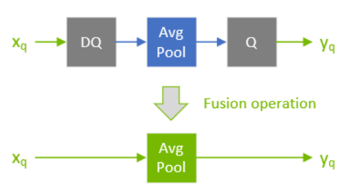

在网络优化期间，TensorRT 在称为 `Q/DQ` 传播的过程中移动 `Q/DQ` 层。传播的目标是最大化以低精度处理的图的比例。因此，TensorRT 向后传播 Q 节点（以便尽可能早地进行量化）和向前传播 DQ 节点（以便尽可能晚地进行去量化）。 Q-layers 可以与 `commute-with-Quantization` 层交换位置，DQ-layers 可以与 `commute-with-Dequantization` 层交换位置。

A layer Op commutes with quantization if $Q (Op (x) ) ==Op (Q (x) )$

Similarly, a layer Op commutes with dequantization if $Op (DQ (x) ) ==DQ (Op (x) )$

下图说明了 DQ 前向传播和 Q 后向传播。这些是对模型的合法重写，因为 `Max Pooling` 具有 INT8 实现，并且因为 Max Pooling 与 DQ 和 Q 通讯。

下图描述 DQ 前向传播和 Q 后向传播的插图。

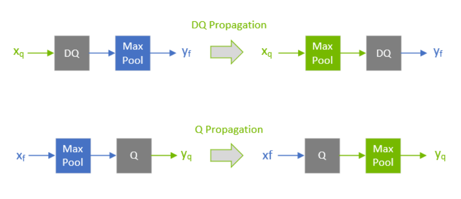

**注意：**

为了理解最大池化交换，让我们看一下应用于某个任意输入的最大池化操作的输出。 `Max Pooling`应用于输入系数组并输出具有最大值的系数。对于由系数组成的组i ： $\{x_0 . . x_m\}$

$utput_i := max(\{x_0, x_1, ... x_m\}) = max(\{max(\{max({x_0, x_1}), x_2)\}, ... x_m\})$

因此，在不失一般性（WLOG）的情况下查看两个任意系数就足够了：

$x_j = max({x_j, x_k})\ \ \ for\ \ \ x_j >= x_k$

对于量化函数$Q(a, scale, x_max, x_min) := truncate(round(a/scale), x_max,x_min)$ 来说$scale>0$, 注意（不提供证明，并使用简化符号):

$Q(x_j, scale) >= Q(x_k, scale)\ \ \ for\ \ \ x_j >= x_k$

因此：

$max(\{Q(x_j, scale), Q(x_k, scale)\}) = Q(x_j, scale)\ \ \ for\ \ \ x_j >= x_k$

然而，根据定义：

$Q(max(\{x_j, x_k\}), scale) = Q(x_j, scale)\ \ \ for\ \ \ x_j >= x_k$

函数 $max$ commutes-with-quantization 和 Max Pooling 也是如此。

类似地，对于去量化，函数$DQ (a, scale) :=a * scale  with scale>0$  我们可以证明：

$max(\{DQ(x_j, scale), DQ(x_k, scale)\}) = DQ(x_j, scale) = DQ(max(\{x_j, x_k\}), scale)\ \ \ for\ \ \ x_j >= x_k$

量化层和交换层的处理方式是有区别的。两种类型的层都可以在 INT8 中计算，但可量化层也与 DQ 输入层和 Q 输出层融合。例如， `AveragePooling`层（可量化）不与 Q 或 DQ 交换，因此使用 `Q/DQ` 融合对其进行量化，如第一张图所示。这与如何量化 `Max Pooling`（交换）形成对比。

### 7.4.4. Q/DQ Layer-Placement Recommendations

Q/DQ 层在网络中的放置会影响性能和准确性。由于量化引入的误差，激进量化会导致模型精度下降。但量化也可以减少延迟。此处列出了在网络中放置 Q/DQ 层的一些建议。

量化加权运算（卷积、转置卷积和 GEMM）的所有输入。权重和激活的量化降低了带宽需求，还使 INT8 计算能够加速带宽受限和计算受限的层。

下图 TensorRT 如何融合卷积层的两个示例。在左边，只有输入被量化。在右边，输入和输出都被量化了。

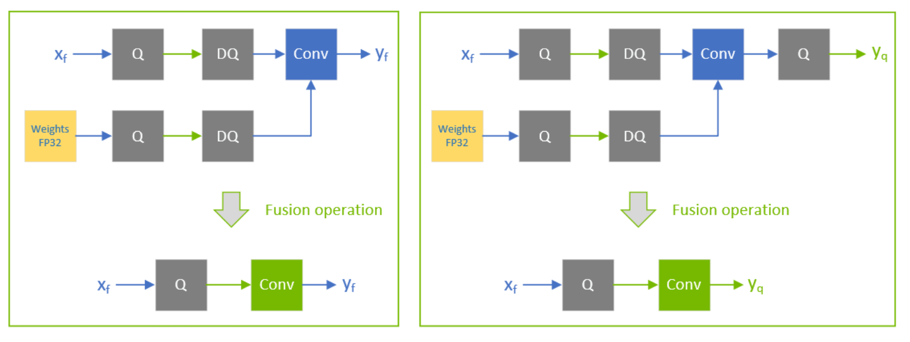

默认情况下，不量化加权运算的输出。保留更高精度的去量化输出有时很有用。例如，如果线性运算后面跟着一个激活函数（SiLU，下图中），它需要更高的精度输入才能产生可接受的精度。

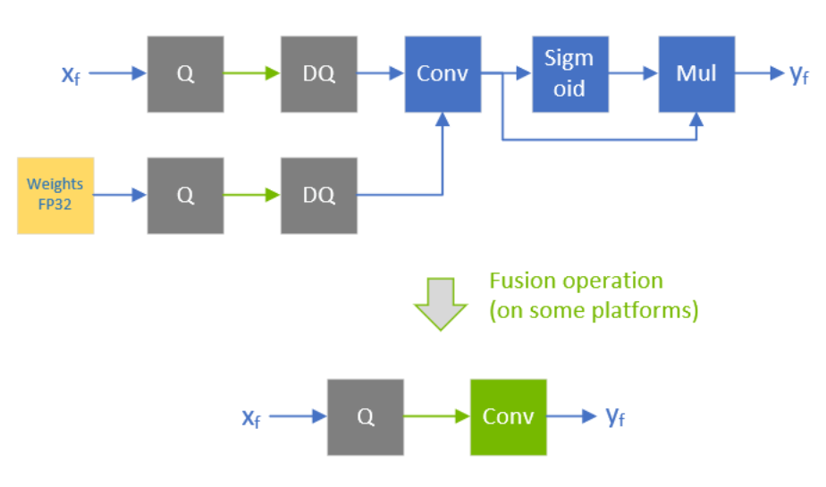

不要在训练框架中模拟批量归一化和 ReLU 融合，因为 TensorRT 优化保证保留这些操作的算术语义。

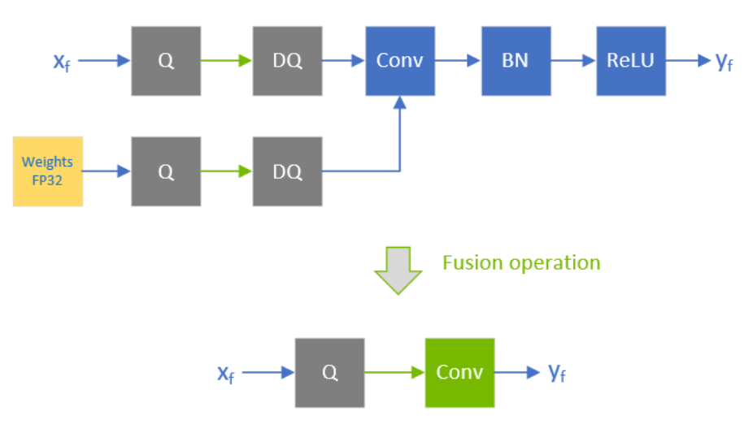

TensorRT 可以在加权层之后融合element-wise addition，这对于像 ResNet 和 EfficientNet 这样具有跳跃连接的模型很有用。element-wise addition层的第一个输入的精度决定了融合输出的精度。

比如下图中，$x_f^1$的精度是浮点数，所以融合卷积的输出仅限于浮点数，后面的Q层不能和卷积融合。

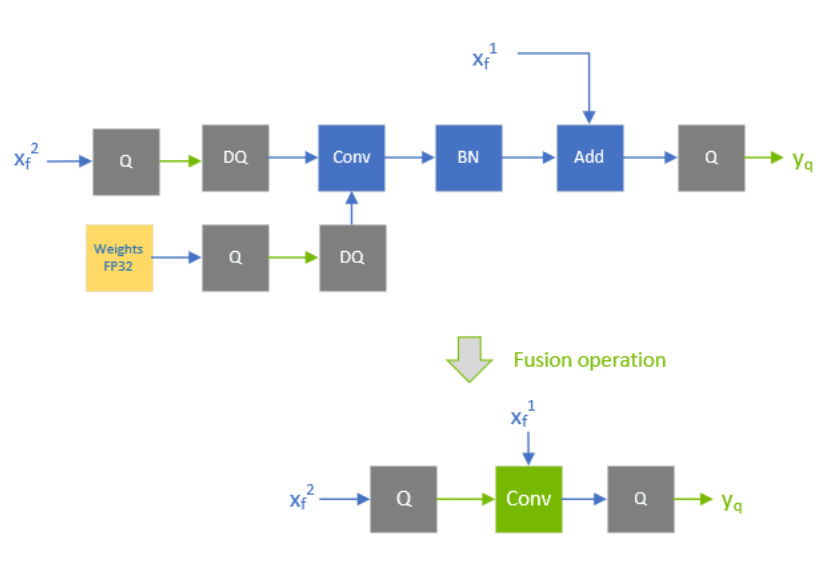

相比之下，当$x_f^1$量化为 INT8 时，如下图所示，融合卷积的输出也是 INT8，尾部的 Q 层与卷积融合。

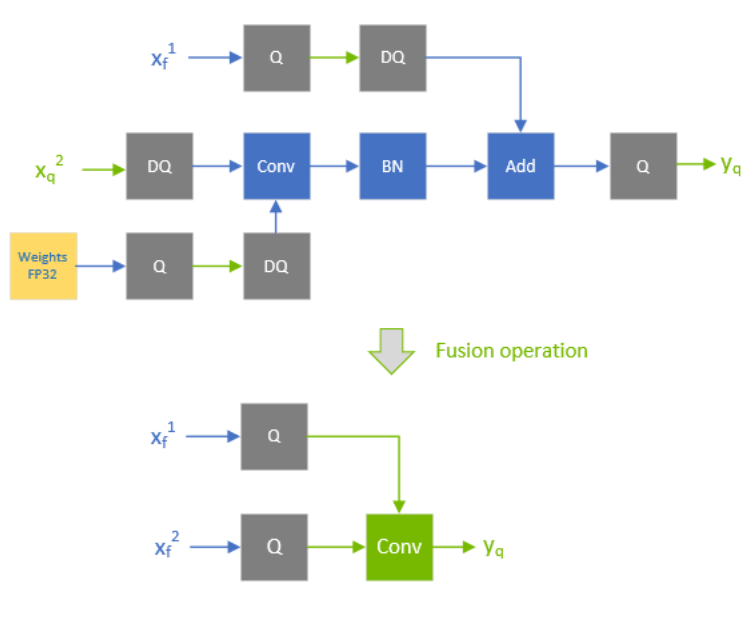

为了获得额外的性能，请尝试使用 Q/DQ 量化不交换的层。目前，具有 INT8 输入的非加权层也需要 INT8 输出，因此对输入和输出都进行量化。

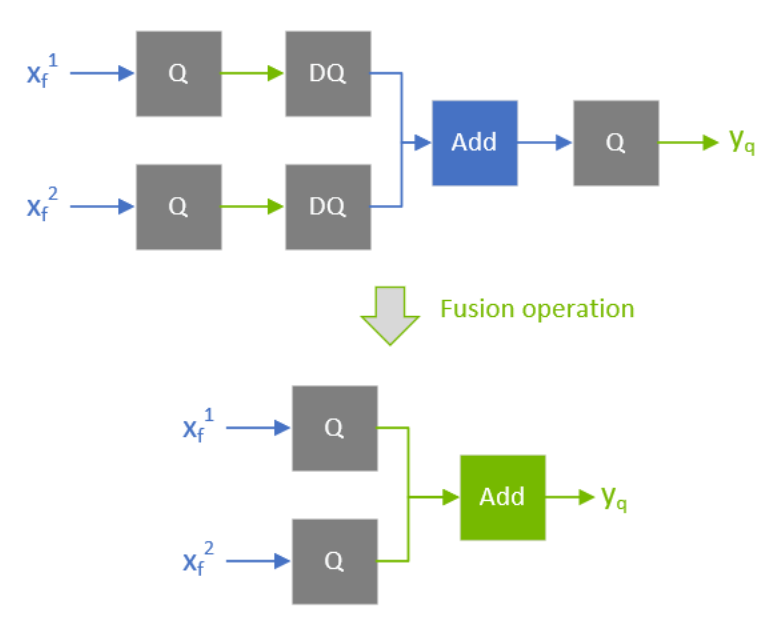

如果 TensorRT 无法将操作与周围的 Q/DQ 层融合，则性能可能会降低，因此在添加 Q/DQ 节点时要保守，并牢记准确性和 TensorRT 性能进行试验。

下图是额外 Q/DQ 操作可能导致的次优融合示例（突出显示的浅绿色背景矩形）。

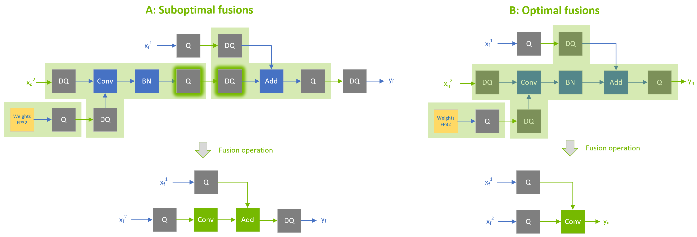

对激活使用逐张量量化；和每个通道的权重量化。这种配置已经被经验证明可以带来最佳的量化精度。

您可以通过启用 `FP16` 进一步优化引擎延迟。 TensorRT 尽可能尝试使用 `FP16` 而不是 `FP32`（目前并非所有层类型都支持）

### 7.4.5. Q/DQ Limitations

TensorRT 执行的一些 Q/DQ 图重写优化比较两个或多个 Q/DQ 层之间的量化尺度值，并且仅在比较的量化尺度相等时才执行图重写。改装可改装的 TensorRT 引擎时，可以为 Q/DQ 节点的尺度分配新值。在 Q/DQ 引擎的改装操作期间，TensorRT 检查是否为参与尺度相关优化的 Q/DQ 层分配了破坏重写优化的新值，如果为真则抛出异常。

下比较 Q1 和 Q2 的尺度是否相等的示例，如果相等，则允许它们向后传播。如果使用 Q1 和 Q2 的新值对引擎进行改装，使得 `Q1 != Q2` ，则异常中止改装过程。

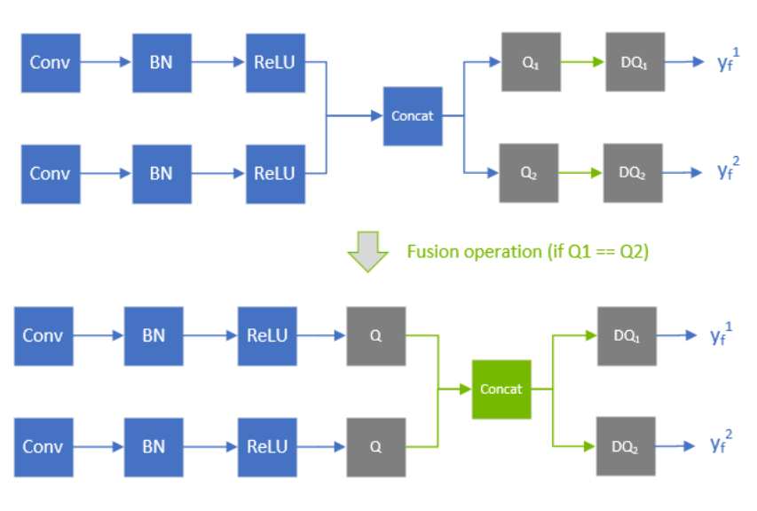

### 7.4.6. QAT Networks Using TensorFlow

目前，没有用于 TensorRT 的 TensorFlow 量化工具包，但是，有几种推荐的方法：

* TensorFlow 2 引入了一个新的 API 来在 QAT（量化感知训练）中执行伪量化： `tf.quantization.quantize_and_dequantize_v2`
  该算子使用与 TensorRT 的量化方案一致的对称量化。我们推荐这个 API 而不是 TensorFlow 1 `tf.quantization.quantize_and_dequantize` API。
  导出到 ONNX 时，可以使用tf2onnx转换器将 `quantize_and_dequantize_v2`算子转换为一对 `QuantizeLinear` 和 `DequantizeLinear` 算子（Q/DQ 算子） 。请参阅[quantization_ops_rewriter](https://github.com/onnx/tensorflow-onnx/blob/master/tf2onnx/rewriter/quantization_ops_rewriter.py)以了解如何执行此转换。
* 默认情况下，TensorFlow 将 `tf.quantization.quantize_and_dequantize_v2`算子（导出到 ONNX 后的 Q/DQ 节点）放在算子输出上，而 TensorRT 建议将 Q/DQ 放在层输入上。有关详细信息，请参阅[QDQ ](https://docs.nvidia.com/deeplearning/tensorrt/developer-guide/index.html#qdq-placement-recs)位置。
* TensorFlow 1 不支持每通道量化 (PCQ)。建议将 PCQ 用于权重，以保持模型的准确性。

### 7.4.7. QAT Networks Using PyTorch

PyTorch 1.8.0 和前版支持 ONNX [QuantizeLinear](https://github.com/onnx/onnx/blob/master/docs/Operators.md#QuantizeLinear) / [DequantizeLinear](https://github.com/onnx/onnx/blob/master/docs/Operators.md#dequantizelinear) ，支持每通道缩放。您可以使用[pytorch-quantization](https://github.com/NVIDIA/TensorRT/tree/main/tools/pytorch-quantization)进行 INT8 校准，运行量化感知微调，生成 ONNX，最后使用 TensorRT 在此 ONNX 模型上运行推理。更多详细信息可以在[PyTorch-Quantization Toolkit](https://docs.nvidia.com/deeplearning/tensorrt/pytorch-quantization-toolkit/docs/index.html) 用户指南中找到。

## 7.5. INT8 Rounding Modes

<div class="tablenoborder"><a name="int8-rounding-modes__table_fwf_vxy_gpb" shape="rect">
                              <!-- --></a><table cellpadding="4" cellspacing="0" summary="" id="int8-rounding-modes__table_fwf_vxy_gpb" class="table" frame="border" border="1" rules="all">
                              <thead class="thead" align="left">
                                 <tr class="row">
                                    <th class="entry" rowspan="2" valign="top" width="25%" id="d54e7059" colspan="1">Backend</th>
                                    <th class="entry" rowspan="2" valign="top" width="25%" id="d54e7062" colspan="1">Compute Kernel Quantization (FP32 to INT8)</th>
                                    <th class="entry" colspan="2" valign="top" id="d54e7065" rowspan="1">Weights Quantization (FP32 to INT8)</th>
                                 </tr>
                                 <tr class="row">
                                    <th class="entry" valign="top" width="25%" id="d54e7071" rowspan="1" colspan="1">Quantized Network (QAT)</th>
                                    <th class="entry" valign="top" width="25%" id="d54e7074" rowspan="1" colspan="1">Dynamic Range API / Calibration</th>
                                 </tr>
                              </thead>
                              <tbody class="tbody">
                                 <tr class="row">
                                    <td class="entry" valign="top" width="25%" headers="d54e7059 d54e7071" rowspan="1" colspan="1">GPU</td>
                                    <td class="entry" valign="top" width="25%" headers="d54e7062 d54e7074" rowspan="1" colspan="1"><samp class="ph codeph">round-to-nearest-with-ties-to-even</samp></td>
                                    <td class="entry" valign="top" width="25%" headers="d54e7065" rowspan="1" colspan="1"><samp class="ph codeph">round-to-nearest-with-ties-to-even</samp></td>
                                    <td class="entry" valign="top" width="25%" headers="d54e7065" rowspan="1" colspan="1"><samp class="ph codeph">round-to-nearest-with-ties-to-positive-infinity</samp></td>
                                 </tr>
                                 <tr class="row">
                                    <td class="entry" valign="top" width="25%" headers="d54e7059 d54e7071" rowspan="1" colspan="1">DLA</td>
                                    <td class="entry" valign="top" width="25%" headers="d54e7062 d54e7074" rowspan="1" colspan="1"><samp class="ph codeph">round-to-nearest-with-ties-away-from-zero</samp></td>
                                    <td class="entry" valign="top" width="25%" headers="d54e7065" rowspan="1" colspan="1">N/A</td>
                                    <td class="entry" valign="top" width="25%" headers="d54e7065" rowspan="1" colspan="1"><samp class="ph codeph">round-to-nearest-with-ties-away-from-zero</samp></td>
                                 </tr>
                              </tbody>
                           </table>
                        </div>

# 8. 在TensorRT中使用动态形状(Dynamic Shapes)

[点击此处加入NVIDIA开发者计划](https://developer.nvidia.com/zh-cn/developer-program)

**动态形状(Dynamic Shapes)** 是延迟指定部分或全部张量维度直到运行时的能力。动态形状可以通过 C++ 和 Python 接口使用。
以下部分提供了更详细的信息；但是，这里概述了构建具有动态形状的引擎的步骤：

1.网络定义不得具有隐式批次维度。

**C++**

通过调用创建 `INetworkDefinition`

```C++
IBuilder::createNetworkV2(1U <<
        static_cast<int>(NetworkDefinitionCreationFlag::kEXPLICIT_BATCH))
```

**Python**

通过调用创建tensorrt.INetworkDefinition

```Python
create_network(1 <<
        int(tensorrt.NetworkDefinitionCreationFlag.EXPLICIT_BATCH))
```

这些调用要求网络没有隐式批处理维度。

2.`-1`作为维度的占位符来指定输入张量的每个运行时维度。

3.指定一个或多个优化配置文件，为具有运行时维度的输入指定允许的维度范围，以及自动调整器将优化的维度。有关详细信息，请参阅[优化配置文件](https://docs.nvidia.com/deeplearning/tensorrt/developer-guide/index.html#opt_profiles)。

4.要使用引擎：

* 从引擎创建执行上下文，与没有动态形状的情况相同。
* 指定步骤 3 中涵盖输入维度的优化配置文件之一。
* 指定执行上下文的输入维度。设置输入维度后，您可以获得TensorRT针对给定输入维度计算的输出维度。
* Enqueue work。

## 8.1. Specifying Runtime Dimensions

构建网络时，使用 `-1`表示输入张量的运行时维度。例如，要创建一个名为 `foo`的 3D 输入张量，其中最后两个维度在运行时指定，第一个维度在构建时固定，请发出以下命令。

**C++**

`networkDefinition.addInput("foo", DataType::kFLOAT, Dims3(3, -1, -1))`

**Python**

`network_definition.add_input("foo", trt.float32, (3, -1, -1))`

在运行时，您需要在选择优化配置文件后设置输入维度（请参阅[优化配置文件](https://docs.nvidia.com/deeplearning/tensorrt/developer-guide/index.html#opt_profiles)）。设输入 `foo`的 `bindingIndex`为 `0` ，输入的维度为 `[3,150,250]` 。在为前面的示例设置优化配置文件后，您将调用：

**C++**

`context.setBindingDimensions(0, Dims3(3, 150, 250))`

**Python**

`context.set_binding_shape(0, (3, 150, 250))`

在运行时，向引擎询问绑定维度会返回用于构建网络的相同维度，这意味着每个运行时维度都会得到 `-1` 。例如：

**C++**

`engine.getBindingDimensions(0) returns a Dims with dimensions {3, -1, -1}`

**Python**

`engine.get_binding_shape(0) returns (3, -1, -1)`

要获取特定于每个执行上下文的实际维度，请查询执行上下文：

**C++**

`context.getBindingDimensions(0) returns a Dims with dimensions {3, 150, 250}.`

**Python**

`context.get_binding_shape(0) returns (3, 150, 250).`

**注意：输入的 `setBindingDimensions`的返回值仅表明与为该输入设置的优化配置文件相关的一致性。指定所有输入绑定维度后，您可以通过查询网络输出绑定的维度来检查整个网络在动态输入形状方面是否一致。**

```C++
nvinfer1::Dims out_dim = context->getBindingDimensions(out_index);

if (out_dim.nbDims == -1) {
gLogError << "Invalid network output, this might be caused by inconsistent input shapes." << std::endl;
// abort inference
}
```

## 8.2. Optimization Profiles

优化配置文件描述了每个网络输入的维度范围以及自动调谐器将用于优化的维度。使用运行时维度时，您必须在构建时创建至少一个优化配置文件。两个配置文件可以指定不相交或重叠的范围。

例如，一个配置文件可能指定最小尺寸 `[3,100,200]` ，最大尺寸 `[3,200,300]`和优化尺寸 `[3,150,250]`而另一个配置文件可能指定最小，最大和优化尺寸 `[3,200,100] ， [3,300,400] ，和[3,250,250]` 。

要创建优化配置文件，首先构造一个 `IOptimizationProfile` 。然后设置最小、优化和最大维度，并将其添加到网络配置中。优化配置文件定义的形状必须为网络定义有效的输入形状。以下是前面提到的第一个配置文件对输入 `foo`的调用：

**C++**

```C++

IOptimizationProfile* profile = builder.createOptimizationProfile();
profile->setDimensions("foo", OptProfileSelector::kMIN, Dims3(3,100,200);
profile->setDimensions("foo", OptProfileSelector::kOPT, Dims3(3,150,250);
profile->setDimensions("foo", OptProfileSelector::kMAX, Dims3(3,200,300);

config->addOptimizationProfile(profile)

```

**Python**

```Python
profile = builder.create_optimization_profile();
profile.set_shape("foo", (3, 100, 200), (3, 150, 250), (3, 200, 300)) 
config.add_optimization_profile(profile)
```

在运行时，您需要在设置输入维度之前设置优化配置文件。配置文件按照添加的顺序编号，从0开始。请注意，每个执行上下文必须使用单独的优化配置文件。
要选择示例中的第一个优化配置文件，请使用：

**C++**
调用 `context.setOptimizationProfileAsync(0, stream)`

其中stream是在此上下文中用于后续enqueue()或enqueueV2()调用的 CUDA 流。

**Python**
设置 `context.set_optimization_profile_async(0, stream)`

如果关联的 CUDA 引擎具有动态输入，则必须使用唯一的配置文件索引至少设置一次优化配置文件，该唯一配置文件索引未被其他未销毁的执行上下文使用。对于为引擎创建的第一个执行上下文，隐式选择配置文件 0。

可以调用 `setOptimizationProfileAsync()`在配置文件之间切换。它必须在当前上下文中的任何 `enqueue()`或 `enqueueV2()`操作完成后调用。当多个执行上下文同时运行时，允许切换到以前使用但已被具有不同动态输入维度的另一个执行上下文释放的配置文件。

`setOptimizationProfileAsync()`函数替换了现在已弃用的 API `setOptimizationProfile()`版本。使用 `setOptimizationProfile()`在优化配置文件之间切换可能会导致后续 `enqueue()`或 `enqueueV2()`操作操作中的 GPU 内存复制操作。要在入队期间避免这些调用，请改用 `setOptimizationProfileAsync()` API。

在由多个配置文件构建的引擎中，每个配置文件都有单独的绑定索引。第K个配置文件的输入/输出张量的名称附加了 `[profile K]` ，其中K以十进制表示。例如，如果 `INetworkDefinition`的名称为“ `foo `”，并且 `bindingIndex`指的是优化配置文件中索引为 `3`的张量，则 `engine.getBindingName ( bindingIndex )` 返回“ `foo [profile 3]` ”。

同样，如果使用 `ICudaEngine::getBindingIndex(name)`获取第一个配置文件 ( `K=0 `) 之外的配置文件 K 的索引，请将“`[profile K]`”附加到 `INetworkDefinition`中使用的名称。例如，如果张量在 `INetworkDefinition` 中被称为“ `foo` ” ，则 `engine.getBindingIndex ( “ foo [profile 3] ” )`在优化配置文件 `3`中返回张量“ `foo`”的绑定索引。

始终省略K=0的后缀。

### 8.2.1. Bindings For Multiple Optimization Profiles

考虑一个具有四个输入、一个输出、在 `IBuilderConfig`中具有三个优化配置文件的网络。该引擎有 `15` 个绑定，每个优化配置文件有 `5 `个，在概念上组织为一个表：

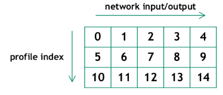

每行都是一个配置文件。表中的数字表示绑定索引。第一个配置文件的绑定索引为 0..4，第二个配置文件为 5..9，第三个配置文件为 10..14。

对于绑定属于第一个配置文件但指定了另一个配置文件的情况，接口具有“自动更正”功能。在这种情况下，TensorRT 会警告错误，然后从同一列中选择正确的绑定索引。

为了向后半兼容，接口在绑定属于第一个配置文件但指定了另一个配置文件的情况下具有“自动更正”功能。在这种情况下，TensorRT 会警告错误，然后从同一列中选择正确的绑定索引。

## 8.3. Layer Extensions For Dynamic Shapes

一些层具有允许指定动态形状信息的可选输入，并且有一个新层IShapeLayer用于在运行时访问张量的形状。此外，一些层允许计算新的形状。下一节将讨论语义细节和限制。以下是与动态形状结合使用时可能有用的内容的摘要。

`IShapeLayer`输出一个包含输入张量尺寸的一维张量。例如，如果输入张量的维度为 `[2,3,5,7]` ，则输出张量是包含 `{2,3,5,7}`的四元素一维张量。如果输入张量是标量，则它的维度为[] ，输出张量是包含{}的零元素一维张量。

`IResizeLayer`接受包含所需输出尺寸的可选第二个输入。

`IShuffleLayer`接受包含重塑尺寸的可选第二个输入。例如，以下网络将张量Y重塑为与X具有相同的维度：

**C++**

    auto* reshape = networkDefinition.addShuffle(Y);
    reshape.setInput(1, networkDefintion.addShape(X)->getOutput(0));

**Python**

    reshape = network_definition.add_shuffle(y)
    reshape.set_input(1, network_definition.add_shape(X).get_output(0))

`ISliceLayer`接受可选的第二、第三和第四个输入，其中包含开始、大小和步幅。

`IConcatenationLayer, IElementWiseLayer, IGatherLayer, IIdentityLayer, and         IReduceLayer`

可用于对形状进行计算并创建新的形状张量。

## 8.4. Restrictions For Dynamic Shapes

由于层的权重具有固定大小，因此会出现以下层限制：

* `IConvolutionLayer`和 `IDeconvolutionLayer`要求通道维度是构建时常数。
* `IFullyConnectedLayer`要求最后三个维度是构建时常量。
* `Int8`要求通道维度是构建时常数。
* 接受额外形状输入的层（ `IResizeLayer` 、 `IShuffleLayer` 、 `ISliceLayer` ）要求额外的形状输入与最小和最大优化配置文件的尺寸以及运行时数据输入的尺寸兼容；否则，它可能导致构建时或运行时错误。

必须是构建时常量的值不必是 API 级别的常量。 TensorRT 的形状分析器通过进行形状计算的层进行逐个元素的常数传播。常量传播发现一个值是构建时常量就足够了。

## 8.5. Execution Tensors vs. Shape Tensors

使用动态形状的引擎采用两阶段执行策略。

1. 计算所有张量的形状
2. 将工作流式传输到 GPU。

阶段 1 是隐含的，由需求驱动，例如在请求输出维度时。第 2 阶段与之前版本的TensorRT 相同。两阶段执行对动态性施加了一些限制，这些限制对于理解是很重要的。

关键限制是：

* 张量的等级必须在构建时确定。
* 张量是执行张量、形状张量或两者兼而有之。归类为形状张量的张量受到限制。

执行张量是传统的TensorRT张量。形状张量是与形状计算相关的张量。它必须是 `0D` 或 `1D`，类型为 `Int32` 、 `Float`或 `Bool` ，并且其形状必须在构建时可确定。例如，有一个 `IShapeLayer` ，其输出是一维张量，其中包含输入张量的维度。输出是一个形状张量。 `IShuffleLayer`接受一个可选的第二个输入，可以指定重塑尺寸。第二个输入必须是一个形状张量。

有些层在它们处理的张量类型方面是“多态的”。例如， `IElementWiseLayer`可以将两个 `INT32` 执行张量相加或将两个 ` INT32`形状张量相加。张量的类型取决于其最终用途。如果总和用于重塑另一个张量，那么它就是一个“形状张量”。

### 8.5.1. Formal Inference Rules

TensorRT 用于对张量进行分类的形式推理规则基于类型推理代数。令E表示执行张量， S表示形状张量。

IActivationLayer具有：

`IActivationLayer: E → E`

因为它将执行张量作为输入，将执行张量作为输出。 `IElementWiseLayer`在这方面是多态的，有两个特点:

`IElementWiseLayer: S × S → S, E × E → E`

为简洁起见，让我们采用约定t是表示任一类张量的变量，并且特征中的所有t都指同一类张量。然后，前面的两个特征可以写成一个单一的多态特征：

`IElementWiseLayer: t × t → t`

双输入 `IShuffleLayer`有一个形状张量作为第二个输入，并且相对于第一个输入是多态的：

`IShuffleLayer (two inputs): t × S → t`

`IConstantLayer`没有输入，但可以产生任何一种张量，所以它的特征是：

`IConstantLayer: → t`

`IShapeLayer`的特征允许所有四种可能的组合E→E 、 E→S 、 S→E和S→S ，因此可以用两个自变量编写：

`IShapeLayer: t1 → t2`

这是完整的规则集，它也可以作为可以使用哪些层来操纵形状张量的参考：

```
IAssertionLayer: S → 
IConcatenationLayer: t × t × ...→ t
IIfConditionalInputLayer: t → t
IIfConditionalOutputLayer: t → t
IConstantLayer: → t
IActivationLayer: t → t
IElementWiseLayer: t × t → t
IFillLayer: S → t
IFillLayer: S × E × E → E 
IGatherLayer: t × t → t
IIdentityLayer: t → t
IReduceLayer: t → t
IResizeLayer (one input): E → E
IResizeLayer (two inputs): E × S → E
ISelectLayer: t × t × t → t
IShapeLayer: t1 → t2
IShuffleLayer (one input): t → t
IShuffleLayer (two inputs): t × S → t
ISliceLayer (one input): t → t
ISliceLayer (two inputs): t × S → t
ISliceLayer (three inputs): t × S × S → t
ISliceLayer (four inputs): t × S × S × S → t
IUnaryLayer: t → t
all other layers: E × ... → E × ...
```

因为输出可以是多个后续层的输入，所以推断的“类型”不是唯一的。例如，一个 `IConstantLayer`可能会馈入一个需要执行张量的用途和另一个需要形状张量的用途。 `IConstantLayer`的输出被归类为两者，可以在两阶段执行的阶段 1 和阶段 2 中使用。

在构建时知道形状张量的等级的要求限制了 `ISliceLayer`可用于操纵形状张量的方式。具体来说，如果指定结果大小的第三个参数不是构建时常数，则生成的形状张量的长度在构建时将不再已知，从而打破形状张量对构建时形状的限制.更糟糕的是，它可能被用来重塑另一个张量，打破了在构建时必须知道张量等级的限制。

可以通过方法 `ITensor::isShapeTensor()`和 `ITensor::isExecutionTensor ()` 方法检查 TensorRT 的推理，它为形状张量返回 `true`，它为执行张量返回 `true`。在调用这些方法之前先构建整个网络，因为它们的答案可能会根据添加的张量用途而改变。

例如，如果一个部分构建的网络将两个张量 `T1`和 `T2`相加来创建张量 `T3 `，并且还不需要任何形状张量，则 `isShapeTensor()`对所有三个张量都返回 `false`。将 `IShuffleLayer`的第二个输入设置为 `T3`会导致所有三个张量成为形状张量，因为 `IShuffleLayer`要求其第二个可选输入是形状张量，如果 `IElementWiseLayer`的输出是形状张量，那么它的输入也是形状张量。

## 8.6. Shape Tensor I/O (Advanced)

有时需要使用形状张量作为网络 I/O 张量。例如，考虑一个仅由 `IshuffleLayer`组成的网络。 TensorRT 推断第二个输入是一个形状张量。 `ITensor::isShapeTensor`为它返回 true。因为它是一个输入形状张量，所以 TensorRT 需要两件事：

* 在构建时：形状张量的优化配置文件值。
* 在运行时：形状张量的值。

输入形状张量的形状在构建时始终是已知的。这是需要描述的值，因为它们可用于指定执行张量的维度。

可以使用 `IOptimizationProfile::setShapeValues`设置优化配置文件值。类似于必须为具有运行时维度的执行张量提供最小、最大和优化维度的方式，必须在构建时为形状张量提供最小、最大和优化值。

对应的运行时方法是 `IExecutionContext::setInputShapeBinding` ，它在运行时设置形状张量的值。

因为“执行张量”与“形状张量”的推断是基于最终用途，所以 TensorRT无法推断网络输出是否为形状张量。您必须通过 `INetworkDefinition::markOutputForShapes`方法告诉它。

除了让您输出形状信息以进行调试外，此功能对于编写引擎也很有用。例如，考虑构建三个引擎，每个引擎用于子网络 `A、B、C`，其中从 `A 到 B 或 B 到 C` 的连接可能涉及形状张量。逆序构建网络：`C、B、A`。构建网络 C 后，可以使用 `ITensor::isShapeTensor`判断输入是否为形状张量，并使用 `INetworkDefinition::markOutputForShapes`标记网络中对应的输出张量B.然后检查B的哪些输入是形状张量，并在网络A中标记对应的输出张量。

网络边界处的形状张量必须具有 `Int32`类型。它们不能具有 `Float`或 `Bool`类型。 `Bool`的一种解决方法是使用 `Int32`作为 I/O 张量，带有 `0` 和 `1`，并且：

* 通过 `ElementWiseOperation::kGREATER`转换为Bool ，即 `x > 0`。
* 通过 `ISelectLayer`从 `Bool`转换，即 `y ? 1：0`。

## 8.7. INT8 Calibration With Dynamic Shapes

要为具有动态形状的网络运行 INT8 校准，必须设置校准优化配置文件。使用配置文件的 `kOPT` 值执行校准。校准输入数据大小必须与此配置文件匹配。

要创建校准优化配置文件，首先，构造一个 `IOptimizationProfile` ，其方式与创建一般优化配置文件的方式相同。然后将配置文件设置为配置：

**C++**

`config->setCalibrationProfile(profile)`

**Python**

`config.set_calibration_profile(profile)`

校准配置文件必须有效或为 `nullptr` 。 `kMIN`和 `kMAX`值被 `kOPT`覆盖。要检查当前校准配置文件，请使用I `BuilderConfig::getCalibrationProfile` 。
此方法返回指向当前校准配置文件的指针，如果未设置校准配置文件，则返回 `nullptr`。为具有动态形状的网络运行校准时， `getBatchSize()`校准器方法必须返回1 。

**注意：如果未设置校准优化配置文件，则使用第一个网络优化配置文件作为校准优化配置文件。**

# 9. TensorRT中的自定义层

NVIDIA TensorRT 支持多种类型的层，其功能不断扩展；但是，在某些情况下，支持的层不能满足模型的特定需求。

您可以通过实现自定义层（通常称为插件）来扩展 TensorRT。

## 9.1. Adding Custom Layers Using The C++ API

您可以通过从 TensorRT 的插件基类之一派生来实现自定义层。

<div class="tablenoborder"><a name="add_custom_layer__table_xkr_fc5_k3b" shape="rect">
                                 <!-- --></a><table cellpadding="4" cellspacing="0" summary="" id="add_custom_layer__table_xkr_fc5_k3b" class="table" frame="border" border="1" rules="all">
                                 <caption><span class="tablecap">Table 3. Base classes, ordered from least expressive to most expressive</span></caption>
                                 <thead class="thead" align="left">
                                    <tr class="row">
                                       <th class="entry" valign="top" width="20%" id="d54e8343" rowspan="1" colspan="1"> </th>
                                       <th class="entry" valign="top" width="20%" id="d54e8345" rowspan="1" colspan="1">Introduced in TensorRT version?</th>
                                       <th class="entry" valign="top" width="20%" id="d54e8348" rowspan="1" colspan="1">Mixed input/output formats/types</th>
                                       <th class="entry" valign="top" width="20%" id="d54e8351" rowspan="1" colspan="1">Dynamic shapes?</th>
                                       <th class="entry" valign="top" width="20%" id="d54e8354" rowspan="1" colspan="1">Supports implicit/explicit batch mode?</th>
                                    </tr>
                                 </thead>
                                 <tbody class="tbody">
                                    <tr class="row">
                                       <td class="entry" valign="top" width="20%" headers="d54e8343" rowspan="1" colspan="1"><a class="xref" href="https://docs.nvidia.com/deeplearning/sdk/tensorrt-api/c_api/classnvinfer1_1_1_i_plugin_v2_ext.html" target="_blank" shape="rect"><samp class="ph codeph"><u class="ph u">IPluginV2Ext</u></samp></a></td>
                                       <td class="entry" valign="top" width="20%" headers="d54e8345" rowspan="1" colspan="1">5.1</td>
                                       <td class="entry" valign="top" width="20%" headers="d54e8348" rowspan="1" colspan="1">Limited</td>
                                       <td class="entry" valign="top" width="20%" headers="d54e8351" rowspan="1" colspan="1">No</td>
                                       <td class="entry" valign="top" width="20%" headers="d54e8354" rowspan="1" colspan="1">Implicit batch mode only</td>
                                    </tr>
                                    <tr class="row">
                                       <td class="entry" valign="top" width="20%" headers="d54e8343" rowspan="1" colspan="1"><a class="xref" href="https://docs.nvidia.com/deeplearning/sdk/tensorrt-api/c_api/classnvinfer1_1_1_i_plugin_v2_i_o_ext.html" target="_blank" shape="rect"><samp class="ph codeph"><u class="ph u">IPluginV2IOExt</u></samp></a></td>
                                       <td class="entry" valign="top" width="20%" headers="d54e8345" rowspan="1" colspan="1">6.0.1</td>
                                       <td class="entry" valign="top" width="20%" headers="d54e8348" rowspan="1" colspan="1">General</td>
                                       <td class="entry" valign="top" width="20%" headers="d54e8351" rowspan="1" colspan="1">No</td>
                                       <td class="entry" valign="top" width="20%" headers="d54e8354" rowspan="1" colspan="1">Implicit batch mode only</td>
                                    </tr>
                                    <tr class="row">
                                       <td class="entry" valign="top" width="20%" headers="d54e8343" rowspan="1" colspan="1"><a class="xref" href="https://docs.nvidia.com/deeplearning/sdk/tensorrt-api/c_api/classnvinfer1_1_1_i_plugin_v2_dynamic_ext.html" target="_blank" shape="rect"><samp class="ph codeph"><u class="ph u">IPluginV2DynamicExt</u></samp></a></td>
                                       <td class="entry" valign="top" width="20%" headers="d54e8345" rowspan="1" colspan="1">6.0.1</td>
                                       <td class="entry" valign="top" width="20%" headers="d54e8348" rowspan="1" colspan="1">General</td>
                                       <td class="entry" valign="top" width="20%" headers="d54e8351" rowspan="1" colspan="1">Yes</td>
                                       <td class="entry" valign="top" width="20%" headers="d54e8354" rowspan="1" colspan="1">Explicit batch mode only</td>
                                    </tr>
                                 </tbody>
                              </table>
                           </div>

为了在网络中使用插件，您必须首先将其注册到 TensorRT 的 `PluginRegistry` （ [C++](https://docs.nvidia.com/deeplearning/tensorrt/api/c_api/classnvinfer1_1_1_i_plugin_registry.html) 、 [Python](https://docs.nvidia.com/deeplearning/tensorrt/api/python_api/infer/Plugin/IPluginRegistry.html) ）。不是直接注册插件，而是为插件注册一个工厂类的实例，派生自 `PluginCreator` ( [C++](https://docs.nvidia.com/deeplearning/tensorrt/api/c_api/classnvinfer1_1_1_i_plugin_creator.html) , [Python](https://docs.nvidia.com/deeplearning/tensorrt/api/python_api/infer/Plugin/IPluginCreator.html) )。插件创建者类还提供有关插件的其他信息：它的名称、版本和插件字段参数。

您必须从插件的基类之一派生插件类。在支持具有不同类型/格式的输入/输出或具有动态形状的网络方面，它们具有不同的表达能力。下表总结了基类，按从最不具表现力到最具表现力的顺序排列。

注意：如果插件用于一般用途，请提供 FP32 实现，以使其能够在任何网络上正常运行。

TensorRT 提供了一个宏 `REGISTER_TENSORRT_PLUGIN` ，它将插件创建者静态注册到注册表中。

TensorRT 库包含可以加载到您的应用程序中的插件。有关开源插件的列表，请参阅[`GitHub：TensorRT`](https://github.com/NVIDIA/TensorRT/tree/main/plugin#tensorrt-plugins) 插件。

注意：

* 要在应用程序中使用 TensorRT 插件，必须加载 `libnvinfer_plugin.so`库，并且必须通过在应用程序代码中调用 `initLibNvInferPlugins`来注册所有插件。
* 如果您有自己的插件库，则可以包含一个类似的入口点，以便在唯一命名空间下的注册表中注册所有插件。这确保了在构建期间跨不同插件库的插件名称没有冲突。

有关这些插件的更多信息，请参阅[NvInferPlugin.h](https://docs.nvidia.com/deeplearning/sdk/tensorrt-api/c_api/_nv_infer_plugin_8h.html)文件以供参考。

调用 `IPluginCreator::createPlugin()`返回 `IPluginV2`类型的插件对象。您可以使用 `addPluginV2()`将插件添加到 TensorRT 网络，该插件使用给定插件创建网络层。

例如，您可以将插件层添加到您的网络，如下所示：

```C++
// Look up the plugin in the registry
auto creator = getPluginRegistry()->getPluginCreator(pluginName, pluginVersion);
const PluginFieldCollection* pluginFC = creator->getFieldNames();
// Populate the fields parameters for the plugin layer 
PluginFieldCollection *pluginData = parseAndFillFields(pluginFC, layerFields); 
// Create the plugin object using the layerName and the plugin meta data
IPluginV2 *pluginObj = creator->createPlugin(layerName, pluginData);
// Add the plugin to the TensorRT network 
auto layer = network.addPluginV2(&inputs[0], int(inputs.size()), pluginObj);
… (build rest of the network and serialize engine)
// Destroy the plugin object
pluginObj->destroy()
… (destroy network, engine, builder)
… (free allocated pluginData)
```

注意：

* `pluginData`必须在传递给 `createPlugin`之前在堆上分配 `PluginField`条目。
* 前面描述的 `createPlugin` 方法在堆上创建一个新的插件对象并返回一个指向它的指针。如前所示，确保销毁 `pluginObj` 以避免内存泄漏。

`IPluginV2`类型插件的插件类型、插件版本和命名空间（如果存在） 。在反序列化期间，TensorRT 从插件注册表中查找插件创建者并调用 `IPluginCreator::deserializePlugin()` 。在反序列化过程中创建的插件对象由 TensorRT 引擎通过调用 `IPluginV2::destroy()`方法在内部销毁。

`IPluginV2`类型插件的插件类型、插件版本和命名空间（如果存在）, 在反序列化期间，TensorRT 从插件注册表中查找插件创建者并调用 `IPluginCreator::deserializePlugin()` 。在反序列化期间创建的插件对象由 TensorRT 引擎通过调用 `IPluginV2::destroy()`方法在内部销毁。

### 9.1.1. Example: Adding A Custom Layer With Dynamic Shape Support Using C++

要支持动态形状，您的插件必须从 `IPluginV2DynamicExt`派生。

关于这个任务

`BarPlugin`是一个有两个输入和两个输出的插件，其中：
•	第一个输出是第二个输入的拷贝
•	第二个输出是两个输入的串联，沿着第一个维度，所有类型/格式必须相同并且是线性格式

BarPlugin需要按如下方式派生：

```C++
class BarPlugin : public IPluginV2DynamicExt
{
	...override virtual methods inherited from IPluginV2DynamicExt.
};
```

继承的方法都是纯虚方法，所以如果你忘记了，编译器会提醒你。

受动态形状影响的四种方法是：

* 获取输出维度
* 支持格式组合
* 配置插件
* 队列

`getOutputDimensions`的覆盖根据输入维度返回输出维度的符号表达式。您可以使用传递给 `getOutputDimensions`的 `IExprBuilder`从输入的表达式构建表达式。在示例中，不必为案例 1 构建新表达式，因为第二个输出的维度与第一个输入的维度相同。

```C++
DimsExprs BarPlugin::getOutputDimensions(int outputIndex, 
    const DimsExprs* inputs, int nbInputs, 
    IExprBuilder& exprBuilder)
{
    switch (outputIndex)
    {
    case 0: 
    {
        // First dimension of output is sum of input 
        // first dimensions.
        DimsExprs output(inputs[0]);
        output.d[0] = 
            exprBuilder.operation(DimensionOperation::kSUM, 
                inputs[0].d[0], inputs[1].d[0]);
	   return output;
    }
    case 1:
        return inputs[0];
    default:
         throw std::invalid_argument(“invalid output”);
}
```

`supportsFormatCombination`的覆盖必须指示是否允许格式组合。接口将输入/输出统一索引为“`connections`”，从第一个输入的 0 开始，然后依次为其余输入，然后为输出编号。在示例中，输入是 `connections` 0 和 1，输出是 `connections` 2 和 3。

TensorRT 使用 `supportsFormatCombination`来询问给定的格式/类型组合是否适用于连接，给定的格式/类型用于索引较少的连接。因此，覆盖可以假设较少索引的连接已经过审查，并专注于与索引 `pos`的连接。

```C++
bool BarPlugin::supportsFormatCombination(int pos, const PluginTensorDesc* inOut, int nbInputs, int nbOutputs) override
{
    assert(0 <= pos && pos < 4);
    const auto* in = inOut;
    const auto* out = inOut + nbInputs;
    switch (pos)
    {
    case 0: return in[0].format == TensorFormat::kLINEAR;
    case 1: return in[1].type == in[0].type &&
                   in[0].format == TensorFormat::kLINEAR;
    case 2: return out[0].type == in[0].type &&
                   out[0].format == TensorFormat::kLINEAR;
    case 3: return out[1].type == in[0].type &&
                   out[1].format == TensorFormat::kLINEAR;
    }
    throw std::invalid_argument(“invalid connection number”);
}
```

这里的局部变量 `in`和 `out`允许通过输入或输出编号而不是连接编号检查 `inOut` 。

**重要提示：覆盖检查索引小于 `pos`的连接的格式/类型，但绝不能检查索引大于 `pos`的连接的格式/类型。该示例使用case 3来检查连接 3 和连接 0，而不是使用case 0来检查连接 0 和连接 3。**

TensorRT 使用 `configurePlugin`在运行时设置插件。这个插件不需要 `configurePlugin`来做任何事情，所以它是一个空操作：

```C++
void BarPlugin::configurePlugin(
    const DynamicPluginTensorDesc* in, int nbInputs, 
    const DynamicPluginTensorDesc* out, int nbOutputs) override
{
}
```

如果插件需要知道它可能遇到的最小或最大尺寸，它可以检查字段 `DynamicPluginTensorDesc::min`或 `DynamicPluginTensorDesc::max`的任何输入或输出。格式和构建时维度信息可以在 `DynamicPluginTensorDesc::desc`中找到。任何运行时维度都显示为 `-1`。实际维度提供给 `BarPlugin::enqueue` 。

最后，重写 `BarPlugin::enqueue`必须完成这项工作。由于形状是动态的，因此 `enqueue` 会收到一个 `PluginTensorDesc` ，它描述了每个输入和输出的实际尺寸、类型和格式。

### 9.1.2. Example: Adding A Custom Layer With INT8 I/O Support Using C++

PoolPlugin是一个插件，用于演示如何为自定义池层扩展 INT8 I/O。推导如下：

```C++
class PoolPlugin : public IPluginV2IOExt
{
    ...override virtual methods inherited from IPluginV2IOExt.
};
```

大多数纯虚方法对插件来说都是通用的。影响INT8 I/O的主要方法有：

* 支持格式组合
* 配置插件
* enqueue

`supportsFormatCombination`的覆盖必须指示允许哪个 INT8 I/O 组合。此接口的用法类似于示例：[使用 C++ 添加具有动态形状支持的自定义层](https://docs.nvidia.com/deeplearning/tensorrt/developer-guide/index.html#example3_add_custlay_dynamic)。在本例中，支持的 I/O 张量格式为线性 `CHW`，数据类型为 ` FP32`、`FP16` 或 `INT8`，但 I/O 张量必须具有相同的数据类型。

```C++
bool PoolPlugin::supportsFormatCombination(int pos, const PluginTensorDesc* inOut, int nbInputs, int nbOutputs) const override
{
    assert(nbInputs == 1 && nbOutputs == 1 && pos < nbInputs + nbOutputs);
    bool condition = inOut[pos].format == TensorFormat::kLINEAR;
    condition &= ((inOut[pos].type == DataType::kFLOAT) ||
                  (inOut[pos].type == DataType::kHALF) ||
                  (inOut[pos].type == DataType::kINT8));
    condition &= inOut[pos].type == inOut[0].type;
    return condition;
}
```

#### 重要的：

* 如果 INT8 校准必须与具有 INT8 I/O 插件的网络一起使用，则该插件必须支持 FP32 I/O，因为它被 FP32 校准图使用。
* 如果不支持 FP32 I/O 变体或未使用 INT8 校准，则必须明确设置所有必需的 INT8 I/O 张量尺度。
* 校准无法确定插件内部张量的动态范围。对量化数据进行操作的插件必须为内部张量计算自己的动态范围。

TensorRT 调用 `configurePlugin`方法通过 `PluginTensorDesc`将信息传递给插件，这些信息存储为成员变量，序列化和反序列化。

```C++
void PoolPlugin::configurePlugin(const PluginTensorDesc* in, int nbInput, const PluginTensorDesc* out, int nbOutput)
{
    ...
    mPoolingParams.mC = mInputDims.d[0];
    mPoolingParams.mH = mInputDims.d[1];
    mPoolingParams.mW = mInputDims.d[2];
    mPoolingParams.mP = mOutputDims.d[1];
    mPoolingParams.mQ = mOutputDims.d[2];
    mInHostScale = in[0].scale >= 0.0f ? in[0].scale : -1.0f;
    mOutHostScale = out[0].scale >= 0.0f ? out[0].scale : -1.0f;
}
```

每个张量的 INT8 I/O 比例可以从 `PluginTensorDesc::scale`获得。
最后，重写 `UffPoolPluginV2::enqueue`必须完成这项工作。它包括一组核心算法，可在运行时通过使用实际批量大小、输入、输出、cuDNN 流和配置的信息来执行自定义层。

```C++
int PoolPlugin::enqueue(int batchSize, const void* const* inputs, void** outputs, void* workspace, cudaStream_t stream)
{
    ...
    CHECK(cudnnPoolingForward(mCudnn, mPoolingDesc, &kONE, mSrcDescriptor, input, &kZERO, mDstDescriptor, output));
    ...
    return 0;
}
```

## 9.2. Adding Custom Layers Using The Python API

尽管 C++ API 是实现自定义层的首选语言，但由于可以访问 CUDA 和 cuDNN 等库，您还可以在 Python 应用程序中使用自定义层。

您可以使用 C++ API 创建自定义层，在 Python 中使用 `pybind11`打包层，然后将插件加载到 Python 应用程序中。有关更多信息，请参阅[在 Python 中创建网络定义](https://docs.nvidia.com/deeplearning/tensorrt/developer-guide/index.html#network_python)。

相同的自定义层实现可用于 C++ 和 Python。

### 9.2.1. Example: Adding A Custom Layer To A TensorRT Network Using Python

可以使用插件节点将自定义层添加到 Python 中的任何 TensorRT 网络。

Python API 有一个名为 `add_plugin_v2`的函数，可让您将插件节点添加到网络。以下示例说明了这一点。它创建了一个简单的TensorRT网络，并通过查找TensorRT插件注册表来添加一个 Leaky ReLU 插件节点。

```C++
import tensorrt as trt
import numpy as np

TRT_LOGGER = trt.Logger()

trt.init_libnvinfer_plugins(TRT_LOGGER, '')
PLUGIN_CREATORS = trt.get_plugin_registry().plugin_creator_list

def get_trt_plugin(plugin_name):
        plugin = None
        for plugin_creator in PLUGIN_CREATORS:
            if plugin_creator.name == plugin_name:
                lrelu_slope_field = trt.PluginField("neg_slope", np.array([0.1], dtype=np.float32), trt.PluginFieldType.FLOAT32)
                field_collection = trt.PluginFieldCollection([lrelu_slope_field])
                plugin = plugin_creator.create_plugin(name=plugin_name, field_collection=field_collection)
        return plugin

def main():
    builder = trt.Builder(TRT_LOGGER) 
    network = builder.create_network()
    config = builder.create_builder_config()
    config.max_workspace_size = 2**20
    input_layer = network.add_input(name="input_layer", dtype=trt.float32, shape=(1, 1))
    lrelu = network.add_plugin_v2(inputs=[input_layer], plugin=get_trt_plugin("LReLU_TRT"))
    lrelu.get_output(0).name = "outputs"
    network.mark_output(lrelu.get_output(0))
```

## 9.3. Using Custom Layers When Importing A Model With A Parser

ONNX 解析器会自动尝试将无法识别的节点作为插件导入。如果在插件注册表中找到与节点具有相同op_type的插件，则解析器将节点的属性作为插件字段参数转发给插件创建者，以创建插件。默认情况下，解析器使用“1”作为插件版本， “”作为插件命名空间。可以通过在相应的 ONNX 节点中设置 `plugin_version`或 `plugin_namespace`字符串属性来覆盖此行为。

在某些情况下，您可能希望在将 ONNX 图导入 TensorRT 之前对其进行修改。例如，用插件节点替换一组操作。为此，您可以使用[ONNX GraphSurgeon 实用程序](https://github.com/NVIDIA/TensorRT/tree/main/tools/onnx-graphsurgeon)。有关如何使用 ONNX-GraphSurgeon 替换子图的详细信息，请参阅[此示例](https://github.com/NVIDIA/TensorRT/tree/main/tools/onnx-graphsurgeon/examples/08_replacing_a_subgraph)。

有关更多示例，请参阅[onnx_packnet](https://github.com/NVIDIA/TensorRT/tree/main/samples/python/onnx_packnet)示例。

## 9.4. Plugin API Description

所有新插件都应从 `IPluginCreator`和使用 C++ API 添加自定义层中描述的插件基类之一派生类。此外，新插件还应调用 `REGISTER_TENSORRT_PLUGIN(...)`宏以将插件注册到 TensorRT 插件注册表或创建等效于 `initLibNvInferPlugins()`的init函数。

### 9.4.1. Migrating Plugins From TensorRT 6.x Or 7.x To TensorRT 8.x.x

`IPluginV2`和 `IPluginV2Ext`以分别向后兼容 TensorRT 5.1 和 6.0.x。但是，新插件应针对 `IPluginV2DynamicExt`或 `IPluginV2IOExt`接口，而旧插件应重构以使用这些接口。

`IPluginV2DynamicExt`中的新特性如下：

```C++
virtual DimsExprs getOutputDimensions(int outputIndex, const DimsExprs* inputs, int nbInputs, IExprBuilder& exprBuilder) = 0;

virtual bool supportsFormatCombination(int pos, const PluginTensorDesc* inOut, int nbInputs, int nbOutputs) = 0;

virtual void configurePlugin(const DynamicPluginTensorDesc* in, int nbInputs, const DynamicPluginTensorDesc* out, int nbOutputs) = 0;

virtual size_t getWorkspaceSize(const PluginTensorDesc* inputs, int nbInputs, const PluginTensorDesc* outputs, int nbOutputs) const = 0;

virtual int enqueue(const PluginTensorDesc* inputDesc, const PluginTensorDesc* outputDesc, const void* const* inputs, void* const* outputs, void* workspace, cudaStream_t stream) = 0;
```

`IPluginV2IOExt`中的新特性如下：

```C++
virtual void configurePlugin(const PluginTensorDesc* in, int nbInput, const PluginTensorDesc* out, int nbOutput) = 0;

virtual bool supportsFormatCombination(int pos, const PluginTensorDesc* inOut, int nbInputs, int nbOutputs) const = 0;
```

迁移到 `IPluginV2DynamicExt`或 `IPluginV2IOExt`的指南：

* `getOutputDimensions`实现给定输入的输出张量维度的表达式。
* `supportsFormatCombination`检查插件是否支持指定输入/输出的格式和数据类型。
* `configurePlugin`模仿 `IPluginV2Ext`中等效的 `configurePlugin`的行为，但接受张量描述符。
* `getWorkspaceSize`和 `enqueue`模仿 `IPluginV2Ext`中等效 API 的行为，但接受张量描述符。

更多详细信息，请参阅[IPluginV2 API](https://docs.nvidia.com/deeplearning/tensorrt/developer-guide/index.html#ipluginv2) 说明中的 API 说明。

### 9.4.2. IPluginV2 API Description

以下部分介绍 `IPluginV2`类的功能。要将插件层连接到相邻层并设置输入和输出数据结构，构建器通过调用以下插件方法检查输出的数量及其维度。

**`getNbOutputs`**

用于指定输出张量的数量。

**`getOutputDimensions`**

用于将输出的维度指定为输入维度的函数。

**`supportsFormat`**

用于检查插件是否支持给定的数据格式。

**`getOutputDataType`**

用于获取给定索引处输出的数据类型。返回的数据类型必须具有插件支持的格式。

插件层可以支持四种数据格式，例如：

* NCHW单精度 (FP32)、半精度 (FP16) 和整型 (INT32) 张量
* NC / 2HW2和NHWC8半精度 (FP16) 张量

格式由 `PluginFormatType`枚举。

除了输入和输出张量之外，不计算所有数据并且需要内存空间的插件可以使用 `getWorkspaceSize`方法指定额外的内存需求，该方法由构建器调用以确定和预分配暂存空间。

在构建和推理期间，可能会多次配置和执行插件层。在构建时，为了发现最佳配置，层被配置、初始化、执行和终止。为插件选择最佳格式后，再次配置插件，然后在推理应用程序的生命周期内初始化一次并执行多次，最后在引擎销毁时终止。这些步骤由构建器和引擎使用以下插件方法控制：

**`configurePlugin`(配置插件)**

传达输入和输出的数量、所有输入和输出的维度和数据类型、所有输入和输出的广播信息、选择的插件格式和最大批量大小。此时，插件设置其内部状态并为给定配置选择最合适的算法和数据结构。

**`initialize`(初始化)**

此时配置是已知的，并且正在创建推理引擎，因此插件可以设置其内部数据结构并准备执行。

**`enqueue`(排队)**

封装插件的实际算法和内核调用，并提供运行时批处理大小、指向输入、输出和暂存空间的指针，以及用于内核执行的CUDA流。

**`terminate`(终止)**

引擎上下文被销毁，插件持有的所有资源必须被释放。

**`clone`(克隆)**

每次创建包含此插件层的新构建器、网络或引擎时都会调用它。它必须返回一个带有正确参数的新插件对象。

**`destroy`(销毁)**

用于销毁插件对象和/或每次创建新插件对象时分配的其他内存。每当构建器或网络或引擎被破坏时都会调用它。

```set/getPluginNamespace`(设置/获取插件命名空间)``

该方法用于设置该插件对象所属的库命名空间（默认可以是“”）。来自同一个插件库的所有插件对象都应该具有相同的命名空间。

`IPluginV2Ext`支持可以处理广播输入和输出的插件。此功能需要实现以下方法：

**`canBroadcastInputAcrossBatch`**

对每个输入调用此方法，其张量在批次中进行语义广播。如果 `canBroadcastInputAcrossBatch`返回true （意味着插件可以支持广播），则 TensorRT 不会复制输入张量。插件应该在批处理中共享一个副本。如果它返回false ，则 TensorRT 会复制输入张量，使其看起来像一个非广播张量。

**`isOutputBroadcastAcrossBatch`**

这为每个输出索引调用。该插件应在给定索引处返回 true 输出，并在整个批次中广播。

**`IPluginV2IOExt`**
这由构建器在 `initialize()`之前调用。它为层提供了基于 I/O PluginTensorDesc和最大批量大小进行算法选择的机会。

**注意：基于 `IPluginV2`的插件在引擎级别共享，而不是在执行上下文级别共享，因此这些可能被多个线程同时使用的插件需要以线程安全的方式管理它们的资源。创建 `ExecutionContext`时会克隆基于 `IPluginV2Ext`和派生接口的插件，因此这不是必需的。**

### 9.4.3. IPluginCreator API Description

`IPluginCreator`类中的以下方法用于从插件注册表中查找和创建适当的插件：

**`getPluginName`**

`IPluginExt::getPluginType`的返回值。

**`getPluginVersion`**
返回插件版本。对于所有内部 TensorRT 插件，默认为1 。

**`getFieldNames`**
要成功创建插件，需要了解插件的所有字段参数。此方法返回 `PluginFieldCollection`结构，其中填充了 `PluginField`条目以反映字段名称和 `PluginFieldType` （数据应指向 `nullptr` ）。

**`createPlugin`**

此方法用于使用 `PluginFieldCollection`参数创建插件。应填充 `PluginField`条目的数据字段以指向每个插件字段条目的实际数据。

**注意：传递给 `createPlugin`函数的数据应该由调用者分配，并在程序被销毁时最终由调用者释放。 `createPlugin`函数返回的插件对象的所有权被传递给调用者，并且也必须被销毁。**

**`deserializePlugin`**

此方法由 TensorRT 引擎根据插件名称和版本在内部调用。它应该返回要用于推理的插件对象。在该函数中创建的插件对象在引擎被销毁时被 TensorRT 引擎销毁。

**`set/getPluginNamespace`**
该方法用于设置此创建者实例所属的命名空间（默认可以是“”）。

## 9.5. Best Practices For Custom Layers Plugin

**调试自定义层问题**

必须释放插件中分配的内存以确保没有内存泄漏。如果在 `initialize()`函数中获取资源，则需要在 `terminate()`函数中释放它们。应该释放所有其他内存分配，最好在插件类析构函数中或在destroy()方法中。[使用 C++ API 添加自定义层](https://docs.nvidia.com/deeplearning/tensorrt/developer-guide/index.html#add_custom_layer)详细概述了这一点，并提供了一些使用插件时的最佳实践说明。

# 10. TensorRT中的循环

NVIDIA TensorRT 支持循环结构，这对于循环网络很有用。 TensorRT 循环支持扫描输入张量、张量的循环定义以及“扫描输出”和“最后一个值”输出。

## 10.1. Defining A Loop

循环由循环边界层(loop boundary layers)定义。

* `ITripLimitLayer`指定循环迭代的次数。
* `IIteratorLayer`使循环能够迭代张量。
* `IRecurrenceLayer`指定一个循环定义。
* `ILoopOutputLayer`指定循环的输出。

每个边界层都继承自类 `ILoopBoundaryLayer` ，该类有一个方法 `getLoop()`用于获取其关联的 `ILoop` 。 `ILoop`对象标识循环。具有相同 `ILoop`的所有循环边界层都属于该循环。

下图描绘了循环的结构和边界处的数据流。循环不变张量可以直接在循环内部使用，例如 FooLayer 所示。

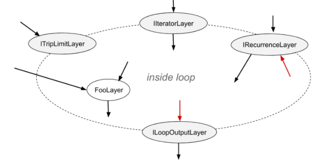

一个循环可以有多个I `IteratorLayer` 、 `IRecurrenceLayer`和 `ILoopOutputLayer` ，并且最多可以有两个 `ITripLimitLayer` ，如后面所述。没有 `ILoopOutputLayer`的循环没有输出，并由 TensorRT 优化。

NVIDIA TensorRT 支持矩阵中的流控制结构层部分描述了[可用于循环内部的 TensorRT 层](https://docs.nvidia.com/deeplearning/tensorrt/support-matrix/index.html#layers-flow-control-constructs)。

内部层可以自由使用在循环内部或外部定义的张量。内部可以包含其他循环（请参阅[嵌套循环](https://docs.nvidia.com/deeplearning/tensorrt/developer-guide/index.html#nested-loops)）和其他条件构造（请参阅[条件嵌套](https://docs.nvidia.com/deeplearning/tensorrt/developer-guide/index.html#nesting-loops)）。

要定义循环，首先，使用 `INetworkDefinition ::addLoop`方法创建一个 `ILoop`对象。然后添加边界层和内部层。本节的其余部分描述了边界层的特征，使用 `loop`表示 `INetworkDefinition ::addLoop`返回的 `ILoop*` 。

`ITripLimitLayer`支持计数循环和 `while` 循环。

* `loop ->addTripLimit( t ,TripLimit::kCOUNT)`创建一个 `ITripLimitLayer` ，其输入 `t`是指定循环迭代次数的 0D INT32 张量。
* `loop ->addTripLimit( t ,TripLimit::kWHILE)`创建一个 `ITripLimitLayer` ，其输入 `t`是一个 0D Bool 张量，用于指定是否应该进行迭代。通常 `t`要么是 `IRecurrenceLayer`的输出，要么是基于所述输出的计算。

一个循环最多可以有一种限制。

`IIteratorLayer`支持在任何轴上向前或向后迭代。

* `loop ->addIterator( t )`添加一个 `IIteratorLayer` ，它在张量t的轴 0 上进行迭代。例如，如果输入是矩阵：

```C++
2 3 5
4 6 8
```

第一次迭代的一维张量{2, 3, 5}和第二次迭代的{4, 6, 8} 。超出张量范围的迭代是无效的。

* `loop ->addIterator( t , axis )`类似，但该层在给定的轴上迭代。例如，如果 axis=1 并且输入是矩阵，则每次迭代都会传递矩阵的一列。
* `loop ->addIterator( t , axis,reverse )`类似，但如果 `reverse =true` ，则该层以相反的顺序产生其输出。

`ILoopOutputLayer`支持三种形式的循环输出：

* `loop ->addLoopOutput( t, LoopOutput::kLAST_VALUE)`输出 `t`的最后一个值，其中 `t`必须是 `IRecurrenceLayer`的输出。
* `loop-> addLoopOutput( t ,LoopOutput::kCONCATENATE, axis )`将每次迭代的输入串联输出到 `t` 。例如，如果输入是一维张量，第一次迭代的值为 `{ a,b,c}` ，第二次迭代的值为 `{d,e,f}` ， axis =0 ，则输出为矩阵：

```C++
a b c
d e f
```

如果axis =1 ，则输出为：

```C++
a d
b e
c f
```

* `loop-> addLoopOutput( t ,LoopOutput::kREVERSE, axis )`类似，但颠倒了顺序。
  `kCONCATENATE`和 `kREVERSE`形式都需要第二个输入，这是一个 0D INT32 形状张量，用于指定新输出维度的长度。当长度大于迭代次数时，额外的元素包含任意值。第二个输入，例如 `u` ，应使用 `ILoopOutputLayer::setInput(1, u )`设置。

最后，还有 `IRecurrenceLayer` 。它的第一个输入指定初始输出值，第二个输入指定下一个输出值。第一个输入必须来自循环外；第二个输入通常来自循环内部。例如，这个 C++ 片段的 TensorRT 模拟：

```C++
for (int32_t i = j; ...; i += k) ...
```

可以通过这些调用创建，其中j和k是 `ITensor*` 。

```C++
ILoop* loop = n.addLoop();
IRecurrenceLayer* iRec = loop->addRecurrence(j);
ITensor* i = iRec->getOutput(0);
ITensor* iNext = addElementWise(*i, *k, 
    ElementWiseOperation::kADD)->getOutput(0);
iRec->setInput(1, *iNext);
```

第二个输入是TensorRT允许后沿的唯一情况。如果删除了这些输入，则剩余的网络必须是非循环的。

## 10.2. Formal Semantics

TensorRT 具有应用语义，这意味着除了引擎输入和输出之外没有可见的副作用。因为没有副作用，命令式语言中关于循环的直觉并不总是有效。本节定义了 TensorRT 循环结构的形式语义。

形式语义基于张量的惰性序列(lazy sequences)。循环的每次迭代对应于序列中的一个元素。循环内张量X的序列表示为 `⟨ X 0, X 1, X 2, ... ⟩` 。序列的元素被懒惰地评估，意思是根据需要。

`IIteratorLayer(X)`的输出是 `⟨ X[0], X[1], X[2], ... ⟩`其中 `X[i]`表示在 `IIteratorLayer`指定的轴上的下标。

`IRecurrenceLayer(X,Y)`的输出是 `⟨ X, Y0, Y1, Y2, ... ⟩` 。
的输入和输出取决于LoopOutput的类型。

* `kLAST_VALUE` ：输入是单个张量X ，对于 n-trip 循环，输出是X n 。
* `kCONCATENATE` ：第一个输入是张量 `X`，第二个输入是标量形状张量 `Y`。结果是 `X0, X1, X2, ... Xn-1`与后填充（如有必要）连接到 `Y`指定的长度。如果 `Y < n`则为运行时错误。 `Y`是构建时间常数。注意与 `IIteratorLayer`的反比关系。 `IIteratorLayer`将张量映射到一系列子张量；带有 `kCONCATENATE`的 `ILoopOutputLayer`将一系列子张量映射到一个张量。
* kREVERSE ：类似于 `kCONCATENATE` ，但输出方向相反。

`ILoopOutputLayer`的输出定义中的n值由循环的 `ITripLimitLayer`确定：

* 对于计数循环，它是迭代计数，表示ITripLimitLayer的输入。
* 对于 while 循环，它是最小的 n 使得$X_n$为假，其中 `X`是 `ITripLimitLayer`的输入张量的序列。

非循环层的输出是层功能的顺序应用。例如，对于一个二输入非循环层 `F(X,Y) = ⟨ f(X 0 , Y 0 ), f(X 1 , Y 1 ), f(X 2 , Y 2 )... ⟩` .如果一个张量来自循环之外，即是循环不变的，那么它的序列是通过复制张量来创建的。

## 10.3. Nested Loops

TensorRT 从数据流中推断出循环的嵌套。例如，如果循环 B 使用在循环 A 中定义的值，则 B 被认为嵌套在 A 中。

TensorRT 拒绝循环没有干净嵌套的网络，例如如果循环 A 使用循环 B 内部定义的值，反之亦然。

## 10.4. Limitations

引用多个动态维度的循环可能会占用意外的内存量。
在一个循环中，内存的分配就像所有动态维度都取任何这些维度的最大值一样。例如，如果一个循环引用两个维度为 `[4,x,y]`和 `[6,y]`的张量，则这些张量的内存分配就像它们的维度是 `[4,max(x,y),max(x ,y)]`和 `[6,max(x,y)]` 。

带有 `kLAST_VALUE`的 `LoopOutputLayer`的输入必须是 `IRecurrenceLayer`的输出。
循环 API 仅支持 ` FP32` 和 `FP16` 精度。

## 10.5. Replacing IRNNv2Layer With Loops

`IRNNv2Layer`在 TensorRT 7.2.1 中已弃用，并将在 TensorRT 9.0 中删除。使用循环 API 合成循环子网络。例如，请参阅sampleCharRNN方法 `SampleCharRNNLoop::addLSTMCell` 。循环 API 让您可以表达一般的循环网络，而不是局限于IRNNLayer和IRNNv2Layer中的预制单元。

请参阅[sampleCharRNN](https://github.com/NVIDIA/TensorRT/blob/main/samples/sampleCharRNN) 。

# 11. TensorRT之条件控制

NVIDIA TensorRT 支持条件 if-then-else 流控制。 TensorRT 条件用于实现网络子图的条件执行。

## 11.1. Defining A Conditional

if-conditional 由条件边界层定义：

* `IConditionLayer`表示predicate 并指定条件是应该执行真分支（`then-branch`）还是假分支（`else-branch`）。
* `IIfConditionalInputLayer`指定两个条件分支之一的输入。
* `IIfConditionalOutputLayer`指定条件的输出。

每个边界层都继承自 `IIfConditionalBoundaryLayer`类，该类具有获取其关联 `IIfConditional`的方法 `getConditional()` 。 `IIfConditional`实例标识条件。所有具有相同 `IIfConditional`的条件边界层都属于该条件。

条件必须恰好有一个 `IConditionLayer`实例、零个或多个 `IIfConditionalInputLayer`实例，以及至少一个 `IIfConditionalOutputLayer`实例。

`IIfConditional`实现了一个 `if-then-else` 流控制结构，该结构提供基于动态布尔输入的网络子图的条件执行。它由一个布尔标量predicate condition和两个分支子图定义：一个 `trueSubgraph`在 `condition`评估为 `true`时执行，一个 `falseSubgraph`在 `condition`评估为 `false`时执行

```C++
If condition is true then: 
	output = trueSubgraph(trueInputs);
Else
	output = falseSubgraph(falseInputs);
Emit output
```

真分支和假分支都必须定义，类似于许多编程语言中的三元运算符。

要定义 `if-conditional`，使用方法 `INetworkDefinition::addIfConditional`创建一个 `IIfConditional`实例，然后添加边界层和分支层。

```C++
IIfConditional* simpleIf = network->addIfConditional();
```

`IIfConditional ::setCondition`方法接受一个参数：`条件张量`。这个 0D 布尔张量（标量）可以由网络中的早期层动态计算。它用于决定执行哪个分支。 `IConditionLayer`有一个输入（条件）并且没有输出，因为它由条件实现在内部使用。

```C++
// Create a condition predicate that is also a network input.
auto cond = network->addInput("cond", DataType::kBOOL, Dims{0});
IConditionLayer* condition = simpleIf->setCondition(*cond);
```

TensorRT 不支持实现条件分支的子图抽象，而是使用 `IIfConditionalInputLayer`和 `IIfConditionalOutputLayer`来定义条件的边界。

* `IIfConditionalInputLayer`将单个输入抽象为 `IIfConditional`的一个或两个分支子图。特定 `IIfConditionalInputLayer`的输出可以同时提供两个分支。`then-branch` 和 `else-branch` 的输入不需要是相同的类型和形状，每个分支可以独立地包含零个或多个输入。`IIfConditionalInputLayer`是可选的，用于控制哪些层将成为分支的一部分（请参阅[条件执行](https://docs.nvidia.com/deeplearning/tensorrt/developer-guide/index.html#conditional-execution)）。如果分支的所有输出都不依赖于 `IIfConditionalInputLayer`实例，则该分支为空。当条件为false时没有要评估的层时，空的 `else-branch` 可能很有用，并且网络评估应按照条件进行（请参阅[条件示例](https://docs.nvidia.com/deeplearning/tensorrt/developer-guide/index.html#conditional-examples)）。

```C++
// Create an if-conditional input.
// x is some arbitrary Network tensor.
IIfConditionalInputLayer* inputX = simpleIf->addInput(*x);
```

* `IIfConditionalOutputLayer`抽象了 `if` 条件的单个输出。它有两个输入：来自真子图的输出（输入索引 0）和来自假子图的输出（输入索引 1）。 `IIfConditionalOutputLayer`的输出可以被认为是最终输出的占位符，最终输出将在运行时确定。`IIfConditionalOutputLayer`的作用类似于传统 SSA 控制流图中的 $Φ(Phi)$ 函数节点。它的语义是：选择真子图或假子图的输出。`IIfConditional`的所有输出都必须源自 `IIfConditionalOutputLayer`实例。没有输出的 if 条件对网络的其余部分没有影响，因此，它被认为是病态的。两个分支（子图）中的每一个也必须至少有一个输出。 `if-conditional` 的输出可以标记为网络的输出，除非 `if-conditional` 嵌套在另一个 `if-conditional` 或循环中。

```C++
// trueSubgraph and falseSubgraph represent network subgraphs
IIfConditionalOutputLayer* outputLayer = simpleIf->addOutput(
    *trueSubgraph->getOutput(0), 
    *falseSubgraph->getOutput(0));
```

下图提供了 if 条件抽象模型的图形表示。绿色矩形表示条件的内部，仅限于NVIDIA TensorRT 支持矩阵中的Layers [For Flow-Control Constructs](https://docs.nvidia.com/deeplearning/tensorrt/support-matrix/index.html#layers-flow-control-constructs)部分中列出的层类型。

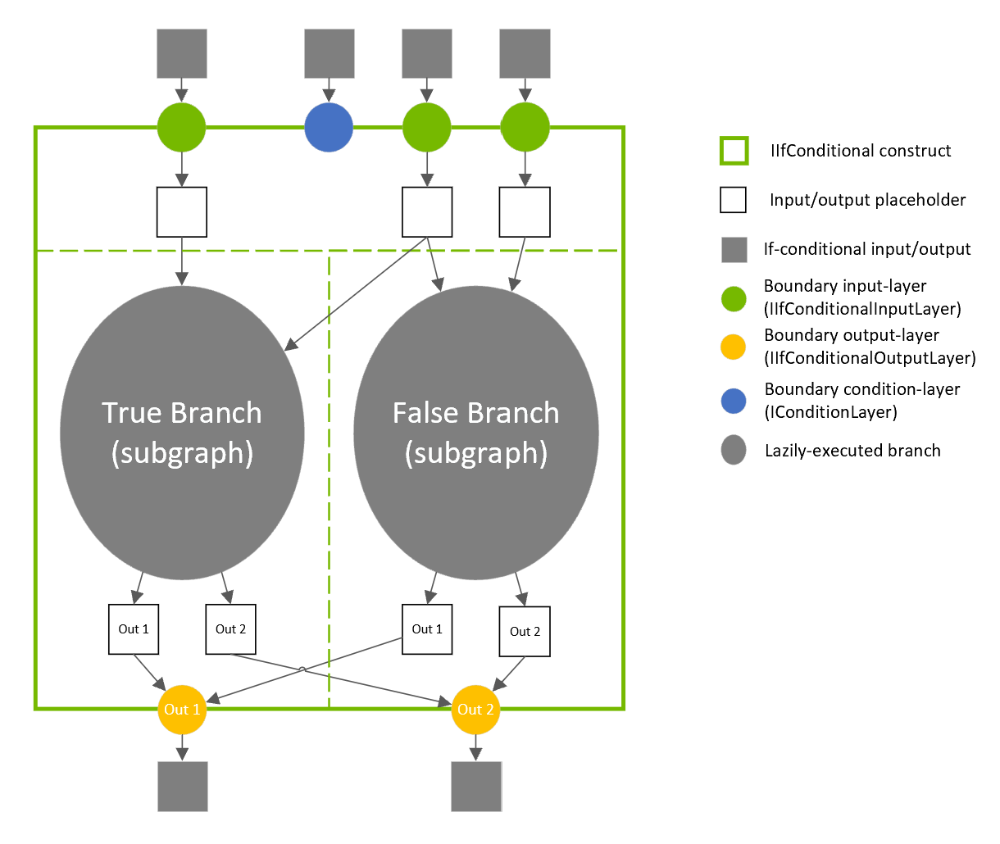

## 11.2. Conditional Execution

网络层的条件执行是一种网络评估策略，其中仅在需要分支输出的值时才执行分支层（属于条件子图的层）。在条件执行中，无论是真分支还是假分支都被执行并允许改变网络状态。

相反，在断定执行中，真分支和假分支都被执行，并且只允许其中之一改变网络评估状态，具体取决于条件断定的值（即仅其中一个的输出）子图被馈送到以下层。

条件执行有时称为惰性求值，断定执行有时称为急切求值。
`IIfConditionalInputLayer`的实例可用于指定急切调用哪些层以及延迟调用哪些层。这是通过从每个条件输出开始向后跟踪网络层来完成的。依赖于至少一个 `IIfConditionalInputLayer`输出的数据层被认为是条件内部的，因此被延迟评估。在没有 `IIfConditionalInputLayer`实例添加到条件条件的极端情况下，所有层都被急切地执行，类似于 `ISelectLayer` 。

下面的三个图表描述了 `IIfConditionalInputLayer`放置的选择如何控制执行调度。

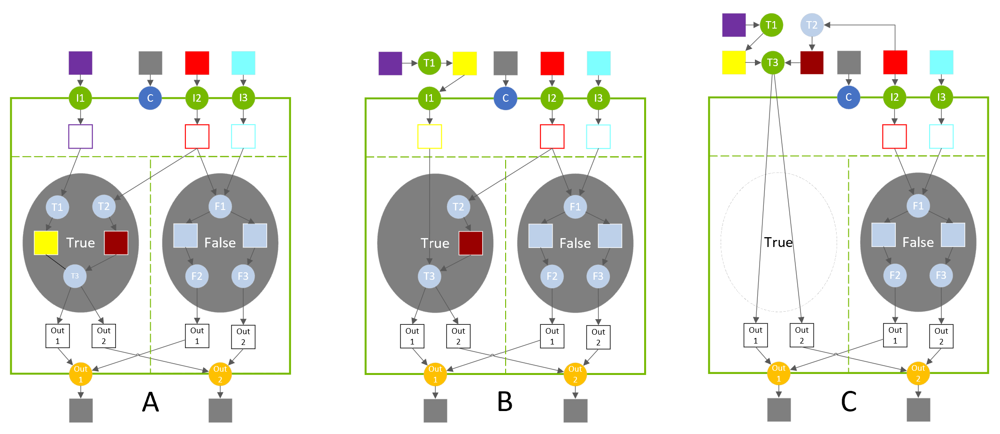

在图 A 中，真分支由 3 层（T1、T2、T3）组成。当条件评估为true时，这些层会延迟执行。

在图 B 中，输入层 I1 放置在层 T1 之后，它将 T1 移出真实分支。在评估 if 结构之前，T1 层急切地执行。

在图表 C 中，输入层 I1 被完全移除，这将 T3 移到条件之外。 T2 的输入被重新配置以创建合法网络，并且 T2 也移出真实分支。当条件评估为true时，条件不计算任何内容，因为输出已经被急切地计算（但它确实将条件相关输入复制到其输出）。

## 11.3. Nesting and Loops

条件分支可以嵌套其他条件，也可以嵌套循环。循环可以嵌套条件。与循环嵌套一样，TensorRT 从数据流中推断条件和循环的嵌套。例如，如果条件 B 使用在循环 A 内定义的值，则 B 被认为嵌套在 A 内。

真分支中的层与假分支中的层之间不能有交叉边，反之亦然。换句话说，一个分支的输出不能依赖于另一个分支中的层。

例如，请参阅[条件示例](https://docs.nvidia.com/deeplearning/tensorrt/developer-guide/index.html#conditional-examples)以了解如何指定嵌套。

## 11.4. Limitations

两个真/假子图分支中的输出张量数必须相同。来自分支的每个输出张量的类型和形状必须相同。

请注意，这比 ONNX 规范更受限制，ONNX 规范要求真/假子图具有相同数量的输出并使用相同的输出数据类型，但允许不同的输出形状。

## 11.5. Conditional Examples

### 11.5.1. Simple If-Conditional

下面的例子展示了如何实现一个简单的条件，它有条件地对两个张量执行算术运算。
**Conditional**

```C++
condition = true
If condition is true:
        output = x + y
Else:
        output = x - y
```

**Example**

```C++
ITensor* addCondition(INetworkDefinition& n, bool predicate)
{
    // The condition value is a constant int32 input that is cast to boolean because TensorRT doesn't support boolean constant layers.

    static const Dims scalarDims = Dims{0, {}};
    static float constexpr zero{0};
    static float constexpr one{1};

    float* const val = predicate ? &one : &zero;

    ITensor* cond = 
        n.addConstant(scalarDims, DataType::kINT32, val, 1})->getOutput(0);

    auto* cast = n.addIdentity(cond);
    cast->setOutputType(0, DataType::kBOOL);
    cast->getOutput(0)->setType(DataType::kBOOL);

    return cast->getOutput(0);
}

IBuilder* builder = createInferBuilder(gLogger);
INetworkDefinition& n = *builder->createNetworkV2(0U);
auto x = n.addInput("x", DataType::kFLOAT, Dims{1, {5}});
auto y = n.addInput("y", DataType::kFLOAT, Dims{1, {5}});
ITensor* cond = addCondition(n, true);

auto* simpleIf = n.addIfConditional();
simpleIf->setCondition(*cond);

// Add input layers to demarcate entry into true/false branches.
x = simpleIf->addInput(*x)->getOutput(0);
y = simpleIf->addInput(*y)->getOutput(0);

auto* trueSubgraph = n.addElementWise(*x, *y, ElementWiseOperation::kSUM)->getOutput(0);
auto* falseSubgraph = n.addElementWise(*x, *y, ElementWiseOperation::kSUB)->getOutput(0);

auto* output = simpleIf->addOutput(*trueSubgraph, *falseSubgraph)->getOutput(0);
n.markOutput(*output);
```

### 11.5.2. Exporting from PyTorch

以下示例展示了如何将脚本化的 PyTorch 代码导出到 ONNX。函数 `sum_even`中的代码执行嵌套在循环中的 if 条件。

```C++
import torch.onnx
import torch
import tensorrt as trt
import numpy as np

TRT_LOGGER = trt.Logger(trt.Logger.WARNING)
EXPLICIT_BATCH = 1 << (int)(trt.NetworkDefinitionCreationFlag.EXPLICIT_BATCH)

@torch.jit.script
def sum_even(items):
    s = torch.zeros(1, dtype=torch.float)
    for c in items:
        if c % 2 == 0:
            s += c
    return s

class ExampleModel(torch.nn.Module):
    def __init__(self):
        super().__init__()

    def forward(self, items):
        return sum_even(items)

def build_engine(model_file):
    builder = trt.Builder(TRT_LOGGER)
    network = builder.create_network(EXPLICIT_BATCH)
    config = builder.create_builder_config()
    parser = trt.OnnxParser(network, TRT_LOGGER)

    with open(model_file, 'rb') as model:
        assert parser.parse(model.read())
        return builder.build_engine(network, config)

def export_to_onnx():
    items = torch.zeros(4, dtype=torch.float)
    example = ExampleModel()
    torch.onnx.export(example, (items), "example.onnx", verbose=False, opset_version=13, enable_onnx_checker=False, do_constant_folding=True)

export_to_onnx()
build_engine("example.onnx")
```

# 12. TensorRT和DLA(Deep Learning Accelerator)

NVIDIA DLA（Deep Learning Accelerator--深度学习加速器）是一款针对深度学习操作的固定功能加速器引擎。 DLA 旨在对卷积神经网络进行全硬件加速。 DLA支持卷积、反卷积、全连接、激活、池化、批量归一化等各种层，DLA不支持Explicit Quantization 。

有关 TensorRT 层中 DLA 支持的更多信息，请参阅[DLA 支持的层](https://docs.nvidia.com/deeplearning/tensorrt/developer-guide/index.html#dla_layers)。 `trtexec`工具具有在 DLA 上运行网络的附加参数，请参阅[trtexec](https://docs.nvidia.com/deeplearning/tensorrt/developer-guide/index.html#trtexec) 。

`trtexec`在DLA 上运行 ResNet-50 FP16 网络：

` ./trtexec --onnx=data/resnet50/ResNet50.onnx --useDLACore=0 --fp16 --allowGPUFallback`

`trtexec`在DLA 上运行 ResNet-50 INT8 网络:

` ./trtexec --onnx=data/resnet50/ResNet50.onnx --useDLACore=0 --int8 --allowGPUFallback`

## 12.1. Running On DLA During TensorRT Inference

TensorRT 构建器可以配置为在 DLA 上启用推理。 DLA 支持目前仅限于在 `FP16` 或 `INT8` 模式下运行的网络。 `DeviceType`枚举用于指定网络或层在其上执行的设备。 `IBuilderConfig`类中的以下 API 函数可用于配置网络以使用 DLA：

**`setDeviceType(ILayer* layer, DeviceType deviceType)`**

此函数可用于设置层必须在其上执行的设备类型

**`getDeviceType(const ILayer* layer)`**

此函数可用于返回该层执行的设备类型。如果层在 GPU 上执行，则返回 `DeviceType::kGPU` 。

**`canRunOnDLA(const ILayer* layer)`**

此功能可用于检查层是否可以在 DLA 上运行。

**`setDefaultDeviceType(DeviceType deviceType)`**

此函数设置构建器使用的默认设备类型。它确保可以在 DLA 上运行的所有层都在 DLA 上运行，除非 `setDeviceType`用于覆盖层的 `deviceType` 。

**`getDefaultDeviceType()`**

此函数返回由 `setDefaultDeviceType` 设置的默认设备类型.

**`isDeviceTypeSet(const ILayer* layer)`**

此函数检查是否已为该层显式设置了 `deviceType` 。

**`resetDeviceType(ILayer* layer)`**

此函数重置此层的 `deviceType` 。如果未指定，该值将重置为由 `setDefaultDeviceType`或 `DeviceType::kGPU`指定的设备类型。

**`allowGPUFallback(bool setFallBackMode)`**

如果应该在 DLA 上运行的层无法在 DLA 上运行，此函数会通知构建器使用 GPU。有关详细信息，请参阅[GPU 回退模式](https://docs.nvidia.com/deeplearning/tensorrt/developer-guide/index.html#gpu_fallback)。

**`reset()`**

此函数可用于重置 `IBuilderConfig`状态，它将所有层的 `deviceType`设置为 `DeviceType::kGPU` 。重置后，构建器可以重新用于构建具有不同 DLA 配置的另一个网络。

`IBuilder`类中的以下 API 函数可用于帮助配置网络以使用 DLA：

**`getMaxDLABatchSize()`**

此函数返回 DLA 可以支持的最大批量大小。

**注意：对于任何张量，索引维度的总体积加上请求的批量大小不得超过此函数返回的值。**

**`getNbDLACores()`**

此函数返回用户可用的 DLA 内核数。

如果构建器不可访问，例如在推理应用程序中在线加载计划文件的情况下，则可以通过对 `IRuntime` 使用 DLA 扩展以不同方式指定要使用的DLA 。 `IRuntime`类中的以下 API 函数可用于配置网络以使用 DLA：

**`getNbDLACores()`**

此函数返回用户可访问的 DLA 内核数。

**`setDLACore(int dlaCore)`**

要在其上执行的 DLA 内核。其中 `dlaCore`是介于0和 `getNbDLACores() - 1`之间的值。默认值为0

**`getDLACore()`**

运行时执行分配到的 DLA 核心。默认值为 0。

### 12.1.1. Example: sampleMNIST With DLA

本节提供有关如何在启用 DLA 的情况下运行 TensorRT 示例的详细信息。

位于 GitHub 存储库中的[`sampleMNIST`](https://github.com/NVIDIA/TensorRT/tree/main/samples/sampleMNIST)演示了如何导入经过训练的模型、构建 TensorRT 引擎、序列化和反序列化引擎，最后使用引擎执行推理。

该示例首先创建构建器：

```C++
auto builder = SampleUniquePtr<nvinfer1::IBuilder>(nvinfer1::createInferBuilder(gLogger));
if (!builder) return false;
builder->setMaxBatchSize(batchSize);
```

然后，启用GPUFallback模式：

```C++
config->setFlag(BuilderFlag::kGPU_FALLBACK);
config->setFlag(BuilderFlag::kFP16); or config->setFlag(BuilderFlag::kINT8);
```

在 DLA 上启用执行，其中dlaCore指定要在其上执行的 DLA 内核：

```C++
config->setDefaultDeviceType(DeviceType::kDLA);
config->setDLACore(dlaCore);
```

通过这些额外的更改，sampleMNIST 已准备好在 DLA 上执行。要使用 DLA Core 1 运行 sampleMNIST，请使用以下命令：

```C++
 ./sample_mnist --useDLACore=0 [--int8|--fp16]
```

### 12.1.2. Example: Enable DLA Mode For A Layer During Network Creation

在这个例子中，让我们创建一个包含输入、卷积和输出的简单网络。

1.创建构建器、构建器配置和网络：

```C++
IBuilder* builder = createInferBuilder(gLogger);
IBuilderConfig* config = builder.createBuilderConfig();
INetworkDefinition* network = builder->createNetworkV2(0U);
```

2.使用输入维度将输入层添加到网络。

```C++
auto data = network->addInput(INPUT_BLOB_NAME, dt, Dims3{1, INPUT_H, INPUT_W});
```

3.添加具有隐藏层输入节点、步幅和权重的卷积层以用于卷积核和偏差。

```C++
auto conv1 = network->addConvolution(*data->getOutput(0), 20, DimsHW{5, 5}, weightMap["conv1filter"], weightMap["conv1bias"]);
conv1->setStride(DimsHW{1, 1});
```

4.将卷积层设置为在 DLA 上运行：

```C++
if(canRunOnDLA(conv1))
{
config->setFlag(BuilderFlag::kFP16); or config->setFlag(BuilderFlag::kINT8);
builder->setDeviceType(conv1, DeviceType::kDLA); 

}
```

5.标记输出

```C++
network->markOutput(*conv1->getOutput(0));
```

6.将 DLA 内核设置为在以下位置执行：

```C++
config->setDLACore(0)
```

## 12.2. DLA Supported Layers

本节列出了 DLA 支持的层以及与每个层相关的约束。

**在 DLA 上运行时的一般限制（适用于所有层）**

* 支持的最大批量大小为 4096。
* DLA 不支持动态尺寸。因此，对于通配符维度，配置文件的 `min` 、 `max`和 `opt`值必须相等。
* 如果违反了任何限制，并且启用了 `GpuFallback`, TensorRT可以将DLA网络分成多个部分。否则，TensorRT会发出错误并返回。更多信息，请参考[GPU回退模式](https://docs.nvidia.com/deeplearning/tensorrt/developer-guide/index.html#gpu_fallback)。
* 由于硬件和软件内存限制，最多可以同时使用四个 DLA 可加载项。

**注意： DLA 的批量大小是除CHW维度之外的所有索引维度的乘积。例如，如果输入维度为NPQRS ，则有效批量大小为N*P 。**

**层特定限制**

卷积层和全连接层

* 仅支持两个空间维度操作。
* 支持 FP16 和 INT8。
* 内核大小的每个维度都必须在[1, 32]范围内。
* 填充(Padding)必须在[0, 31]范围内。
* 填充的维度必须小于相应的内核维度。
* 步幅的尺寸必须在[1, 8]范围内。
* 输出映射的数量必须在[1, 8192]范围内。
* 对于使用格式 `TensorFormat::kLINEAR` 、 `TensorFormat::kCHW16`和 `TensorFormat::kCHW32`的操作，组数必须在[1, 8192]范围内。
* 对于使用格式 `TensorFormat::kCHW4`的操作，组数必须在[1, 4]范围内。
* 空洞卷积(Dilated convolution )必须在[1, 32]范围内。
* 如果 CBUF 大小要求 `wtBanksForOneKernel + minDataBanks`超过 `numConvBufBankAllotted`限制 `16` ，则不支持操作，其中 `CBUF` 是在对输入权重和激活进行操作之前存储输入权重和激活的内部卷积缓存， `wtBanksForOneKernel`是一个内核存储最小权重/卷积所需的核元素， `minDataBanks`是存储卷积所需的最小激活数据的最小库。伪代码细节如下：

```C++
wtBanksForOneKernel = uint32(ceil(roundUp(inputDims_c * kernelSize_h * kernelSize_w * (INT8 ? 1 : 2), 128) / 32768.0))

minDataBanks = uint32(ceil(float(entriesPerDataSlice * dilatedKernelHt) / 256.0)) where entriesPerDataSlice = uint32(ceil(ceil(inputDims_c * (INT8 ? 1 : 2) / 32.0) * inputDims_w / 4.0)) and dilatedKernelHt = (kernelSize_h - 1) * dilation_h + 1

FAIL if wtBanksForOneKernel + minDataBanks > 16, PASS otherwise.
```

**反卷积层**

* 仅支持两个空间维度操作。
* 支持 `FP16` 和 `INT8`。
* 除了 `1x[64, 96, 128]`和 `[64, 96, 128]x1`之外，内核的尺寸必须在 `[1, 32]`范围内。
* TensorRT 在 DLA 上禁用了反卷积平方内核并在 `[23 - 32]`范围内跨步，因为它们显着减慢了编译速度。
* 填充(Padding)必须为0 。
* 分组反卷积必须为1 。
* 扩张反卷积必须为1 。
* 输入通道数必须在[1, 8192]范围内。
* 输出通道数必须在[1, 8192]范围内。

**池化层**

* 仅支持两个空间维度操作。
* 支持 `FP16` 和 `INT8`。
* 支持的操作： `kMAX` ， `kAVERAGE` 。
* 窗口的尺寸必须在 `[1, 8]`范围内。
* 填充的尺寸必须在 `[0, 7]`范围内。
* 步幅的尺寸必须在[1, 16]范围内。
* 使用 `INT8` 模式，输入和输出张量标度必须相同。

**激活层**

* 仅支持两个空间维度操作。
* 支持 `FP16` 和 `INT8`。
* 支持的函数： `ReLU` 、 `Sigmoid` 、 `TanH` 、 `Clipped ReLU`和 `Leaky ReLU` 。
  * ReLU不支持负斜率。
  * Clipped ReLU仅支持[1, 127]范围内的值。
  * TanH , Sigmoid INT8 支持通过自动升级到 FP16 来支持。

**参数 ReLU 层**

* 斜率输入必须是构建时间常数。

**ElementWise 层**

* 仅支持两个空间维度操作。
* 支持 `FP16` 和 `INT8`。
* 支持的操作： `Sum` 、 `Sub` 、 `Product` 、 `Max`和 `Min` 。
* 

**注意：在 Xavier 上，TensorRT 将 DLA Scale 层和 DLA ElementWise 层与操作Sum连接以支持Sub操作，单个 Xavier DLA ElementWise 层不支持。**

**Scale层**

* 仅支持两个空间维度操作。
* 支持 `FP16` 和 `INT8`。
* 支持的模式： `Uniform` 、 `Per-Channel`和 `ElementWise` 。
* 仅支持缩放和移位操作。

**LRN（局部响应归一化）层**

* 允许的窗口大小为3 、 5 、 7或9 。
* 支持的规范化区域是ACROSS_CHANNELS 。
* LRN INT8。

**连接层**

* DLA 仅支持沿通道轴连接。
* Concat 必须至少有两个输入。
* 所有输入必须具有相同的空间维度。
* 对于 INT8 模式，所有输入的动态范围必须相同。
* 对于 INT8 模式，输出的动态范围必须等于每个输入。

**Resize层**

* 刻度的数量必须正好是4 。
* scale 中的前两个元素必须正好为1 （对于未更改的批次和通道尺寸）。
* scale 中的最后两个元素，分别表示沿高度和宽度维度的比例值，在最近邻模式下需要为[1, 32]范围内的整数值，在双线性模式下需要为[1, 4]范围内的整数值。

**Unary 层**

* 仅支持 ABS 操作。

**Softmax 层**

* 仅支持 NVIDIA Orin™，不支持 Xavier™。
* 仅支持批量大小为 1 的单个输入。
* 输入的非批量、非轴维度都应该是大小 1。例如，对于轴 = 1 的 softmax（即在 C 维度上），H 和 W 维度的大小都应该是 1。

**注意：当使用 TensorRT 在 DLA 上运行 INT8 网络时，建议将操作添加到同一子图中，以通过允许它们融合并为中间结果保留更高的精度来减少在 DLA 上运行的网络的子图上的量化误差。通过将张量设置为网络输出张量来拆分子图以检查中间结果可能会由于禁用这些优化而导致不同级别的量化误差。**

## 12.3. GPU Fallback Mode

如果被标记为在DLA上运行的层不能在DLA上运行，则 `GPUFallbackMode`设置生成器使用GPU。

由于以下原因，层无法在 DLA 上运行：

1. DLA 不支持层操作。
2. 指定的参数超出了 DLA 支持的范围。
3. 给定的批量大小超过了允许的最大 DLA 批量大小。有关详细信息，请参阅[DLA 支持的层](https://docs.nvidia.com/deeplearning/tensorrt/developer-guide/index.html#dla_layers)。
4. 网络中的层组合导致内部状态超过 DLA 能够支持的状态。
5. 平台上没有可用的 DLA 引擎。

如果 `GPUFallbackMode`设置为 `false` ，则设置为在 DLA 上执行但无法在 DLA 上运行的层会导致错误。但是，将 `GPUFallbackMode`设置为 `true`后，它会在报告警告后继续在 GPU 上执行。

同样，如果 `defaultDeviceType`设置为 `DeviceType::kDLA`并且 `GPUFallbackMode`设置为 `false` ，则如果任何层无法在 DLA 上运行，则会导致错误。将 `GPUFallbackMode`设置为 `true`时，它会报告警告并继续在 GPU 上执行。

如果网络中的层组合无法在 DLA 上运行，则组合中的所有层都在 GPU 上执行。

## 12.4. I/O Formats on DLA

DLA 支持设备独有的格式，并且由于矢量宽度字节要求而对其布局有限制。

对于 DLA 输入，支持 `kDLA_LINEAR ( FP16 , INT8 )`、 `kDLA_HWC4 ( FP16 , INT8 )`、 `kCHW16 ( FP16 )` 和 `kCHW32 ( INT8 )`。对于 DLA 输出，仅支持 `kDLA_LINEAR ( FP16 , INT8 )`、 `kCHW16 ( FP16 )` 和 `kCHW32 ( INT8 )`。对于 `kCHW16`和 `kCHW32`格式，如果C不是整数倍，则必须将其填充到下一个 32 字节边界。

对于 `kDLA_LINEAR`格式，沿W维度的步幅必须最多填充 64 个字节。内存格式等效于维度为 `[N][C][H][roundUp(W, 64/elementSize)]`的C数组，其中 `FP16`的 `elementSize`为 2， `Int8`为 1 ，张量坐标为 `(n, c, h, w)`映射到数组下标 `[n][c][h][w]` 。

对于 `kDLA_HWC4`格式，沿 `W`维度的步幅必须是 Xavier 上 32 字节和 Orin 上 64 字节的倍数。

* 当 `C == 1`时，TensorRT 将格式映射到本机灰度图像格式。
* 当 `C == 3`或 `C == 4`时，它映射到本机彩色图像格式。如果 `C == 3` ，沿 `W`轴步进的步幅需要填充为 4 个元素。

  在这种情况下，填充通道位于第 4 个索引处。理想情况下，填充值无关紧要，因为权重中的第 4 个通道被 DLA 编译器填充为零；但是，应用程序分配四个通道的零填充缓冲区并填充三个有效通道是安全的。
* 当 `C`为 `{1, 3, 4}`时，填充后的 `C'`分别为 `{1, 4, 4}` ，内存布局等价于维度为 `[N][H][roundUp(W, 32/C'/elementSize)][C']`的C数组, 其中 `elementSize`对于 `FP16`为 2，对于 `Int8`为 1 。张量坐标 `(n, c, h, w)`映射到数组下标 `[n][h][w][c]` ， `roundUp`计算大于或等于 `W`的 `64/elementSize`的最小倍数。

使用 `kDLA_HWC4`作为 DLA 输入格式时，有以下要求：

* C必须是1 、 3或4
* 第一层必须是卷积。
* 卷积参数必须满足 DLA 要求，请参阅D[LA Supported Layers](https://docs.nvidia.com/deeplearning/tensorrt/developer-guide/index.html#dla_layers) 。

当 `EngineCapability`为 `EngineCapability::kSTANDARD`且 TensorRT 无法为给定的输入/输出格式生成无重构网络时，可以自动将不支持的 DLA 格式转换为支持的 DLA 格式。例如，如果连接到网络输入或输出的层不能在 DLA 上运行，或者如果网络不满足其他 DLA 要求，则插入重新格式化操作以满足约束。在所有情况下，TensorRT 期望数据格式化的步幅都可以通过查询 `IExecutionContext::getStrides`来获得。

## 12.5. DLA Standalone Mode

如果您使用单独的 DLA 运行时组件，则可以使用 `EngineCapability::kDLA_STANDALONE`生成 DLA 可加载项。请参阅相关 DLA 运行时组件的文档以了解如何使用可加载项。

当使用 `kDLA_STANDALONE`时，TensorRT 为给定的输入/输出格式生成一个无重新格式化的网络。对于 DLA 输入，支持 `kLINEAR ( FP16 , INT8 )`、 `kCHW4 ( FP16 , INT8 )`、 `kCHW16 ( FP16 )` 和 `kCHW32 ( INT8 )`。而对于 DLA 输出，仅支持 `kLINEAR ( FP16 , INT8 )`、 `kCHW16 ( FP16 )` 和 `kCHW32 ( INT8 )`。对于 `kCHW16`和 `kCHW32`格式，建议C通道数等于向量大小的正整数倍。如果C不是整数倍，则必须将其填充到下一个 32 字节边界。

## 12.6. Customizing DLA Memory Pools

您可以自定义分配给网络中每个可加载的 DLA 的内存池的大小。共有三种类型的 DLA 内存池（有关每个池的描述，请参见枚举类 `MemoryPoolType` ）：

* Managed SRAM
* Local DRAM
* Global DRAM

对于每种池类型，使用 API `IBuilderConfig::setMemoryPoolLimit`和 `IBuilderConfig::getMemoryPoolLimit`来设置和查询相关池的大小，以便为每个可加载的 DLA 分配更大的内存池。每个可加载的实际需要的内存量可能小于池大小，在这种情况下将分配较小的量。池大小仅用作上限。

请注意，所有 DLA 内存池都需要大小为 2 的幂，最小为 4 KiB。违反此要求会导致 DLA 可加载编译失败。

Managed SRAM 与其他 DRAM 池的区别主要在于角色的不同。以下是Managed SRAM 的一些值得注意的方面：

* 它类似于缓存，因为资源稀缺，DLA 可以通过回退到本地 DRAM 来运行而无需它。
* 任何分配往往都会被充分利用。因此，报告的 SRAM 通常与分配的 SRAM 池的数量相同（在某些情况下可能与用户指定的大小不同）。
* 由于类似于缓存的性质，DLA 在 SRAM 不足时会回退到 DRAM，而不是失败。因此，如果可以负担得起，即使在成功的引擎构建之后也尝试增加 SRAM 的数量，以查看推理速度是否有任何提升。这尤其适用于卸载许多子图的网络。
* Orin 和 Xavier 在每个内核可用的最大 SRAM 数量方面存在差异：Xavier 在 4 个内核（包括 2 个 DLA 内核）中提供总共 4 MiB 的 SRAM，而 Orin 为每个 DLA 内核专用 1 MiB SRAM。这意味着当在一个设备上运行多个网络时，Xavier 需要明确控制总体 SRAM 消耗，而 Orin 在这方面不必担心。

在多子图情况下，重要的是要记住池大小适用于每个 DLA 子图，而不是整个网络。

# 13. TensorRT的最佳性能实践

## 13.1. Measuring Performance

在开始使用 TensorRT 进行任何优化工作之前，必须确定应该测量什么。没有衡量标准，就不可能取得可靠的进展或衡量是否取得了成功

**Latency**

网络推理的性能度量是从输入呈现给网络到输出可用所经过的时间。这是单个推理的网络**延迟**。较低的延迟更好。在某些应用中，低延迟是一项关键的安全要求。在其他应用程序中，延迟作为服务质量问题对用户来说是直接可见的。对于批量处理，**延迟可能根本不重要**。

**Throughput**

另一个性能测量是在固定的时间单位内可以完成多少推理。这是网络的**吞吐量**。吞吐量越高越好。更高的吞吐量表明更有效地利用固定计算资源。对于批量处理，所花费的总时间将由网络的吞吐量决定。

查看延迟和吞吐量的另一种方法是确定最大延迟并在该延迟下测量吞吐量。像这样的服务质量测量可以是用户体验和系统效率之间的合理折衷。

在测量延迟和吞吐量之前，您需要选择开始和停止计时的确切点。根据网络和应用程序，选择不同的点可能是有意义的。

在很多应用中，都有一个处理流水线，整个系统的性能可以通过整个处理流水线的延迟和吞吐量来衡量。由于预处理和后处理步骤在很大程度上取决于特定应用程序，因此本节仅考虑网络推理的延迟和吞吐量。

### 13.1.1. Wall-clock Timing

经过时间（计算开始和结束之间经过的时间）可用于测量应用程序的整体吞吐量和延迟，以及将推理时间置于更大系统的上下文中。 C++11 在 `<chrono>`标准库中提供了高精度计时器。例如， `std::chrono::system_clock`表示系统范围的经过时间，而 `std::chrono::high_resolution_clock`以可用的最高精度测量时间。

以下示例代码片段显示了测量网络推理主机时间：

```C++
#include <chrono>

auto startTime = std::chrono::high_resolution_clock::now();
context->enqueueV2(&buffers[0], stream, nullptr);
cudaStreamSynchronize(stream);
auto endTime = std::chrono::high_resolution_clock::now();
float totalTime = std::chrono::duration<float, std::milli>
(endTime - startTime).count();
```

如果设备上一次只发生一个推理，那么这可能是一种简单的方法来分析各种操作所花费的时间。推理通常是异步的，因此请确保添加显式 CUDA 流或设备同步以等待结果可用。

### 13.1.2. CUDA Events

仅在主机上计时的一个问题是它需要主机/设备同步。优化的应用程序可能会在设备上并行运行许多推理，并具有重叠的数据移动。此外，同步本身给定时测量增加了一些噪声。
为了帮助解决这些问题，CUDA 提供了一个事件 API 。此 API 允许您将事件放入 CUDA 流中，这些事件将在遇到事件时由 GPU 打上时间戳。然后，时间戳的差异可以告诉您不同操作花费了多长时间。

以下示例代码片段显示了计算两个 CUDA 事件之间的时间：

```C++
cudaEvent_t start, end;
cudaEventCreate(&start);
cudaEventCreate(&end);

cudaEventRecord(start, stream);
context->enqueueV2(&buffers[0], stream, nullptr);
cudaEventRecord(end, stream);

cudaEventSynchronize(end);
float totalTime;
cudaEventElapsedTime(&totalTime, start, end);
```

### 13.1.3. Built-In TensorRT Profiling

深入挖掘推理性能需要在优化网络中进行更细粒度的时序测量。
TensorRT 有一个**Profiler** ( [C++](https://docs.nvidia.com/deeplearning/tensorrt/api/c_api/classnvinfer1_1_1_i_profiler.html) , [Python](https://docs.nvidia.com/deeplearning/tensorrt/api/python_api/infer/Core/Profiler.html) ) 接口，您可以实现该接口以便让 TensorRT 将分析信息传递给您的应用程序。调用时，网络将以分析模式运行。完成推理后，将调用您的类的分析器对象以报告网络中每一层的时间。这些时序可用于定位瓶颈、比较序列化引擎的不同版本以及调试性能问题。

分析信息可以从常规推理 `enqueueV2()`启动或 CUDA 图启动中收集。有关详细信息，请参阅 `IExecutionContext::setProfiler()`和 `IExecutionContext::reportToProfiler()` （ [C++](https://docs.nvidia.com/deeplearning/tensorrt/api/c_api/classnvinfer1_1_1_i_execution_context.html#a0e7271a7ea69c348f64db31b96103620) 、 [Python](https://docs.nvidia.com/deeplearning/tensorrt/api/python_api/infer/Core/ExecutionContext.html?highlight=report_to_profiler#tensorrt.IExecutionContext.report_to_profiler) ）。

循环内的层编译为单个单片层，因此，这些层的单独时序不可用。

公共示例代码 ( `common.h` ) 中提供了一个展示如何使用 `IProfiler`接口的示例，然后在位于 GitHub 存储库中的[sampleNMT](https://github.com/NVIDIA/TensorRT/tree/main/samples/sampleNMT)中使用。

您还可以使用 `trtexec`在给定输入网络或计划文件的情况下使用 TensorRT 分析网络。有关详细信息，请参阅[trtexec](https://docs.nvidia.com/deeplearning/tensorrt/developer-guide/index.html#trtexec)部分。

### 13.1.4. CUDA Profiling Tools

推荐的 CUDA 分析器是NVIDIA Nsight™ Systems 。一些 CUDA 开发人员可能更熟悉 nvprof 和 nvvp，但是，这些已被弃用。在任何情况下，这些分析器都可以用于任何 CUDA 程序，以报告有关在执行期间启动的内核、主机和设备之间的数据移动以及使用的 CUDA API 调用的时序信息。

Nsight Systems 可以通过多种方式配置，以仅报告程序执行的一部分的时序信息，或者也可以将传统的 CPU 采样配置文件信息与 GPU 信息一起报告。

**仅分析推理阶段**

分析 TensorRT 应用程序时，您应该仅在构建引擎后启用分析。在构建阶段，所有可能的策略都被尝试和计时。分析这部分执行将不会显示任何有意义的性能测量，并将包括所有可能的内核，而不是实际选择用于推理的内核。限制分析范围的一种方法是：

* 第一阶段：构建应用程序，然后在一个阶段序列化引擎。
* 第二阶段：加载序列化引擎并在第二阶段运行推理并仅对第二阶段进行分析。
* 

如果应用程序无法序列化引擎，或者应用程序必须连续运行两个阶段，您还可以在第二阶段周围添加 `cudaProfilerStart() / cudaProfilerStop()` CUDA API，并在 Nsight Systems 命令中添加 `-c cudaProfilerApi`标志以仅配置文件 `cudaProfilerStart()和cudaProfilerStop()`之间的部分。

在 Nsight Systems 中使用 `NVTX` 跟踪
启用NVIDIA 工具扩展 SDK (NVTX)跟踪允许 Nsight Compute 和 Nsight Systems 收集由 TensorRT 应用程序生成的数据。 NVTX 是一个基于 C 的 API，用于标记应用程序中的事件和范围。

将内核名称解码回原始网络中的层可能很复杂。因此，TensorRT 使用 NVTX 为每一层标记一个范围，然后允许 CUDA 分析器将每一层与调用来实现它的内核相关联。在 TensorRT 中，NVTX 有助于将运行时引擎层的执行与 CUDA内核调用相关联。 Nsight Systems 支持在时间轴上收集和可视化这些事件和范围。 Nsight Compute 还支持在应用程序挂起时收集和显示给定线程中所有活动 NVTX 域和范围的状态。

在 TensorRT 中，每一层都可以启动一个或多个内核来执行其操作。启动的确切内核取决于优化的网络和存在的硬件。根据构建器的选择，可能会有多个额外的操作对穿插在层计算中的数据进行重新排序；这些重新格式化操作可以作为设备到设备的内存副本或自定义内核来实现。

例如，以下屏幕截图来自 Nsight Systems。

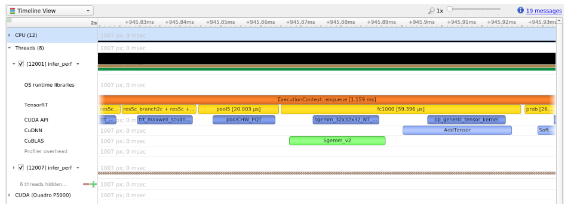

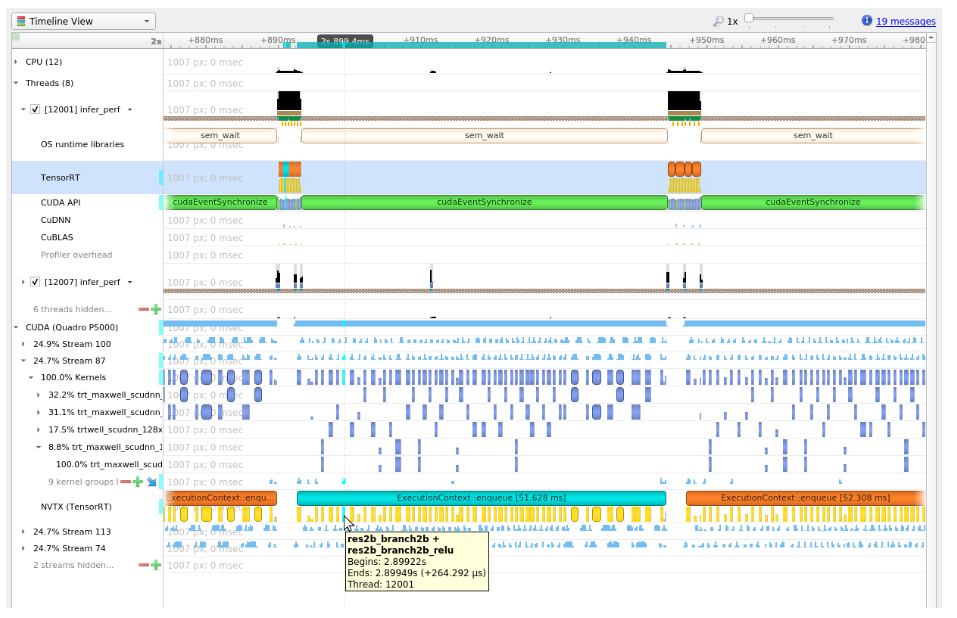

**控制 NVTX 跟踪中的详细程度**

默认情况下，TensorRT 仅在 NVTX 标记中显示层名称，而用户可以在构建引擎时通过设置 `IBuilderConfig`中的 `ProfilingVerbosity` 来控制细节级别。例如，要禁用 NVTX 跟踪，请将 `ProfilingVerbosity` 设置为 `kNONE` ：

**C++**

`builderConfig->setProfilingVerbosity(ProfilingVerbosity::kNONE);`

**Python**

`builder_config.profiling_verbosity = trt.ProfilingVerbosity.NONE`

另一方面，您可以通过将 `ProfilingVerbosity`设置为 `kDETAILED`来选择允许 TensorRT 在 NVTX 标记中打印更详细的层信息，包括输入和输出尺寸、操作、参数、顺序编号等：

**C++**

`builderConfig->setProfilingVerbosity(ProfilingVerbosity::kDETAILED);`

**Python**

`builder_config.profiling_verbosity = trt.ProfilingVerbosity.DETAILED`

trtexec运行 Nsight 系统
以下是使用trtexec工具收集 Nsight Systems 配置文件的命令示例：

`trtexec --onnx=foo.onnx --profilingVerbosity=detailed --saveEngine=foo.plan`

`nsys profile -o foo_profile trtexec --loadEngine=foo.plan --warmUp=0 --duration=0 --iterations=50`

第一个命令构建引擎并将其序列化为 `foo.plan` ，第二个命令使用 `foo.plan`运行推理并生成一个 `foo_profile.qdrep`文件，然后可以在 Nsight Systems GUI 界面中打开该文件以进行可视化。

`--profilingVerbosity=detailed`标志允许 TensorRT 在 NVTX 标记中显示更详细的层信息，而 `--warmUp =0` `--duration=0` `--iterations=50`标志允许您控制要运行的推理迭代次数。默认情况下， trtexec运行推理三秒钟，这可能会导致输出 `qdrep` 文件非常大。

### 13.1.5. Tracking Memory

跟踪内存使用情况与执行性能一样重要。通常，设备上的内存比主机上的内存更受限制。为了跟踪设备内存，推荐的机制是创建一个简单的自定义 GPU 分配器，它在内部保留一些统计信息，然后使用常规 CUDA 内存分配函数 `cudaMalloc`和 `cudaFree` 。

可以为构建器 `IBuilder`设置自定义 GPU 分配器以进行网络优化，并在使用 `IGpuAllocator` API反序列化引擎时为 `IRuntime` 设置。自定义分配器的一个想法是跟踪当前分配的内存量，并将带有时间戳和其他信息的分配事件推送到分配事件的全局列表中。查看分配事件列表可以分析一段时间内的内存使用情况。

在移动平台上，GPU 内存和 CPU 内存共享系统内存。在内存大小非常有限的设备上，如 Nano，系统内存可能会因大型网络而耗尽；甚至所需的 GPU 内存也小于系统内存。在这种情况下，增加系统交换大小可以解决一些问题。一个示例脚本是：

```C++
echo "######alloc swap######"
if [ ! -e /swapfile ];then
    sudo fallocate -l 4G /swapfile
    sudo chmod 600 /swapfile
    sudo mkswap /swapfile
    sudo /bin/sh -c 'echo  "/swapfile \t none \t swap \t defaults \t 0 \t 0" >> /etc/fstab'
    sudo swapon -a
fi
```

## 13.2. Optimizing TensorRT Performance

以下部分重点介绍 GPU 上的一般推理流程和一些提高性能的一般策略。这些想法适用于大多数 CUDA 程序员，但对于来自其他背景的开发人员可能并不那么明显。

### 13.2.1. Batching

最重要的优化是使用批处理并行计算尽可能多的结果。在 TensorRT 中，批次是可以统一处理的输入的集合。批次中的每个实例都具有相同的形状，并以完全相同的方式流经网络。因此，每个实例都可以简单地并行计算。

网络的每一层都有计算前向推理所需的一定数量的开销和同步。通过并行计算更多结果，这种开销可以更有效地得到回报。此外，许多层的性能受到输入中最小维度的限制。如果批量大小为 1 或较小，则此大小通常可能是性能限制维度。例如，具有V个输入和K个输出的完全连接层可以针对一个批次实例实现为1xV矩阵与VxK权重矩阵的矩阵乘法。如果对N个实例进行批处理，则这将变为NxV乘以VxK矩阵。向量矩阵乘法器变成矩阵矩阵乘法器，效率更高。

更大的批量大小几乎总是在 GPU 上更有效。非常大的批次，例如N > 2^16 ，有时可能需要扩展索引计算，因此应尽可能避免。但通常，增加批量大小会提高总吞吐量。此外，当网络包含 `MatrixMultiply` 层或完全连接层时，如果硬件支持，由于使用了 Tensor Cores，32 的倍数的批大小往往对 FP16 和 INT8 推理具有最佳性能。

由于应用程序的组织，有时无法进行批处理推理工作。在一些常见的应用程序中，例如根据请求进行推理的服务器，可以实现机会批处理。对于每个传入的请求，等待时间T 。如果在此期间有其他请求进来，请将它们一起批处理。否则，继续进行单实例推理。这种类型的策略为每个请求增加了固定的延迟，但可以将系统的最大吞吐量提高几个数量级。

**使用批处理**

如果在创建网络时使用显式批处理模式，则批处理维度是张量维度的一部分，您可以通过添加优化配置文件来指定批处理大小和批处理大小的范围以优化引擎。有关更多详细信息，请参阅[使用动态形状](https://docs.nvidia.com/deeplearning/tensorrt/developer-guide/index.html#work_dynamic_shapes)部分。

如果在创建网络时使用隐式批处理模式，则 `IExecutionContext::execute `（ Python 中的 `IExecutionContext.execute` ）和 `IExecutionContext::enqueue` （ Python 中的 `IExecutionContext.execute_async` ）方法采用批处理大小参数。在使用 `IBuilder::setMaxBatchSize` （ Python中的 `Builder.max_batch_size` ）构建优化网络时，还应该为构建器设置最大批量大小。当调用 `IExecutionContext::execute`或 `enqueue`时，作为绑定参数传递的绑定是按张量组织的，而不是按实例组织的。换句话说，一个输入实例的数据没有组合到一个连续的内存区域中。相反，每个张量绑定都是该张量的实例数据数组。

另一个考虑因素是构建优化的网络会针对给定的最大批量大小进行优化。最终结果将针对最大批量大小进行调整，但对于任何较小的批量大小仍然可以正常工作。可以运行多个构建操作来为不同的批量大小创建多个优化引擎，然后在运行时根据实际批量大小选择要使用的引擎。

### 13.2.2. Streaming

一般来说，CUDA 编程流是一种组织异步工作的方式。放入流中的异步命令保证按顺序运行，但相对于其他流可能会乱序执行。特别是，两个流中的异步命令可以被调度为同时运行（受硬件限制）。

在 TensorRT 和推理的上下文中，优化的最终网络的每一层都需要在 GPU 上工作。但是，并非所有层都能够充分利用硬件的计算能力。在单独的流中安排请求允许在硬件可用时立即安排工作，而无需进行不必要的同步。即使只有一些层可以重叠，整体性能也会提高。

**使用流式传输**

1. 识别独立的推理批次。
2. 为网络创建一个引擎。
3. `cudaStreamCreate`为每个独立批次创建一个 CUDA 流，并为每个独立批次创建一个 `IExecutionContext` 。
4. `IExecutionContext::enqueue`从适当的 `IExecutionContext`请求异步结果并传入适当的流来启动推理工作。
5. 在所有工作启动后，与所有流同步以等待结果。执行上下文和流可以重用于以后的独立工作批次。

**多个流**
运行多个并发流通常会导致多个流同时共享计算资源的情况。这意味着与优化 TensorRT 引擎时相比，推理期间网络可用的计算资源可能更少。这种资源可用性的差异可能会导致 TensorRT 选择一个对于实际运行时条件不是最佳的内核。为了减轻这种影响，您可以在引擎创建期间限制可用计算资源的数量，使其更接近实际运行时条件。这种方法通常以延迟为代价来提高吞吐量。有关更多信息，请参阅[限制计算资源](https://docs.nvidia.com/deeplearning/tensorrt/developer-guide/index.html#limit-compute-resources)。

也可以将多个主机线程与流一起使用。一种常见的模式是将传入的请求分派到等待工作线程池中。在这种情况下，工作线程池将每个都有一个执行上下文和 CUDA 流。当工作变得可用时，每个线程将在自己的流中请求工作。每个线程将与其流同步以等待结果，而不会阻塞其他工作线程。

### 13.2.3. CUDA Graphs

[CUDA 图](https://docs.nvidia.com/cuda/cuda-c-programming-guide/index.html#cuda-graphs)是一种表示内核序列（或更一般地是图）的方式，其调度方式允许由 CUDA 优化。当您的应用程序性能对将内核排入队列所花费的 CPU 时间敏感时，这可能特别有用。
TensorRT 的 `enqueuev2()`方法支持对不需要 CPU 交互的模型进行 CUDA 图捕获。例如：

**C++**

```C++
// Capture a CUDA graph instance
cudaGraph_t graph;
cudaGraphExec_t instance;
cudaStreamBeginCapture(stream, cudaStreamCaptureModeGlobal);
context->enqueueV2(buffers, stream, nullptr);
cudaStreamEndCapture(stream, &graph);
cudaGraphInstantiate(&instance, graph, NULL, NULL, 0);

// To run inferences:
cudaGraphLaunch(instance, stream);
cudaStreamSynchronize(stream);
```

不支持图的模型包括带有循环或条件的模型。在这种情况下， `cudaStreamEndCapture()`将返回 `cudaErrorStreamCapture*`错误，表示图捕获失败，但上下文可以继续用于没有 CUDA 图的正常推理。

捕获图时，重要的是要考虑在存在动态形状时使用的两阶段执行策略。

1. 更新模型的内部状态以考虑输入大小的任何变化
2. 将工作流式传输到 GPU

对于在构建时输入大小固定的模型，第一阶段不需要每次调用工作。否则，如果自上次调用以来输入大小发生了变化，则可能需要进行一些工作来更新派生属性。

第一阶段的工作不是为捕获而设计的，即使捕获成功也可能会增加模型执行时间。因此，在更改输入的形状或形状张量的值后，调用 `enqueueV2()`一次以在捕获图形之前刷新延迟更新。

使用 TensorRT 捕获的图特定于捕获它们的输入大小，以及执行上下文的状态。修改捕获图表的上下文将导致执行图表时未定义的行为 - 特别是，如果应用程序通过 `createExecutionContextWithoutDeviceMemory()`为激活提供自己的内存，则内存地址也会作为图表的一部分被捕获。绑定位置也被捕获为图表的一部分。

`trtexec`允许您检查构建的 TensorRT 引擎是否与 CUDA 图形捕获兼容。有关详细信息，请参阅[trtexec](https://docs.nvidia.com/deeplearning/tensorrt/developer-guide/index.html#trtexec)部分。

### 13.2.4. Enabling Fusion

#### 13.2.4.1. Layer Fusion

TensorRT 尝试在构建阶段在网络中执行许多不同类型的优化。在第一阶段，尽可能将层融合在一起。融合将网络转换为更简单的形式，但保持相同的整体行为。在内部，许多层实现具有在创建网络时无法直接访问的额外参数和选项。相反，融合优化步骤检测支持的操作模式，并将多个层融合到一个具有内部选项集的层中。

考虑卷积后跟 `ReLU` 激活的常见情况。要创建具有这些操作的网络，需要使用 `addConvolution` 添加卷积层，然后使用 `addActivation`和 `kRELU`的 `ActivationType`添加激活层。未优化的图将包含用于卷积和激活的单独层。卷积的内部实现支持直接从卷积核一步计算输出上的 ReLU 函数，而无需第二次内核调用。融合优化步骤将检测 ReLU 之后的卷积，验证实现是否支持这些操作，然后将它们融合到一层。

为了调查哪些融合已经发生或没有发生，构建器将其操作记录到构建期间提供的记录器对象。优化步骤在 `kINFO`日志级别。要查看这些消息，请确保将它们记录在 `ILogger`回调中。

融合通常通过创建一个新层来处理，该层的名称包含被融合的两个层的名称。例如，在 MNIST 中，名为 `ip1` 的全连接层（`InnerProduct`）与名为 `relu1`的 `ReLU` 激活层融合，以创建名为 `ip1 + relu1`的新层。

#### 13.2.4.2. Types Of Fusions

以下列表描述了支持的融合类型。

**支持的层融合**

**ReLU ReLU Activation**

执行 ReLU 的激活层，然后执行 ReLU 的激活将被单个激活层替换。

**Convolution and ReLU Activation**
卷积层可以是任何类型，并且对值没有限制。激活层必须是 ReLU 类型。

**Convolution and GELU Activation**

输入输出精度要一致；它们都是 `FP16` 或 `INT8`。激活层必须是 `GELU `类型。 TensorRT 应该在具有 CUDA 10.0 或更高版本的 Turing 或更高版本的设备上运行。

**Convolution and Clip Activation**

卷积层可以是任何类型，并且对值没有限制。激活层必须是Clip类型。

**Scale and Activation**

Scale 层后跟一个 Activation 层可以融合成一个 Activation 层。

**Convolution And ElementWise Operation**

卷积层后跟 ElementWise 层中的简单求和、最小值或最大值可以融合到卷积层中。总和不得使用广播，除非广播跨越批量大小。

**Padding and Convolution/Deconvolution**

如果所有填充大小都是非负的，则可以将后跟卷积或反卷积的填充融合到单个卷积/反卷积层中。

**Shuffle and Reduce**

一个没有 reshape 的 Shuffle 层，然后是一个 Reduce 层，可以融合成一个 Reduce 层。 Shuffle 层可以执行排列，但不能执行任何重塑操作。 Reduce 层必须有一组keepDimensions维度。

**Shuffle and Shuffle**

每个 Shuffle 层由转置、重塑和第二个转置组成。一个 Shuffle 层后跟另一个 Shuffle 层可以被单个 Shuffle 替换（或什么都没有）。如果两个 Shuffle 层都执行 reshape 操作，则只有当第一个 shuffle 的第二个转置是第二个 shuffle 的第一个转置的逆时，才允许这种融合。

**Scale**
可以擦除添加0 、乘以1或计算 1 的幂的Scale 层。

**Convolution and Scale**

卷积层后跟kUNIFORM或kCHANNEL的 Scale 层融合为单个卷积。如果秤具有非恒定功率参数，则禁用此融合。

**Reduce**

执行平均池化的 Reduce 层将被 Pooling 层取代。 Reduce 层必须有一个keepDimensions集，使用kAVG操作在批处理之前从CHW输入格式减少H和W维度。

Convolution and Pooling
卷积层和池化层必须具有相同的精度。卷积层可能已经具有来自先前融合的融合激活操作。

**Depthwise Separable Convolution**
带有激活的深度卷积，然后是带有激活的卷积，有时可能会融合到单个优化的 DepSepConvolution 层中。两个卷积的精度必须为 INT8，并且设备的计算能力必须为 7.2 或更高版本。

**SoftMax and Log**

如果 SoftMax 尚未与先前的日志操作融合，则可以将其融合为单个 Softmax 层。

**SoftMax 和 TopK**

可以融合成单层。 SoftMax 可能包含也可能不包含 Log 操作。

**FullyConnected**

FullyConnected 层将被转换为 Convolution 层，所有用于卷积的融合都会生效。

**Supported Reduction Operation Fusions**

**GELU**

一组表示以下方程的 `Unary` 层和 `ElementWise` 层可以融合到单个 GELU 归约操作中。

$0.5x × (1+tanh (2/π (x+0.044715x^3)))$

或替代表示：
$0.5x × (1+erf (x/\sqrt{2}))$

**L1Norm**

一个一元层kABS操作和一个 Reduce 层kSUM操作可以融合成一个 L1Norm 归约操作。

**Sum of Squares**

具有相同输入（平方运算）的乘积 ElementWise 层后跟kSUM 约简可以融合为单个平方和约简运算。

**L2Norm**

kSQRT UnaryOperation之后的平方和运算可以融合到单个 L2Norm 归约运算中。

**LogSum**

一个缩减层kSUM后跟一个kLOG UnaryOperation 可以融合成一个单一的 LogSum 缩减操作。

**LogSumExp**

一个一元kEXP ElementWise操作后跟一个 LogSum 融合可以融合成一个单一的 LogSumExp 约简。

#### 13.2.4.3. PointWise Fusion

多个相邻的 `PointWise` 层可以融合到一个 `PointWise` 层中，以提高性能。

支持以下类型的 `PointWise` 层，但有一些限制：

**Activation**

每个ActivationType 。

**Constant**

仅具有单个值的常量（大小 == 1）。

**ElementWise**

每个ElementWiseOperation 。

**PointWise**

PointWise本身也是一个 PointWise 层。

**Scale**

仅支持 `ScaleMode::kUNIFORM` 。

**Unary**

每个UnaryOperation 。

融合的 PointWise 层的大小不是无限的，因此，某些 `PointWise` 层可能无法融合。

Fusion 创建一个新层，其名称由融合的两个层组成。例如，名为add1的 ElementWise 层与名为relu1的 ReLU 激活层融合，新层名称为： `fusedPointwiseNode(add1, relu1)` 。

#### 13.2.4.4. Q/DQ Fusion

从 QAT 工具（如[NVIDIA 的 PyTorch 量化工具包](https://github.com/NVIDIA/TensorRT/tree/main/tools/pytorch-quantization)）生成的量化 INT8 图由具有比例和零点的 `onnx::QuantizeLinear`和 `onnx::DequantizeLinear`节点对 `(Q/DQ)` 组成。从 TensorRT 7.0 开始，要求 `zero_point`为0 。

Q/DQ 节点帮助将 FP32 值转换为 INT8，反之亦然。这样的图在 FP32 精度上仍然会有权重和偏差。

权重之后是 `Q/DQ` 节点对，以便在需要时可以对它们进行量化/去量化。偏置量化是使用来自激活和权重的尺度执行的，因此偏置输入不需要额外的 `Q/DQ` 节点对。偏差量化的假设是$S_weights * S_input = S_bias$ 。

与 Q/DQ 节点相关的融合包括量化/去量化权重，在不改变模型数学等价性的情况下对 Q/DQ 节点进行交换，以及擦除冗余 Q/DQ 节点。应用 Q/DQ 融合后，其余的构建器优化将应用于图。

**Fuse Q/DQ with weighted node (Conv, FC, Deconv)**

如果我们有一个

```C++
[DequantizeLinear (Activations), DequantizeLinear (weights)] > Node >
        QuantizeLinear

```

( [DQ, DQ] > Node > Q ) 序列，然后融合到量化节点 ( QNode )。

支持权重的 Q/DQ 节点对需要加权节点支持多个输入。因此，我们支持添加第二个输入（用于权重张量）和第三个输入（用于偏置张量）。可以使用 `setInput(index, tensor)` API 为卷积、反卷积和全连接层设置其他输入，其中 index = 2 用于权重张量， index = 3 用于偏置张量。

在与加权节点融合期间，我们会将 FP32 权重量化为 INT8，并将其与相应的加权节点融合。类似地，FP32 偏差将被量化为 INT32 并融合。

**使用非加权节点融合 Q/DQ**

如果我们有一个 `DequantizeLinear > Node > QuantizeLinear ( DQ > Node > Q )` 序列，那么它将融合到量化节点 `( QNode )`。

**Commutate Q/DQ nodes**

`DequantizeLinear` commutation is allowed when $Φ (DQ (x)) == DQ (Φ (x))$ . `QuantizeLinear `commutation is allowed when $Q (Φ (x)) == Φ (Q (x))$ .

此外，交换逻辑还考虑了可用的内核实现，从而保证了数学等价性。

**Insert missing Q/DQ nodes**

如果一个节点缺少一个 Q/DQ 节点对，并且$max (abs (Φ (x))) == max (abs (x))$ ; （例如，MaxPool），将插入缺少的 Q/DQ 对以运行更多具有 INT8 精度的节点。

**Erase redundant Q/DQ nodes**

有可能在应用所有优化之后，该图仍然有 Q/DQ 节点对，它们本身就是一个空操作。 Q/DQ 节点擦除融合将删除此类冗余对。

### 13.2.5. Limiting Compute Resources

当减少的数量更好地代表运行时的预期条件时，限制在引擎创建期间可用于 TensorRT 的计算资源量是有益的。例如，当期望 GPU 与 TensorRT 引擎并行执行额外工作时，或者当期望引擎在资源较少的不同 GPU 上运行时（请注意，推荐的方法是在 GPU 上构建引擎，即将用于推理，但这可能并不总是可行的）。

您可以通过以下步骤限制可用计算资源的数量：

1. 启动 CUDA MPS 控制守护进程。

   `nvidia-cuda-mps-control -d`
2. `CUDA_MPS_ACTIVE_THREAD_PERCENTAGE`环境变量一起使用的计算资源量。例如，导出 `CUDA_MPS_ACTIVE_THREAD_PERCENTAGE=50` 。
3. 构建网络引擎。
4. 停止 CUDA MPS 控制守护程序。

   `echo quit | nvidia-cuda-mps-control`

生成的引擎针对减少的计算核心数量（本例中为 50%）进行了优化，并在推理期间使用类似条件时提供更好的吞吐量。鼓励您尝试不同数量的流和不同的 MPS 值，以确定网络的最佳性能。

有关nvidia-cuda-mps-control 的更多详细信息，请参阅[nvidia-cuda-mps-control](https://docs.nvidia.com/deploy/mps/index.html#topic_5_1_1)文档和[此处](https://docs.nvidia.com/deploy/mps/index.html#topic_3_3_1_1)的相关 GPU 要求。

## 13.3. Optimizing Layer Performance

以下描述详细说明了如何优化列出的层。

**Concatenation Layer**

如果使用隐式批处理维度，连接层的主要考虑是如果多个输出连接在一起，它们不能跨批处理维度广播，必须显式复制。大多数层支持跨批次维度的广播以避免不必要地复制数据，但如果输出与其他张量连接，这将被禁用。

**Gather Layer**
请使用0轴。 Gather 层没有可用的融合。

**Reduce Layer**

要从 Reduce 层获得最大性能，请在最后一个维度上执行归约（尾部归约）。这允许最佳内存通过顺序内存位置读取/写入模式。如果进行常见的归约操作，请尽可能以将融合为单个操作的方式表达归约。

**RNN Layer**

如果可能，请选择使用较新的 RNNv2 接口而不是传统的 RNN 接口。较新的接口支持可变序列长度和可变批量大小，以及具有更一致的接口。为了获得最佳性能，更大的批量大小更好。通常，大小为 64 的倍数可获得最高性能。双向 RNN 模式由于增加了依赖性而阻止了波前传播，因此，它往往更慢。

此外，新引入的基于 `ILoop` 的 API 提供了一种更灵活的机制，可以在循环中使用通用层，而不受限于一小组预定义的 `RNNv2` 接口。 ILoop 循环实现了一组丰富的自动循环优化，包括循环融合、展开和循环不变的代码运动，仅举几例。例如，当同一 `MatrixMultiply` 或 `FullyConnected` 层的多个实例正确组合以在沿序列维度展开循环后最大化机器利用率时，通常会获得显着的性能提升。如果您可以避免 `MatrixMultiply` 或 `FullyConnected` 层沿序列维度具有循环数据依赖性，则此方法效果最佳。

**Shuffle**

如果输入张量仅用于 shuffle 层，并且该层的输入和输出张量不是网络的输入和输出张量，则省略相当于对基础数据的身份操作的 shuffle 操作。 TensorRT 不会为此类操作执行额外的内核或内存副本。

**TopK**

要从 TopK 层中获得最大性能，请使用较小的K值来减少数据的最后一维，以实现最佳的顺序内存访问。通过使用 Shuffle 层来重塑数据，然后适当地重新解释索引值，可以一次模拟沿多个维度的缩减。

有关层的更多信息，请参阅[TensorRT 层](https://docs.nvidia.com/deeplearning/tensorrt/developer-guide/index.html#layers)。

## 13.4. Optimizing for Tensor Cores

Tensor Core 是在 NVIDIA GPU 上提供高性能推理的关键技术。在 TensorRT 中，所有计算密集型层（`MatrixMultiply`、`FullyConnected`、`Convolution` 和 `Deconvolution`）都支持 Tensor Core 操作。

如果输入/输出张量维度与某个最小粒度对齐，则张量核心层往往会获得更好的性能：

* 在卷积和反卷积层中，对齐要求是输入/输出通道维度
* 在 `MatrixMultiply` 和 `FullyConnected` 层中，对齐要求是在 `MatrixMultiply` 中的矩阵维度K和N上，即M x K乘以K x N

下表捕获了建议的张量维度对齐，以获得更好的张量核心性能。

| Tensor Core Operation Type | Suggested Tensor Dimension Alignment in Elements |
| -------------------------- | ------------------------------------------------ |
| TF32                       | 4                                                |
| FP16                       | 8 for dense math, 16 for sparse math             |
| INT8                       | 32                                               |

在不满足这些要求的情况下使用 Tensor Core 实现时，TensorRT 会隐式地将张量填充到最接近的对齐倍数，将模型定义中的维度向上舍入，以在不增加计算或内存流量的情况下允许模型中的额外容量。

TensorRT 总是对层使用最快的实现，因此在某些情况下，即使可用，也可能不使用 Tensor Core 实现。

## 13.5. Optimizing Plugins

TensorRT 提供了一种注册执行层操作的自定义插件的机制。插件创建者注册后，您可以在序列化/反序列化过程中查找注册表找到创建者并将相应的插件对象添加到网络中。

加载插件库后，所有 TensorRT 插件都会自动注册。有关自定义插件的更多信息，请参阅[使用自定义层扩展 TensorRT](https://docs.nvidia.com/deeplearning/tensorrt/developer-guide/index.html#extending) 。

插件的性能取决于执行插件操作的 CUDA 代码。适用标准CUDA 最佳实践。在开发插件时，从执行插件操作并验证正确性的简单独立 CUDA 应用程序开始会很有帮助。然后可以通过性能测量、更多单元测试和替代实现来扩展插件程序。代码运行并优化后，可以作为插件集成到 TensorRT 中。
为了尽可能获得最佳性能，在插件中支持尽可能多的格式非常重要。这消除了在网络执行期间对内部重新格式化操作的需要。有关示例，请参阅[使用自定义层扩展 TensorRT](https://docs.nvidia.com/deeplearning/tensorrt/developer-guide/index.html#extending)部分。

## 13.6. Optimizing Python Performance

使用 Python API 时，大多数相同的性能注意事项都适用。在构建引擎时，构建器优化阶段通常会成为性能瓶颈；不是 API 调用来构建网络。 Python API 和 C++ API 的推理时间应该几乎相同。

在 Python API 中设置输入缓冲区涉及使用pycuda或其他 CUDA Python 库（如cupy ）将数据从主机传输到设备内存。其工作原理的详细信息将取决于主机数据的来源。在内部， pycuda支持允许有效访问内存区域的[Python 缓冲区协议](https://docs.python.org/3/c-api/buffer.html)。这意味着，如果输入数据在numpy数组或其他也支持缓冲区协议的类型中以合适的格式可用，则可以有效地访问和传输到 GPU。为了获得更好的性能，请确保您使用pycuda分配一个页面锁定的缓冲区，并在那里写入最终的预处理输入。

有关使用 Python API 的更多信息，请参阅[Python API](https://docs.nvidia.com/deeplearning/tensorrt/developer-guide/index.html#python_topics) 。

## 13.7. Improving Model Accuracy

TensorRT 可以根据构建器配置以 `FP32`、`FP16` 或 `INT8` 精度执行层。默认情况下，TensorRT 选择以可实现最佳性能的精度运行层。有时这可能会导致准确性下降。通常，以更高的精度运行层有助于提高准确性，但会影响一些性能。

我们可以采取几个步骤来提高模型的准确性：

1. 验证层输出：

   1. 使用[Polygraphy](https://github.com/NVIDIA/TensorRT/tree/main/tools/Polygraphy)转储层输出并验证没有 NaN 或 Inf。 `--validate`选项可以检查 NaN 和 Infs 。此外，我们可以将层输出与来自例如 ONNX 运行时的黄金值进行比较。
   2. 对于 FP16，模型可能需要重新训练以确保中间层输出可以以 FP16 精度表示，而不会出现上溢/下溢。
   3. 对于 INT8，考虑使用更具代表性的校准数据集重新校准。如果您的模型来自 PyTorch，除了 TensorRT 中的 PTQ，我们还提供了 NVIDIA 的 [Quantization Toolkit for PyTorch for QAT](https://github.com/NVIDIA/TensorRT/tree/main/tools/pytorch-quantization) 框架中的 QAT。您可以尝试这两种方法并选择更准确的方法。
2. 操纵层精度：

   1. 有时以特定精度运行层会导致输出不正确。这可能是由于固有的层约束（例如，LayerNorm 输出不应为 INT8）、模型约束（输出发散导致准确性差）或报告TensorRT 错误。
   2. 您可以控制层执行精度和输出精度。
   3. 一个实验性的[调试精度](https://github.com/NVIDIA/TensorRT/tree/main/tools/Polygraphy/polygraphy/tools/debug)工具可以帮助自动找到以高精度运行的层。
3. 使用[算法选择和可重现构建](https://docs.nvidia.com/deeplearning/tensorrt/developer-guide/index.html#algorithm-select)来禁用不稳定的策略：

   1. 当构建+运行与构建+运行之间的准确性发生变化时，可能是由于为层选择了错误的策略。
   2. 使用算法选择器从好的和坏的运行中转储策略。将算法选择器配置为仅允许策略的子集（即仅允许来自良好运行的策略等）。
      c.	您可以使用[Polygraphy](https://github.com/NVIDIA/TensorRT/tree/main/tools/Polygraphy)[自动执行此过程](https://github.com/NVIDIA/TensorRT/tree/main/tools/Polygraphy/examples/cli/debug/01_debugging_flaky_trt_tactics)。

每次运行变化的准确性不应改变；一旦为特定 GPU 构建了引擎，它应该会在多次运行中产生位准确的输出。如果没有，请提交[TensorRT 错误](https://docs.nvidia.com/deeplearning/tensorrt/developer-guide/index.html#bug-reporting)。

# 14. TensorRT中的常见问题

以下部分有助于回答有关 NVIDIA TensorRT 典型用例的最常见问题。

## 14.1. FAQs

本部分旨在帮助解决问题并回答我们最常问的问题。

问：如何创建针对多种不同批次大小进行优化的引擎？

答：虽然 TensorRT 允许针对给定批量大小优化的引擎以任何较小的大小运行，但这些较小大小的性能无法得到很好的优化。要针对多个不同的批量大小进行优化，请在分配给 `OptProfilerSelector::kOPT`的维度上创建优化配置文件。

问：引擎和校准表是否可以跨TensorRT版本移植？

答：不会。内部实现和格式会不断优化，并且可以在版本之间更改。因此，不保证引擎和校准表与不同版本的TensorRT二进制兼容。使用新版本的TensorRT时，应用程序必须构建新引擎和 INT8 校准表。

问：如何选择最佳的工作空间大小？

答：一些 TensorRT 算法需要 GPU 上的额外工作空间。方法 `IBuilderConfig::setMemoryPoolLimit()`控制可以分配的最大工作空间量，并防止构建器考虑需要更多工作空间的算法。在运行时，创建 `IExecutionContext`时会自动分配空间。即使在 `IBuilderConfig::setMemoryPoolLimit()`中设置的数量要高得多，分配的数量也不会超过所需数量。因此，应用程序应该允许 TensorRT 构建器尽可能多的工作空间；在运行时，TensorRT 分配的数量不超过这个，通常更少。

问：如何在多个 GPU 上使用TensorRT ？

答：每个 `ICudaEngine`对象在实例化时都绑定到特定的 GPU，无论是由构建器还是在反序列化时。要选择 GPU，请在调用构建器或反序列化引擎之前使用 `cudaSetDevice()` 。每个 `IExecutionContext`都绑定到与创建它的引擎相同的 GPU。调用 `execute()`或 `enqueue()`时，如有必要，请通过调用 `cudaSetDevice()`确保线程与正确的设备相关联。

问：如何从库文件中获取TensorRT的版本？

A: 符号表中有一个名为 `tensorrt_version_#_#_#_#`的符号，其中包含TensorRT版本号。在 Linux 上读取此符号的一种可能方法是使用nm命令，如下例所示：

```C++
$ nm -D libnvinfer.so.* | grep tensorrt_version
00000000abcd1234 B tensorrt_version_#_#_#_#
```

问：如果我的网络产生了错误的答案，我该怎么办？
答：您的网络生成错误答案的原因有多种。以下是一些有助于诊断问题的故障排除方法：

* 打开日志流中的VERBOSE级别消息并检查 TensorRT 报告的内容。
* 检查您的输入预处理是否正在生成网络所需的输入格式。
* 如果您使用降低的精度，请在 FP32 中运行网络。如果它产生正确的结果，则较低的精度可能对网络的动态范围不足。
* 尝试将网络中的中间张量标记为输出，并验证它们是否符合您的预期。
* 

注意：将张量标记为输出会抑制优化，因此会改变结果。

您可以使用[Polygraphy](https://github.com/NVIDIA/TensorRT/tree/main/tools/Polygraphy)来帮助您进行调试和诊断。

问：如何在TensorRT中实现批量标准化？

答：批量标准化可以使用TensorRT中的 `IElementWiseLayer`序列来实现。进一步来说：

```C++
adjustedScale = scale / sqrt(variance + epsilon) 
batchNorm = (input + bias - (adjustedScale * mean)) * adjustedScale
```

问：为什么我的网络在使用 DLA 时比不使用 DLA 时运行得更慢？

答：DLA 旨在最大限度地提高能源效率。根据 DLA 支持的功能和 GPU 支持的功能，任何一种实现都可以提高性能。使用哪种实现取决于您的延迟或吞吐量要求以及您的功率预算。由于所有 DLA 引擎都独立于 GPU 并且彼此独立，因此您还可以同时使用这两种实现来进一步提高网络的吞吐量。

问：TensorRT支持INT4量化还是INT16量化？

答：TensorRT 目前不支持 INT4 和 INT16 量化。

问：TensorRT 何时会在 UFF 解析器中支持我的网络所需的层 XYZ？

答：UFF 已弃用。我们建议用户将他们的工作流程切换到 ONNX。 TensorRT ONNX 解析器是一个开源项目。

问：我可以使用多个 TensorRT 构建器在不同的目标上进行编译吗？

答：TensorRT 假设它所构建的设备的所有资源都可用于优化目的。同时使用多个 TensorRT 构建器（例如，多个 `trtexec`实例）在不同的目标（`DLA0`、`DLA1` 和 GPU）上进行编译可能会导致系统资源超额订阅，从而导致未定义的行为（即计划效率低下、构建器失败或系统不稳定）。

建议使用带有 `--saveEngine` 参数的 `trtexec`分别为不同的目标（DLA 和 GPU）编译并保存它们的计划文件。然后可以重用此类计划文件进行加载（使用带有 `--loadEngine` 参数的 `trtexec `）并在各个目标（`DLA0、DLA1、GPU`）上提交多个推理作业。这个两步过程在构建阶段缓解了系统资源的过度订阅，同时还允许计划文件的执行在不受构建器干扰的情况下继续进行。

问：张量核心(tensor core)加速了哪些层？

大多数数学绑定运算将通过张量核(tensor core)加速 - 卷积、反卷积、全连接和矩阵乘法。在某些情况下，特别是对于小通道数或小组大小，另一种实现可能更快并且被选择而不是张量核心实现。

## 14.2.Understanding Error Messages

如果在执行过程中遇到错误，TensorRT 会报告一条错误消息，旨在帮助调试问题。以下部分讨论了开发人员可能遇到的一些常见错误消息。

**UFF 解析器错误消息**

下表捕获了常见的 UFF 解析器错误消息。

<div class="tablenoborder"><a name="error-messaging__table_mjd_hzj_1gb" shape="rect">
                                    <!-- --></a><table cellpadding="4" cellspacing="0" summary="" id="error-messaging__table_mjd_hzj_1gb" class="table" frame="border" border="1" rules="all">
                                    <thead class="thead" align="left">
                                       <tr class="row">
                                          <th class="entry" valign="top" width="50%" id="d54e15081" rowspan="1" colspan="1">Error Message</th>
                                          <th class="entry" valign="top" width="50%" id="d54e15084" rowspan="1" colspan="1">Description</th>
                                       </tr>
                                    </thead>
                                    <tbody class="tbody">
                                       <tr class="row">
                                          <td class="entry" valign="top" width="50%" headers="d54e15081" rowspan="1" colspan="1"><pre class="pre screen" xml:space="preserve"><kbd class="ph userinput">The input to the Scale Layer is required to have a minimum of 3 dimensions.</kbd></pre></td>
                                          <td class="entry" rowspan="3" valign="top" width="50%" headers="d54e15084" colspan="1">This error message can occur due to incorrect
                                             input dimensions. In UFF, input dimensions should always be
                                             specified with the implicit batch dimension <em class="ph i">not</em> included
                                             in the specification.
                                          </td>
                                       </tr>
                                       <tr class="row">
                                          <td class="entry" valign="top" width="50%" headers="d54e15081" rowspan="1" colspan="1"><pre class="pre screen" xml:space="preserve"><kbd class="ph userinput">Invalid scale mode, nbWeights: <X></kbd></pre></td>
                                       </tr>
                                       <tr class="row">
                                          <td class="entry" valign="top" width="50%" headers="d54e15081" rowspan="1" colspan="1"><pre class="pre screen" xml:space="preserve"><kbd class="ph userinput">kernel weights has count <X> but <Y> was expected</kbd></pre></td>
                                       </tr>
                                       <tr class="row">
                                          <td class="entry" valign="top" width="50%" headers="d54e15081" rowspan="1" colspan="1"><pre class="pre screen" xml:space="preserve"><kbd class="ph userinput"><NODE> Axis node has op <OP>, expected Const. The axis must be specified as a Const node.</kbd></pre></td>
                                          <td class="entry" valign="top" width="50%" headers="d54e15084" rowspan="1" colspan="1">As indicated by the error message, the axis must be a
                                             build-time constant in order for UFF to parse the node
                                             correctly.
                                          </td>
                                       </tr>
                                    </tbody>
                                 </table>
                              </div>

**ONNX 解析器错误消息**

下表捕获了常见的 ONNX 解析器错误消息。有关特定 ONNX 节点支持的更多信息，请参阅[ operators支持](https://github.com/onnx/onnx/blob/main/docs/Operators.md)文档。

<div class="tablenoborder"><a name="error-messaging__table_dvp_5qd_3rb" shape="rect">
                                    <!-- --></a><table cellpadding="4" cellspacing="0" summary="" id="error-messaging__table_dvp_5qd_3rb" class="table" frame="border" border="1" rules="all">
                                    <thead class="thead" align="left">
                                       <tr class="row">
                                          <th class="entry" valign="top" width="50%" id="d54e15167" rowspan="1" colspan="1">Error Message</th>
                                          <th class="entry" valign="top" width="50%" id="d54e15170" rowspan="1" colspan="1">Description</th>
                                       </tr>
                                    </thead>
                                    <tbody class="tbody">
                                       <tr class="row">
                                          <td class="entry" valign="top" width="50%" headers="d54e15167" rowspan="1" colspan="1"><samp class="ph codeph"><X> must be an initializer!</samp></td>
                                          <td class="entry" rowspan="2" valign="top" width="50%" headers="d54e15170" colspan="1">These error messages signify that an ONNX node
                                             input tensor is expected to be an initializer in TensorRT. A
                                             possible fix is to run constant folding on the model using
                                             TensorRT’s <a class="xref" href="https://github.com/NVIDIA/TensorRT/tree/main/tools/Polygraphy" target="_blank" shape="rect"><u class="ph u">Polygraphy
                                                   </u></a>tool:<pre class="pre screen" xml:space="preserve"><kbd class="ph userinput">polygraphy surgeon sanitize model.onnx --fold-constants --output model_folded.onnx</kbd></pre></td>
                                       </tr>
                                       <tr class="row">
                                          <td class="entry" valign="top" width="50%" headers="d54e15167" rowspan="1" colspan="1"><samp class="ph codeph">!inputs.at(X).is_weights()</samp></td>
                                       </tr>
                                       <tr class="row">
                                          <td class="entry" valign="top" width="50%" headers="d54e15167" rowspan="1" colspan="1"><pre xml:space="preserve">getPluginCreator() could not find Plugin <operator name> version
    1</pre></td>
                                          <td class="entry" valign="top" width="50%" headers="d54e15170" rowspan="1" colspan="1">This is an error stating that the ONNX parser does not have
                                             an import function defined for a particular operator, and did
                                             not find a corresponding plugin in the loaded registry for the
                                             operator.
                                          </td>
                                       </tr>
                                    </tbody>
                                 </table>
                              </div>

**TensorRT 核心库错误消息**

下表捕获了常见的 TensorRT 核心库错误消息。

<div class="tablenoborder"><a name="error-messaging__table_ybv_cdk_1gb" shape="rect">
                                    <!-- --></a><table cellpadding="4" cellspacing="0" summary="" id="error-messaging__table_ybv_cdk_1gb" class="table" frame="border" border="1" rules="all">
                                    <thead class="thead" align="left">
                                       <tr class="row">
                                          <th class="entry" valign="top" width="33.33333333333333%" id="d54e15238" rowspan="1" colspan="1"> </th>
                                          <th class="entry" valign="top" width="33.33333333333333%" id="d54e15240" rowspan="1" colspan="1">Error Message</th>
                                          <th class="entry" valign="top" width="33.33333333333333%" id="d54e15243" rowspan="1" colspan="1">Description</th>
                                       </tr>
                                    </thead>
                                    <tbody class="tbody">
                                       <tr class="row">
                                          <td class="entry" valign="top" width="33.33333333333333%" headers="d54e15238" rowspan="1" colspan="1"><strong class="ph b">Installation Errors</strong></td>
                                          <td class="entry" valign="top" width="33.33333333333333%" headers="d54e15240" rowspan="1" colspan="1"><samp class="ph codeph">Cuda initialization failure with error <code>.
                                                Please check cuda installation: </samp><a class="xref" href="http://docs.nvidia.com/cuda/cuda-installation-guide-linux/index.html" target="_blank" shape="rect"><samp class="ph codeph"><u class="ph u">http://docs.nvidia.com/cuda/cuda-installation-guide-linux/index.html</u></samp></a><samp class="ph codeph">.</samp></td>
                                          <td class="entry" valign="top" width="33.33333333333333%" headers="d54e15243" rowspan="1" colspan="1">This error message can occur if the CUDA or NVIDIA driver
                                             installation is corrupt. Refer to the URL for instructions on
                                             installing CUDA and the NVIDIA driver on your operating
                                             system.
                                          </td>
                                       </tr>
                                       <tr class="row">
                                          <td class="entry" rowspan="4" valign="top" width="33.33333333333333%" headers="d54e15238" colspan="1"><strong class="ph b">Builder Errors</strong></td>
                                          <td class="entry" valign="top" width="33.33333333333333%" headers="d54e15240" rowspan="1" colspan="1"><pre xml:space="preserve">Internal error: could not find any implementation for node <name>. Try increasing the workspace size with IBuilderConfig::setMemoryPoolLimit().</pre></td>
                                          <td class="entry" valign="top" width="33.33333333333333%" headers="d54e15243" rowspan="1" colspan="1">This error message occurs because there is no layer
                                             implementation for the given node in the network that can
                                             operate with the given workspace size. This usually occurs
                                             because the workspace size is insufficient but could also
                                             indicate a bug. If increasing the workspace size as suggested
                                             doesn’t help, report a bug (refer to <a class="xref" href="https://docs.nvidia.com/deeplearning/tensorrt/developer-guide/index.html#bug-reporting" target="_blank" shape="rect"><u class="ph u">How Do I Report A
                                                   Bug?</u></a>).
                                          </td>
                                       </tr>
                                       <tr class="row">
                                          <td class="entry" valign="top" width="33.33333333333333%" headers="d54e15240" rowspan="1" colspan="1"><samp class="ph codeph"><layer-name>: (kernel|bias) weights has non-zero
                                                count but null
                                                values</samp><pre xml:space="preserve"><layer-name>: (kernel|bias) weights has zero count but non-null
    values</pre></td>
                                          <td class="entry" valign="top" width="33.33333333333333%" headers="d54e15243" rowspan="1" colspan="1">This error message occurs when there is a mismatch between
                                             the values and count fields in a Weights data structure passed
                                             to the builder. If the count is <samp class="ph codeph">0</samp>, then the
                                             values field must contain a null pointer; otherwise, the count
                                             must be non-zero, and values must contain a non-null
                                             pointer.
                                          </td>
                                       </tr>
                                       <tr class="row">
                                          <td class="entry" valign="top" width="33.33333333333333%" headers="d54e15240" rowspan="1" colspan="1"><samp class="ph codeph">Builder was created on device different from current
                                                device.</samp></td>
                                          <td class="entry" valign="top" width="33.33333333333333%" headers="d54e15243" rowspan="1" colspan="1">This error message can show up if you:<a name="error-messaging__ol_rz1_xdk_1gb" shape="rect">
                                                <!-- --></a><ol class="ol" id="error-messaging__ol_rz1_xdk_1gb">
                                                <li class="li">Created an IBuilder targeting one GPU, then</li>
                                                <li class="li">Called <samp class="ph codeph">cudaSetDevice()</samp> to target a
                                                   different GPU, then
                                                </li>
                                                <li class="li">Attempted to use the IBuilder to create an engine.</li>
                                             </ol>
                                             Ensure you only use the <samp class="ph codeph">IBuilder</samp> when
                                             targeting the GPU that was used to create the
                                             <samp class="ph codeph">IBuilder</samp>.
                                          </td>
                                       </tr>
                                       <tr class="row">
                                          <td class="entry" colspan="2" valign="top" headers="d54e15240 d54e15243" rowspan="1">You can encounter error messages
                                             indicating that the tensor dimensions do not match the semantics
                                             of the given layer. Carefully read the documentation on <a class="xref" href="https://docs.nvidia.com/deeplearning/sdk/tensorrt-api/c_api/namespacenvinfer1.html" target="_blank" shape="rect"><u class="ph u">NvInfer.h</u></a> on
                                             the usage of each layer and the expected dimensions of the
                                             tensor inputs and outputs to the layer.
                                          </td>
                                       </tr>
                                       <tr class="row">
                                          <td class="entry" valign="top" width="33.33333333333333%" headers="d54e15238" rowspan="1" colspan="1"><strong class="ph b">INT8 Calibration Errors</strong></td>
                                          <td class="entry" valign="top" width="33.33333333333333%" headers="d54e15240" rowspan="1" colspan="1"><pre class="pre screen" xml:space="preserve"><kbd class="ph userinput">Tensor <X> is uniformly zero.</kbd></pre></td>
                                          <td class="entry" valign="top" width="33.33333333333333%" headers="d54e15243" rowspan="1" colspan="1">This warning occurs and should be treated as an error when
                                             data distribution for a tensor is uniformly zero. In a network,
                                             the output tensor distribution can be uniformly zero under the
                                             following scenarios:<a name="error-messaging__ol_kgr_dxl_1gb" shape="rect">
                                                <!-- --></a><ol class="ol" id="error-messaging__ol_kgr_dxl_1gb">
                                                <li class="li">Constant tensor with all zero values; not an error.</li>
                                                <li class="li">Activation (ReLU) output with all negative inputs: not
                                                   an error.
                                                </li>
                                                <li class="li">Data distribution is forced to all zero due to
                                                   computation error in the previous layer; emit a warning
                                                   here.<a name="fnsrc_1" href="#fntarg_1" shape="rect"><sup>1</sup></a></li>
                                                <li class="li">User does not provide any calibration images; emit a
                                                   warning here.<sup class="ph sup">1</sup></li>
                                             </ol>
                                          </td>
                                       </tr>
                                       <tr class="row">
                                          <td class="entry" valign="top" width="33.33333333333333%" headers="d54e15238" rowspan="1" colspan="1"> </td>
                                          <td class="entry" valign="top" width="33.33333333333333%" headers="d54e15240" rowspan="1" colspan="1"><pre class="pre screen" xml:space="preserve"><kbd class="ph userinput">Could not find scales for tensor <X>.</kbd></pre></td>
                                          <td class="entry" valign="top" width="33.33333333333333%" headers="d54e15243" rowspan="1" colspan="1">This error message indicates that a calibration failure
                                             occurred with no scaling factors detected. This could be due to
                                             no INT8 calibrator or insufficient custom scales for network
                                             layers. For more information, refer to <a class="xref" href="https://github.com/NVIDIA/TensorRT/tree/main/samples/sampleINT8" target="_blank" shape="rect"><u class="ph u">sampleINT8</u></a>
                                             located in the<samp class="ph codeph"> opensource/sampleINT8</samp> directory
                                             in the GitHub repository to set up calibration
                                             correctly.
                                          </td>
                                       </tr>
                                       <tr class="row">
                                          <td class="entry" valign="top" width="33.33333333333333%" headers="d54e15238" rowspan="1" colspan="1"> </td>
                                          <td class="entry" valign="top" width="33.33333333333333%" headers="d54e15240" rowspan="1" colspan="1"><pre class="pre screen" xml:space="preserve"><kbd class="ph userinput">The engine plan file is not compatible with this version of TensorRT, expecting (format|library) version <X> got <Y>, please rebuild.</kbd></pre></td>
                                          <td class="entry" valign="top" width="33.33333333333333%" headers="d54e15243" rowspan="1" colspan="1">This error message can occur if you are running TensorRT
                                             using an engine PLAN file that is incompatible with the current
                                             version of TensorRT. Ensure you use the same version of TensorRT
                                             when generating the engine and running it.
                                          </td>
                                       </tr>
                                       <tr class="row">
                                          <td class="entry" valign="top" width="33.33333333333333%" headers="d54e15238" rowspan="1" colspan="1"> </td>
                                          <td class="entry" valign="top" width="33.33333333333333%" headers="d54e15240" rowspan="1" colspan="1"><pre class="pre screen" xml:space="preserve"><kbd class="ph userinput">The engine plan file is generated on an incompatible device, expecting compute <X> got compute <Y>, please rebuild.</kbd></pre></td>
                                          <td class="entry" valign="top" width="33.33333333333333%" headers="d54e15243" rowspan="1" colspan="1">This error message can occur if you build an engine on a
                                             device of a different compute capability than the device that is
                                             used to run the engine. 
                                          </td>
                                       </tr>
                                       <tr class="row">
                                          <td class="entry" valign="top" width="33.33333333333333%" headers="d54e15238" rowspan="1" colspan="1"> </td>
                                          <td class="entry" valign="top" width="33.33333333333333%" headers="d54e15240" rowspan="1" colspan="1"><pre class="pre screen" xml:space="preserve"><kbd class="ph userinput">Using an engine plan file across different models of devices is not recommended and is likely to affect performance or even cause errors.</kbd></pre></td>
                                          <td class="entry" valign="top" width="33.33333333333333%" headers="d54e15243" rowspan="1" colspan="1">
                                             <p class="p">This warning message can occur if you build an engine on a
                                                device with the same compute capability but is not identical
                                                to the device that is used to run the engine.
                                             </p>
                                             <p class="p">As indicated by the warning, it is highly recommended to use
                                                a device of the same model when generating the engine and
                                                deploying it to avoid compatibility issues.
                                             </p>
                                          </td>
                                       </tr>
                                       <tr class="row">
                                          <td class="entry" valign="top" width="33.33333333333333%" headers="d54e15238" rowspan="1" colspan="1"> </td>
                                          <td class="entry" valign="top" width="33.33333333333333%" headers="d54e15240" rowspan="1" colspan="1"><pre class="pre screen" xml:space="preserve"><kbd class="ph userinput">GPU memory allocation failed during initialization of (tensor|layer): <name>
GPU memory</kbd></pre></td>
                                          <td class="entry" rowspan="3" valign="top" width="33.33333333333333%" headers="d54e15243" colspan="1">These error messages can occur if there is
                                             insufficient GPU memory available to instantiate a given <span class="ph">TensorRT</span> engine. Verify that the GPU has
                                             sufficient available memory to contain the required layer
                                             weights and activation tensors.
                                          </td>
                                       </tr>
                                       <tr class="row">
                                          <td class="entry" valign="top" width="33.33333333333333%" headers="d54e15238" rowspan="1" colspan="1"> </td>
                                          <td class="entry" valign="top" width="33.33333333333333%" headers="d54e15240" rowspan="1" colspan="1"><pre class="pre screen" xml:space="preserve"><kbd class="ph userinput">Allocation failed during deserialization of weights.</kbd></pre></td>
                                       </tr>
                                       <tr class="row">
                                          <td class="entry" valign="top" width="33.33333333333333%" headers="d54e15238" rowspan="1" colspan="1"> </td>
                                          <td class="entry" valign="top" width="33.33333333333333%" headers="d54e15240" rowspan="1" colspan="1"><pre class="pre screen" xml:space="preserve"><kbd class="ph userinput">GPU does not meet the minimum memory requirements to run this engine …</kbd></pre></td>
                                       </tr>
                                       <tr class="row">
                                          <td class="entry" valign="top" width="33.33333333333333%" headers="d54e15238" rowspan="1" colspan="1"> </td>
                                          <td class="entry" valign="top" width="33.33333333333333%" headers="d54e15240" rowspan="1" colspan="1"><pre class="pre screen" xml:space="preserve"><kbd class="ph userinput">Network needs native FP16 and platform does not have native FP16</kbd></pre></td>
                                          <td class="entry" valign="top" width="33.33333333333333%" headers="d54e15243" rowspan="1" colspan="1">This error message can occur if you attempt to deserialize an
                                             engine that uses FP16 arithmetic on a GPU that does not support
                                             FP16 arithmetic. You either need to rebuild the engine without
                                             FP16 precision inference or upgrade your GPU to a model that
                                             supports FP16 precision inference.
                                          </td>
                                       </tr>
                                       <tr class="row">
                                          <td class="entry" valign="top" width="33.33333333333333%" headers="d54e15238" rowspan="1" colspan="1"> </td>
                                          <td class="entry" valign="top" width="33.33333333333333%" headers="d54e15240" rowspan="1" colspan="1"><pre class="pre screen" xml:space="preserve"><kbd class="ph userinput">Custom layer <name> returned non-zero initialization</kbd></pre></td>
                                          <td class="entry" valign="top" width="33.33333333333333%" headers="d54e15243" rowspan="1" colspan="1">This error message can occur if the
                                             <samp class="ph codeph">initialize()</samp> method of a given plugin layer
                                             returns a non-zero value. Refer to the implementation of that
                                             layer to debug this error further. For more information, refer
                                             to <a class="xref" href="index.html#layers" shape="rect">TensorRT Layers</a>.
                                          </td>
                                       </tr>
                                    </tbody>
                                 </table>
                              </div>

## 14.3. Code Analysis Tools

### 14.3.1. Compiler Sanitizers

Google sanitizers 是一组[代码分析工具](https://github.com/google/sanitizers)。

#### 14.3.1.1. Issues With dlopen And Address Sanitizer

`Sanitizer`存在一个已知问题，在[此处](https://github.com/google/sanitizers/issues/89)记录。在 `sanitizer `下在 TensorRT 上使用 `dlopen`时，会报告内存泄漏，除非采用以下两种解决方案之一：

1. 在 `Sanitizer`下运行时不要调用 `dlclose` 。
2. 将标志 `RTLD_NODELETE `传递给 `dlopen` 。

#### 14.3.1.2. Issues With dlopen And Thread Sanitizer

从多个线程使用 `dlopen`时，线程清理程序可以列出错误。为了抑制此警告，请创建一个名为 `tsan.supp`的文件并将以下内容添加到文件中：

```C++
race::dlopen
```

在 thread sanitizer 下运行应用程序时，使用以下命令设置环境变量：

```C++
export TSAN_OPTIONS=”suppressions=tsan.supp”
```

#### 14.3.1.3. Issues With CUDA And Address Sanitizer

在[此处](https://github.com/google/sanitizers/issues/629)记录的 CUDA 应用程序中存在一个已知问题。为了在地址清理器下成功运行 CUDA 库（例如 TensorRT），请将选项 `protect_shadow_gap=0`添加到 `ASAN_OPTIONS`环境变量中。

在 CUDA 11.4 上，有一个已知错误可能会在地址清理程序中触发不匹配的分配和释放错误。将 `alloc_dealloc_mismatch=0`添加到 `ASAN_OPTIONS`以禁用这些错误。

#### 14.3.1.4. Issues With Undefined Behavior Sanitizer

[UndefinedBehaviorSanitizer (UBSan)](https://clang.llvm.org/docs/UndefinedBehaviorSanitizer.html)使用 `-fvisibility=hidden` 选项报告误报，如[此处](https://gcc.gnu.org/bugzilla/show_bug.cgi?id=80963)所述。您必须添加 `-fno-sanitize=vptr`选项以避免 `UBSan` 报告此类误报。

### 14.3.2. Valgrind

`Valgrind`是一个动态分析工具框架，可用于自动检测应用程序中的内存管理和线程错误。

某些版本的 `valgrind` 和 `glibc` 受到错误的影响，该错误会导致在使用 `dlopen`时报告错误的内存泄漏，这可能会在 `valgrind` 的 `memcheck`工具下运行 TensorRT 应用程序时产生虚假错误。要解决此问题，请将以下内容添加到此处记录的 `valgrind `抑制文件中：

```C++
{
   Memory leak errors with dlopen
   Memcheck:Leak
   match-leak-kinds: definite
   ...
   fun:*dlopen*
   ...
}
```

在 CUDA 11.4 上，有一个已知错误可能会在 `valgrind` 中触发不匹配的分配和释放错误。将选项 `--show-mismatched-frees=no`添加到 `valgrind` 命令行以抑制这些错误。

### 14.3.3. Compute Sanitizer

在计算清理程序下运行 TensorRT 应用程序时， cuGetProcAddress可能会因缺少函数而失败，错误代码为 500。可以使用 `--report-api-errors no`选项忽略或抑制此错误。这是由于 CUDA 向后兼容性检查功能是否可用于 CUDA 工具包/驱动程序组合。这些功能在 CUDA 的更高版本中引入，但在当前平台上不可用。

# # A.1 TensorRT网络层详解

## A.1. TensorRT Layers

在 TensorRT 中，层代表了不同风格的数学或编程操作。以下部分描述了 TensorRT 支持的每一层。 TensorRT 所需的最小工作空间取决于网络使用的算子。建议的最小构建时间设置为 16 MB。无论提供给构建器的最大工作空间值如何，TensorRT 都将在运行时分配不超过它所需的工作空间。要查看每个层支持的特定属性列表，请参阅[NVIDIA TensorRT API 参考文档](https://docs.nvidia.com/deeplearning/sdk/tensorrt-api/index.html)。

TensorRT 可以通过[融合层](https://docs.nvidia.com/deeplearning/tensorrt/developer-guide/index.html#fusion-types)来优化性能。有关如何启用层融合优化的信息，请参阅融合类型。有关优化单个层性能的信息，请参阅[优化层性能](https://docs.nvidia.com/deeplearning/tensorrt/developer-guide/index.html#optimize-layer)。

有关每层支持的精度类型和功能的详细信息，请参阅[NVIDIA TensorRT 支持矩阵](https://docs.nvidia.com/deeplearning/sdk/tensorrt-support-matrix/index.html)。

### A.1.1. IActivationLayer

`IActivationLayer`实现元素激活函数。

**层描述**

对输入张量A应用激活函数，并生成具有相同维度的输出张量B。

激活层支持以下操作：

```
rectified Linear Unit (ReLU): B = ReLU(A)
Hyperbolic tangent: B = tanh(A)
“s” shaped curve (sigmoid): B = σ(A)
```

**条件和限制**

没有任何

请参阅[C++ 类IActivationLayer](https://docs.nvidia.com/deeplearning/sdk/tensorrt-api/c_api/classnvinfer1_1_1_i_activation_layer.html)或[Python 类IActivationLayer](https://docs.nvidia.com/deeplearning/sdk/tensorrt-api/python_api/infer/Graph/Layers.html#iactivationlayer) 。

### A.1.2. IAssertionLayer

如果 `IAssertionLayer `的输入张量包含任何错误值，则 `IAssertionLayer`会导致构建器或运行时报告错误。

**层描述**

该层有一个布尔输入张量，没有输出。输入张量必须是形状张量。如果构建器可以证明任何元素在构建时始终为假，则会报告构建时错误。否则，在运行时计算张量，如果任何元素为假，则报告错误。

Assert输入维度相等可能有助于优化器。例如，如果网络有两个前导维度必须相等的输入，则使用 `IGatherLayer` （或 `ISliceLayer` ）提取这些维度，将它们与 `ElementWiseOperation::kEQUAL`进行比较，并将输出馈送到 `IAssertionLayer`让 TensorRT 知道维度必须相等。

**条件和限制**

输入张量必须是布尔形状张量。

请参阅[C++ 类IAssertionLayer](https://docs.nvidia.com/deeplearning/sdk/tensorrt-api/c_api/classnvinfer1_1_1_i_assertion_layer.html)或[Python 类IAssertionLayer](https://docs.nvidia.com/deeplearning/sdk/tensorrt-api/python_api/infer/Graph/Layers.html#iassertionlayer) 。

### A.1.3. IConcatenationLayer

`IConcatenationLayer`将多个具有相同非通道大小的张量沿通道维度链接在一起。

**层描述**

m个输入张量$A^i$和通道轴c的数组中传递。

所有输入张量的所有维度必须在除轴c之外的每个轴上匹配。让每个输入张量都有维度$a^i$ 。连接的输出张量将具有维度b使得

$b_j =\{a_j\ \ \ if \ \ j≠c\ \ \ and\ \ \ \sum {m−1\atop i=0}\ a{i\atop c} \ \ otherwise\}$

**条件和限制**

如果非批处理轴少于三个，则默认通道轴假定为最后一个轴的第三个或第一个非批处理轴。使用隐式批处理维度模式时，无法沿批处理轴进行连接。所有输入张量必须是非 `INT32` 类型，或者都必须是 `INT32` 类型。

请参阅[C++ 类IConcatenationLayer](https://docs.nvidia.com/deeplearning/sdk/tensorrt-api/c_api/classnvinfer1_1_1_i_concatenation_layer.html)或[Python 类IConcatenationLayer](https://docs.nvidia.com/deeplearning/sdk/tensorrt-api/python_api/infer/Graph/Layers.html#iconcatenationlayer) 。

### A.1.4. IConditionLayer

`IConditionLayer`表示与 Conditional 构造关联的条件边界。它由 TensorRT 在使用 `IIfConditional::setCondition`时创建。 if-conditional 由条件边界层定义。

**层描述**

`IConditionLayer`只有一个输入，它接受一个布尔张量，该张量控制与此 `IConditionLayer`关联的 Conditional 的评估流。

**条件和限制**

`IConditionLayer`的输入必须是布尔标量（零维张量）。

请参阅[C++ 类IConditionLayer](https://docs.nvidia.com/deeplearning/sdk/tensorrt-api/c_api/classnvinfer1_1_1_i_condition_layer.html)或[Python 类IConditionLayer ](https://docs.nvidia.com/deeplearning/sdk/tensorrt-api/python_api/infer/Graph/Layers.html#iconditionlayer)。

### A.1.5. IConstantLayer

`IConstantLayer`输出一个张量，其值作为该层的参数提供，从而可以方便地在计算中使用常量。

**层描述**

给定维度 `d`和权重向量 `w` ，Constant层将输出维度为d的张量B ，其中常数值在w中。该层不接受输入张量。权重向量 `w`中的元素数量等于 `d`的volume。

**条件和限制**

输出可以是零到七维的张量。不支持布尔权重。

请参阅[C++ 类IConstantLayer](https://docs.nvidia.com/deeplearning/sdk/tensorrt-api/c_api/classnvinfer1_1_1_i_constant_layer.html)或[Python 类IConstantLayer](https://docs.nvidia.com/deeplearning/sdk/tensorrt-api/python_api/infer/Graph/Layers.html#iconstantlayer) 。

### A.1.6. IConvolutionLayer

`IConvolutionLayer`计算带或不带偏差的2D（通道、高度和宽度）卷积或 3D（通道、深度、高度和宽度）卷积。

注意： `IConvolutionLayer`执行的操作实际上是一个correlation。因此，如果您正在格式化权重以通过 API 而不是通过解析器导入，这是一个考虑因素。

**层描述：2D卷积**

4D tensor A上计算与 2D filters 的互相关，尺寸为 a ，以生成 4D 张量B ，尺寸为b 。 B的维度取决于A的维度、输出映射的数量m 、内核大小k 、对称填充p 、步幅s 、扩张d和扩张内核大小 $t = 1+d (k−1)$ ，因此高度和宽度相应调整如下：

* $b =[a_0\ \ \ m\ \ \  b_2\ \ \  b_3]$
* $b_2 =⌊ (a_2+2p_0−t_0)/s_0⌋ + 1$
* $b_3 =⌊ (a_3+2p_1−t_1)/s_1⌋ + 1$

`g`的核权重 `w`和偏置权重 `x` （可选）如下：

* w根据形状 $[m\ a_1/g\ r_0\ r1]$排序
* x的长度为m

让张量K尺寸为$k = [m\ a_1/g\  t_0\  t_1]$被定义为零填充张量，使得：

* $k_{i, j, {hh}, {ll}}= w_{i, j, h, l}$
* $hh = \{0\ \ \ if\  \ \ h = 0, h + d_0 \ \ (h−1) \ \ otherwise\}$
* $ll = \{0\ \  if\ \  l = 0, l + d_1 (l−1) \ \ otherwise\}$

张量C是A的零填充副本，尺寸为$[a_0\ \  a_1\ \  a_2+p_0 \ \ a_3+p_1]$，则张量B定义为

$B_{i, j, k, l}=\sum(C_{i, :, k:kk, l:ll}× K_{j, :, :, :}) +x_j\ \ \ where\ \  kk = k+t_0−1\ \  and\ \  ll = l+t_1−1$

**层描述：3D卷积**

5D tensor A上计算与 3D filter的互相关，以产生尺寸为b的5D 张量B。 B的维度取决于A的维度、输出映射的数量m 、内核大小k 、对称填充p 、步幅s 、扩张d和扩张内核大小$t = 1+d (k−1)$，因此高度和宽度相应调整如下：

* $b =[a_0\ m \ b_2\  b_3\  b_4]$
* $b_2 = (a_2+2p_0−t_0)/s_0+1$
* $b_3 = (a_3+2p_1−t_1)/s_1+1$
* $b_4 = (a_4+2p_2−t_2)/s_1+1$

g的核权重 `w`和偏置权重 `x` （可选）如下：

* `w`根据形状$[m\ a_1/g\  r_0\  r_1\  r_2]$排序
* `x`的长度为 `m`

让张量K尺寸为$k = [m\  a_1/g\  t_0\  t_1\  t_2]$ 被定义为零填充张量，使得：

* $k_{i, j, dd, hh, ll}= w_{i, j, d, h, l}$
* $dd = \{0\ \  if\ \  d = 0, d + d_0\ \  (d−1)\ \  otherwise\}$
* $hh = \{0\  if\  \ h = 0, h + d_1\ \  (h−1) \ otherwise\}$
* $ll = \{0\ \  if\ \  l = 0, l + d_2\ \  (l−1)\ \  otherwise\}$

张量C是A的零填充副本，尺寸为$[a_0 \ \ a_1\ \  a_2+p_0 \ \ a_3+p_1 \ \ a_4+p_2]$

则张量B定义为

$B_{i, j, d, k, l}=\sum(C_{i, :, d:dd, k:kk, l:ll} × K_{j, :, :, :, :}) +x_j \ \  where\ \  dd = d+t_0−1 , kk = k+t_1−1 , and\ \  ll = l+t_2−1$ .

**条件和限制**

输入内核维度的数量决定了 2D 或 3D。对于 2D 卷积，输入和输出可能有四个以上的维度；超过四个，所有维度都被视为批量大小的乘数，输入和输出被视为 4D 张量。对于 3D 卷积，类似于 2D 卷积，如果输入或输出的维度超过 5 个，则所有超过 5 个维度都被视为批量大小的乘数。如果指定了组并且使用了 INT8 数据类型，则输入和输出的组大小必须是四的倍数。

**空张量**

与零输入通道（例如[n, 0, h, w] ）的卷积会导致维度为[n, k, p, q]的零张量，因为结果的每个元素都是对一组空的乘积求和。

请参阅[C++ 类IConvolutionLayer](https://docs.nvidia.com/deeplearning/sdk/tensorrt-api/c_api/classnvinfer1_1_1_i_convolution_layer.html)或[Python 类IConvolutionLayer](https://docs.nvidia.com/deeplearning/sdk/tensorrt-api/python_api/infer/Graph/Layers.html#iconvolutionlayer) 。

### A.1.7. IDeconvolutionLayer

`IDeconvolutionLayer`计算带或不带偏差的2D（通道、高度和宽度）或 3D（通道、深度、高度和宽度）反卷积。

注意：该层实际上在 2D/3D 输入上应用了 2D/3D 转置卷积算子。它也被称为分数步幅卷积或转置卷积。

**层描述：2D反卷积**

4D tensor A上计算与 2D filter的互相关，尺寸为 a ，以生成 4D 张量B ，尺寸为b 。 B的维度取决于A的维度、输出映射的数量m 、内核大小k 、对称填充p 、步幅s 、扩张d和扩张内核大小$t = 1+d (k−1)$ ，因此高度和宽度相应调整如下：

* $b =[a_0\ m\  b_2\  b_3]$
* $b_2 = (a_2−1)*s_0 + t_0 − 2p_0$
* $b_3 = (a_3−1)*s_1 + t_1 − 2p_1$

`g`的核权重 `w`和偏置权重 `x` （可选）如下：

* w是根据形状$[a_1/g\  m\  r_0\  r_1]$排序
* x的长度为m

让张量K尺寸为$k = [m\  b_1/g\  t_0\  t_1]$被定义为零填充张量，使得：

* $k_{i, j, hh, ll}= w_{i, j, h, l}$
* $hh = \{0\ \  if\ \  h = 0, h + d_0 (h−1)\ \  otherwise\}$
* $ll = \{0\ \  if\ \  l = 0, l + d_1 (l−1) \ \ otherwise\}$

张量 `C`是 `A`的零填充副本，尺寸为 $[a_0 \ a_1 \ a_2+p_0\  a_3+p_1]$ , 则张量B定义为

$B_{i, j, k, l}=\sum _{u, v} (C_{i, j, k-u, l-v} \ K) +x_j$

其中u范围从0到 $min (t_0-1, k)$ , v范围从0到$min (t_1-1, l)$ 。

**层描述：3D反卷积**

5D tensor A上计算与 3D filter 的互相关，以产生尺寸为b的5D 张量B。 B的维度取决于A的维度、输出映射的数量m 、内核大小k 、对称填充p 、步幅s 、扩张d和扩张内核大小$t = 1+d (k−1)$ ，因此高度和宽度相应调整如下：

* $b =[a_0\ m\  b_2\  b_3]$
* $b_2 = (a_2−1)*s_0 + t_0 − 2p_0$
* $b_3 = (a_3−1)*s_1 + t_1 − 2p_1$
* $b_4 = (a_4−1) *s_2 +t_2 −2p_2$

`g`的核权重 `w`和偏置权重 `x` （可选）如下：

* w是根据形状$[a_1/g\  m\  r_0\  r_1\ r_2]$排序
* x的长度为m

让张量K尺寸为$k = [m\  b_1/g\  t_0\  t_1\ t_2]$被定义为零填充张量，使得：

* $k_{i, j, dd, hh, ll}= w_{i, j, d, h, l}$
* $dd = \{0 \ \ if\ \  d = 0, d + d_0 (d−1) \ \ otherwise\}$
* $hh = \{0\ \  if\ \  h = 0, h + d_1 (h−1)\ \  otherwise\}$
* $ll = \{0\ \  if\ \  l = 0, l + d_2 (l−1) \ \ otherwise\}$

张量 `C`是 `A`的零填充副本，尺寸为 $[a_0 \ a_1 \ a_2+p_0\  a_3+p_1\  a_4+p_2]$ , 则张量B定义为

$B_{i, j, k, l, m}=\sum _{u, v, w} (C_{i, j, k-u, l-v, m-w} \ K) +x_j$

其中u范围从0到 $min (t_0-1, k)$ , v范围从0到$min (t_1-1, l)$, 其中w范围从0到 $min (t_2-1, m)$

**条件和限制**

2D 或 3D 由输入内核维度的数量决定。对于 2D 反卷积，输入和输出可能有超过 4 个维度；超过 4，所有维度都被视为批量大小的乘数，输入和输出被视为 4D 张量。对于 3D 反卷积，类似于 2D 反卷积，超过 5 的维度被视为批量大小的乘数。如果指定了组并且使用了 INT8 数据类型，则输入和输出组的大小必须是 4 的倍数。

请参阅[C++ 类IDeconvolutionLayer](https://docs.nvidia.com/deeplearning/sdk/tensorrt-api/c_api/classnvinfer1_1_1_i_deconvolution_layer.html)或[Python 类IDeconvolutionLayer](https://docs.nvidia.com/deeplearning/sdk/tensorrt-api/python_api/infer/Graph/Layers.html#ideconvolutionlayer) 。

### A.1.8. IDequantizeLayer

`DequantizeLayer`实现反量化运算符。

**层描述**

`IDequantizeLayer`层接受带符号的 8 位整数输入张量，并使用配置的比例和零点输入根据以下公式对输入进行反量化：

`output = (input - zeroPt) * scale`

第一个输入（索引 0 ）是要量化的张量。第二个输入（索引 1 ）和第三个输入（索引 2 ）分别是刻度和零点。

请参阅[C++ 类IDequantizeLayer](https://docs.nvidia.com/deeplearning/sdk/tensorrt-api/c_api/classnvinfer1_1_1_i_dequantize_layer.html)或[Python 类IDequantizeLayer](https://docs.nvidia.com/deeplearning/sdk/tensorrt-api/python_api/infer/Graph/Layers.html#idequantizelayer) 。

### A.1.9. IEinsumLayer

`IEinsumLayer`实现了一个 `Einsum` 运算符。

**层描述**

`IEinsumLayer`根据 `Einstein` 求和约定，沿方程参数指定的维度对输入元素进行求和。

* 该等式以与维度相同的顺序为输入中的每个维度指定 ASCII 小写字母，每个输入用逗号分隔。
* 该等式表示为term1,term2...->output-term ，其中每个项对应于一个操作数张量，项内的字符对应于操作数维度。
* 标有相同下标的尺寸必须匹配。
* 一个输入中的重复下标标签采用对角线。
* 跨多个输入重复标签意味着这些轴将成倍增加
* 从输出中省略标签意味着沿这些轴的值将被求和。
* 对于某些输入操作数，输出下标必须至少出现一次，而对于输出则至多出现一次。
* 在隐式模式下，即如果等式不包含-> ，则表达式中出现一次的索引将成为按字母顺序递增的输出的一部分。
* 在显式模式下，可以通过添加箭头 ( -> ) 后跟输出下标来指定输出下标标签来控制输出。例如， `ij,jk->ik`等价于 `ij,jk` 。
* 空字符串 ("") 对标量操作数有效。
* 该等式可能在不同元素（下标、省略号、箭头和逗号）之间包含空格（`SPC-0x20`）。

**条件和限制**

TensorRT 不支持 `Einsum` 的省略号、对角线运算或两个以上的输入。所有输入必须具有相同的数据类型，并且该数据类型必须是 `DataType::kFLOAT`或 `DataType::kHALF` 。

请参阅[C++ 类IEinsumLayer](https://docs.nvidia.com/deeplearning/sdk/tensorrt-api/c_api/classnvinfer1_1_1_i_einsum_layer.html)或[Python 类IEinsumLayer ](https://docs.nvidia.com/deeplearning/sdk/tensorrt-api/python_api/infer/Graph/Layers.html#ieinsumlayer)。

### A.1.10. IElementWiseLayer

`IElementWiseLayer`也称为 `Eltwise` 层，实现了每个元素的操作。

**层描述**

该层计算输入张量A和输入张量B之间的每元素二元运算，以产生输出张量C 。对于每个维度，它们的长度必须匹配，或者其中一个必须是一个。在后一种情况下，张量沿该轴广播。输出张量与输入具有相同的维数。输出张量与输入具有相同的维数。对于每个输出维度，如果它们匹配，则其长度等于相应输入维度的长度；否则，它等于对应的输入维度不是一。

`IElementWiseLayer`支持以下操作：

```
Sum: C = A+B
Product: C = A*B
Minimum: C = min(A, B)
Maximum: C = max(A, B)
Subtraction: C = A-B
Division: C = A/B
Power: C = A^B
Floor division : C = floor(A/B)
And : C = A & B
Or : C = A | B
Xor : C = A xor B
Equal : C = (A == B)
Greater : C = A > B
Less: C = A < B
```

**条件和限制**

A和B的每个维度的长度必须等于或等于 1。

`IElementWiseLayer`层可以接受不同的输入数据类型，具体取决于所使用的操作。 `IElementWiseLayer`支持每个操作的以下类型：

```
| Operation   | DataTypes                    |
| ----------- | ---------------------------- |
| kSUM        | kFLOAT, kHALF, kINT8, kINT32 |
| kPROD       | kFLOAT, kHALF, kINT8, kINT32 |
| kMAX        | kFLOAT, kHALF, kINT8, kINT32 |
| kMIN        | kFLOAT, kHALF, kINT8, kINT32 |
| kSUB        | kFLOAT, kHALF, kINT8, kINT32 |
| kDIV        | kFLOAT, kHALF, kINT8, kINT32 |
| kPOW        | kFLOAT, kHALF, kINT8         |
| kFLOOR\_DIV | kFLOAT, kHALF, kINT8, kINT32 |
| kAND        | kBOOL                        |
| kOR         | kBOOL                        |
| kXOR        | kBOOL                        |
| kEQUAL      | kFLOAT, kHALF, kINT8, kINT32 |
| kGREATER    | kFLOAT, kHALF, kINT8, kINT32 |
| kLESS       | kFLOAT, kHALF, kINT8, kINT32 |
```

请参阅[C++ 类IElementWiseLayer](https://docs.nvidia.com/deeplearning/sdk/tensorrt-api/c_api/classnvinfer1_1_1_i_element_wise_layer.html)或[Python 类IElementWiseLayer](https://docs.nvidia.com/deeplearning/sdk/tensorrt-api/python_api/infer/Graph/Layers.html#ielementwiselayer) 。

#### A.1.10.1. ElementWise Layer Setup

ElementWise 层用于执行完全连接层提供的功能的第二步。 `fcbias`常数层和矩阵乘法层的输出用作 `ElementWise` 层的输入。然后将该层的输出提供给 `TopK` 层。下面的代码演示了如何设置图层：

```C++
auto fcbias = network->addConstant(Dims2(VOCAB_SIZE, 1), weightMap[FCB_NAME]);
auto addBiasLayer = network->addElementWise(
*matrixMultLayer->getOutput(0), 
*fcbias->getOutput(0), ElementWiseOperation::kSUM);
assert(addBiasLayer != nullptr);
addBiasLayer->getOutput(0)->setName("Add Bias output");
```

有关详细信息，请参阅[NVIDIA TensorRT API 参考](http://docs.nvidia.com/deeplearning/sdk/tensorrt-api/index.html)。

### A.1.11. IFillLayer

`IFillLayer`用于生成具有指定模式的输出张量。

**层描述**

给定输出张量大小，该层将生成具有指定模式的数据并填充张量。 `alpha `和 `beta` 作为不同模式的不同参数执行。

IFillLayer支持以下操作：

* LINSPACE ：Output = alpha(scalar) + beta(different on each axis) * element_index
* RANDOM_UNIFORM ：Output = Random(min = alpha, max = beta)

**条件和限制**

如果使用静态张量大小，该层只能生成一维张量。使用动态张量大小时，`alpha` 和 `beta` 的尺寸应符合每种模式的要求。

请参阅[C++ 类IFillLayer](https://docs.nvidia.com/deeplearning/sdk/tensorrt-api/c_api/classnvinfer1_1_1_i_fill_layer.html)或[Python 类IFillLayer](https://docs.nvidia.com/deeplearning/sdk/tensorrt-api/python_api/infer/Plugin/IPluginV2Ext.html) 。

### A.1.12. IFullyConnectedLayer

`IFullyConnectedLayer`实现了一个矩阵向量乘积，有或没有偏差。

**层描述**

`IFullyConnectedLayer`需要三个或更多维度的输入张量A。给定一个尺寸为$a=[a_0 ... a_{n−1}]$ ,  它首先被重新整形为尺寸为 $a^′=[a_0 ... a_{n−4} (a_{n−3}*a_{n−2}*a_{n−1})]$ 将最后三个维度压缩为一个维度。

然后，该层执行操作$B^′=WA^′+X$, 其中W是维度$w=[(a_{n−3}*a_{n−2}*a_{n−1}) k]$  , X是沿其他维度广播的维度$x=(k)$ 的偏置张量, k是输出通道，通过 `setNbOutputChannels()`配置。如果未指定 `X` ，则偏差值隐含为 `0` 。结果$B'$是一个尺寸为$b^′=[a_0 ... a_{n−4} k]$的张量

最后，将$B'$重新整形为尺寸为$b=[a_0 ... a_{n−4} k \ 1 \ 1]$ 通过插入两个尺寸为1的较低维度。

总之，对于尺寸为 $a=[a_0 ... a_{n−1}]$ ,输出张量B的维度为$b=[a_0 ... a_{n−4} k\ 1 \ 1]$

**条件和限制**

A必须具有三个或更多维度。

请参阅[C++ 类IFullyConnectedLayer](https://docs.nvidia.com/deeplearning/sdk/tensorrt-api/c_api/classnvinfer1_1_1_i_fully_connected_layer.html)或[Python 类IFullyConnectedLayer](https://docs.nvidia.com/deeplearning/sdk/tensorrt-api/python_api/infer/Graph/Layers.html#ifullyconnectedlayer) 。

### A.1.13. IGatherLayer

`IGatherLayer`实现了聚合操作的三种变体。

**层描述**

默认聚合模式： `IGatherLayer`的 `kDEFAULT`模式使用零维或更多维的索引张量B沿指定轴x收集每个数据张量A的元素，以生成尺寸为c的输出张量C。

如果B有零维并且它是一个标量b ，那么$c_k = \{a_k\ if\  k<x, and\  a_{k+1}\  if\  k<x\}$, 并且c的长度等于 a 的长度减一。在这种情况下，$C_i = A_j \ \ \  where\ \ \  j_k = \{b\ \  if\ \  k=x, i_k \ \ if\ \  k<x, \ and \ \ i_{k−1} if k>x\}$。

如果B是维度为b的张量（长度为b ），则$c_k = \{a_k\ \  if\ \  k<x, b_{k−x}\ \  if\ \  k≥x\ \  and\ \  k<x+b, \ and \ \ a_{k−b+1}\ \  otherwise\}$。在这种情况下， $C_i\  =\  A_j \ \  where\ \  j_k = \{B_{X(i)}\ \  if \ \ k=x, i_k\ \  if\ \  k<x, and\ \  i_{k−b}\ \  if\ \  k>x\}\ \  and\ \  X(i)=i_{x, .., x+b−1}$ 。

`GatherND` 模式： `IGatherLayer`的 `GatherMode ::kND`模式使用维度b的索引张量B收集维度a的数据张量A的元素，以产生维度c的输出C。

让我们表示输入张量的形状如:
$shape (A) = [f_1, ... f_a], shape (B) = [g_1, ... g_{b−1}, k]$。 让我们将元素维度的数量表示为n 。那么， $c = a + b − k − 1 − n$

* If $k = a − n$
  * $shape (C) = [g_1, ... g_{b−1}]$
  * $C (i_1 ... i_{n−1}, i_n, ... i_{b−1})  = A (i_1 ... i_{n−1}, B (i_1, ... i_{b−1}))$
* If $k < a − n$
  * $shape (C) = [g_1, ... g_{b−1}, f_{n+k+1}, ... f_a]$
  * $C (i_1, ... i_{n−1}, i_n, ... i_{a−1}, i_a, ... i_{a+b-k-1-n})  = A (i_1, ... i_{n−1}, B (i_{1, ... ib−1}), i_b, ... i_{a+b-k-1-n})$
  * where $B (i_1, ... i_{b−1})$ is a tensor with k dimensions, and $shape (B (i_1, ... i_{b−1})) = [i_n, ... i_{n+k+1}]$ .
* If k > a − n
  * This is a build time error.

`GatherElements` 模式： `IGatherLayer`的 `GatherMode ::kELEMENT`模式使用维度b的索引张量B在指定轴上收集维度a的数据张量A的元素，以产生维度c的输出C。

输出C具有形状$shape (C) = shape (B)$ 。以下伪代码说明了如何计算C。

```C++
For each element X of B:
Let J denote a sequence for the subscripts of X
Let K = sequence J with element [axis] replaced by X
C[J] = A[K]
```

**条件和限制**

* 索引张量B必须仅包含 INT32 值。
* 如果索引张量中有任何无效的索引元素，则零将存储在输出张量中的适当位置。
* A的轴具有动态长度，则对其使用负索引具有未定义的行为。

Default Gather Mode：适用于隐式批处理模式：

* 不能沿批量大小维度收集元素。
* 数据张量A必须至少包含一个非批量维度。
* 数据张量A必须至少包含轴+ 1 个非批量维度。
* 参数轴是零索引的，从数据张量A的第一个非批量维度开始。

适用于显式批处理模式：

* 数据张量A必须至少包含一维。
* 数据张量A必须至少包含轴+ 1 个维度。
* 参数轴是零索引的，从数据张量A的第一维开始。
* 轴必须大于或等于 `IGatherLayer::setNbElementWiseDimensions()`设置的元素维度数。
* ElementWise 维度的数量只能设置为 0 或 1。
* 如果 ElementWise 维数设置为 1，则行为将类似于隐式批处理模式。前导维度将被视为隐式批处理模式中的批处理维度，这不是收集操作的一部分。例如，数据张量A的维度为 `[N, C, H, W]` ，索引张量B的维度为 `[N, K]` 。如果 `nbElementWiseDimensions`为 1 并且轴设置为 1，则结果的维度将为 `[N, K, H, W]` 。如果 `nbElementWiseDimensions`为 0 并且轴设置为 1，则结果的维度将为 `[N, N, K, H, W]` 。
* ElementWise 维度支持像IElementWiseLayer这样的广播。

GatherND Mode：

* 数据张量A必须至少包含一维。
* 索引张量B必须至少包含一维。
* A和B的前n 个维度必须相等，其中n是元素维度的数量。
* n必须小于A的维数和B的维数。
* B的最里面的维度应该有一个介于1和a - n之间的值，包括 1 和 a - n 。

GatherElements Mode：

* 数据张量A必须至少包含一维。
* 索引张量B必须至少包含一维。
* 轴必须介于0和-1之间，包括在内。

请参阅[C++ 类IGatherLayer](https://docs.nvidia.com/deeplearning/sdk/tensorrt-api/c_api/classnvinfer1_1_1_i_gather_layer.html)或[Python 类IGatherLayer](https://docs.nvidia.com/deeplearning/sdk/tensorrt-api/python_api/infer/Graph/Layers.html#igatherlayer) 。

### A.1.14. IIdentityLayer

`IIdentityLayer`实现identity操作。

**层描述**

该层的输出在数学上与输入相同。该层允许您精确控制张量的精度并从一种精度转换为另一种精度。如果输入的精度与输出的精度不同，则该层会将输入张量转换为输出精度。

**条件和限制**

没有任何

请参阅[C++ 类IIdentityLayer](https://docs.nvidia.com/deeplearning/sdk/tensorrt-api/c_api/classnvinfer1_1_1_i_identity_layer.html)或[Python 类IIdentityLayer](https://docs.nvidia.com/deeplearning/sdk/tensorrt-api/python_api/infer/Graph/Layers.html#iidentitylayer) 。

### A.1.15. IIfConditionalBoundaryLayer

`IIfConditionalBoundaryLayer`是 if 条件相关层的基类，特别是 `IConditionLayer` 、 `IIfConditionalOutputLayer`和 `IIfConditionalInputLayer` 。 `if-conditional` 由条件边界层定义。

**层描述**

`IIfConditionalBoundaryLayer`类定义了一个虚拟方法 `getConditional()` ，它返回一个指向关联 `IIfConditional`的指针。

**条件和限制**

没有任何

有关 `IIfConditionalBoundaryLayer`的更多信息，包括条件如何工作及其限制，请参阅[使用条件](https://docs.nvidia.com/deeplearning/tensorrt/developer-guide/index.html#work-with-conditionals)。

### A.1.16. IIfConditionalOutputLayer

`IfConditionalOutputLayer`指定 if 条件的输出。 if-conditional 由条件边界层定义。

**层描述**

`if-conditional` 必须有一个或多个输出，每个输出由 `IfConditionalOutputLayer`的唯一实例定义。 `IfConditionalOutputLayer`正好有两个输入，一个来自真分支（then-branch），一个来自假分支（else-branch）。当 if-conditional 执行 `IfConditionalOutputLayer`时，它会根据与 if-conditional 关联的条件值选择两个输入中的哪一个复制到输出。

**条件和限制**

必须恰好有两个输入和一个输出。

有关IfConditionalOutputLayer的更多信息，包括条件如何工作及其限制，请参阅[使用条件](https://docs.nvidia.com/deeplearning/tensorrt/developer-guide/index.html#work-with-conditionals)。

### A.1.17. IIfConditionalInputLayer

`IfConditionalInputLayer`指定 if 条件的输入。 `if-conditional` 由条件边界层定义。

**层描述**

`IfConditionalInputLayer`是 `if-conditional` 输入的占位符，可由 if-conditional 的一个或两个分支使用。 `IfConditionalInputLayer`划分了 if 条件的输入边界。

**条件和限制**

必须只有一个输入和一个输出。

有关 `IfConditionalOutputLayer`的更多信息，包括条件如何工作及其限制，请参阅[使用条件](https://docs.nvidia.com/deeplearning/tensorrt/developer-guide/index.html#work-with-conditionals)。

### A.1.18. IIteratorLayer

`IIteratorLayer`使循环能够迭代张量。循环由循环边界层定义。

有关 `IIteratorLayer`的更多信息，包括循环的工作方式及其限制，请参阅[使用循环](https://docs.nvidia.com/deeplearning/sdk/tensorrt-developer-guide/index.html#work-with-loops)。

请参阅[C++ 类IIteratorLayer](https://docs.nvidia.com/deeplearning/sdk/tensorrt-api/c_api/classnvinfer1_1_1_i_loop_boundary_layer.html)或[Python 类IIteratorLayer](https://docs.nvidia.com/deeplearning/sdk/tensorrt-api/python_api/infer/Graph/Layers.html#iloopboundarylayer) 。

### A.1.20. ILoopOutputLayer

`ILoopOutputLayer`指定循环的输出。循环由循环边界层定义。

有关 `ILoopOutputLayer`的更多信息，包括循环的工作方式及其限制，请参阅使用循环。

请参阅[C++ 类ILoopOutputLayer](https://docs.nvidia.com/deeplearning/sdk/tensorrt-api/c_api/classnvinfer1_1_1_i_loop_output_layer.html)或[Python 类ILoopOutputLayer](https://docs.nvidia.com/deeplearning/sdk/tensorrt-api/python_api/infer/Graph/Layers.html#iloopboundarylayer) 。

### A.1.21. ILRNLayer

`ILRNLayer`实现跨通道本地响应归一化（LRN） 。

**层描述**

给定输入A ，LRN 层执行跨通道 LRN 以产生相同维度的输出B。该层的操作取决于四个常数值： w是进行归一化的跨通道窗口的大小， α 、 β和k是归一化参数。这个公式显示了层执行的操作：
$BI=\frac{A_I}{(k+aA_j(I)^2)β}$

其中I表示张量元素的索引，而$j(I)$表示通道维度被j替换的索引。对于C个通道的通道索引c ，索引j的范围从$max (0, c−w)$到$min (C−1, c+w)$   。

**条件和限制**

A必须具有三个或更多维度。以下列表显示了参数的可能值：

$W ϵ\{1, 3, 5, 7, 9, 11, 13, 15\}$

$α ϵ[­1 ×10^{20}, 1 ×10^{20}]$

$β ϵ[0.01, 1 ×10^5]$

$k ϵ[1 × 10­^5, 1 ×10^{10}]$

请参阅[C++ 类ILRNLayer](https://docs.nvidia.com/deeplearning/sdk/tensorrt-api/c_api/classnvinfer1_1_1_i_l_r_n_layer.html)或[Python 类ILRNLayer](https://docs.nvidia.com/deeplearning/sdk/tensorrt-api/python_api/infer/Graph/Layers.html#ilrnlayer) 。

### A.1.22. IMatrixMultiplyLayer

`IMatrixMultiplyLayer`为一组矩阵实现矩阵乘法。

**层描述**

`IMatrixMultiplyLayer`计算输入张量A （尺寸为 a ）和B （尺寸为b ）的矩阵乘法，并生成输出张量C （尺寸为c ）。 A 、 B和C都具有相同的秩 `n≥2` 。如果 `n>2` ，则A 、 B和C被视为矩阵的集合； A和B可以选择转置（转置应用于最后两个维度）。令$A^I$和$B^I$为可选转置后的输入张量，则

$C_{i_0, . . , i_{n-3}, :, :}=A^I_{i_0, . ., i_{n−3}, :, :}*B^I_{i_0, . ., i_{n−3}, :, :}$

$A^I$ 和$B^I$的对应维度$a^I$和$b^I$ ，则 $C_i=\{max(a_i,b_i)\ \ \ if\ \ \  i<n−2, a^I_i\ \ \  if\ \ \  i=n−2, and\ \ \  b^I_i \ \ \ if\ \ \  i=n−1\}$; 也就是说，结果集合与输入集合具有相同数量的矩阵，并且行和列对应于$A^I$中的行和$B^I$中的列。还要注意在维度上广播的情况下使用最大长度。

**条件和限制**

张量A和B必须至少有两个维度，并且在维度的数量上达成一致。每个维度的长度必须相同，假设广播长度为 1 的维度以匹配对应的长度。

请参阅[C++ 类IMatrixMultiplyLayer](https://docs.nvidia.com/deeplearning/sdk/tensorrt-api/c_api/classnvinfer1_1_1_i_matrix_multiply_layer.html)或[Python 类IMatrixMultiplyLayer](https://docs.nvidia.com/deeplearning/sdk/tensorrt-api/python_api/infer/Graph/Layers.html#imatrixmultiplylayer) 。

#### A.1.22.1. MatrixMultiply Layer Setup

矩阵乘法层用于执行全连接层提供的功能的第一步。如下面的代码所示，需要使用一个常量层，以便可以将全连接权重存储在引擎中。然后将常量和 RNN 层的输出用作矩阵乘法层的输入。 RNN 输出被转置，以便 MatrixMultiply 的维度有效。

```C++
weightMap["trt_fcw"] = transposeFCWeights(weightMap[FCW_NAME]);
auto fcwts = network->addConstant(Dims2(VOCAB_SIZE, HIDDEN_SIZE), weightMap["trt_fcw"]);
auto matrixMultLayer = network->addMatrixMultiply(
*fcwts->getOutput(0), false, *rnn->getOutput(0), true);
assert(matrixMultLayer != nullptr);
matrixMultLayer->getOutput(0)->setName("Matrix Multiplication output");

```

有关更多信息，请参阅[TensorRT API 文档](https://docs.nvidia.com/deeplearning/sdk/tensorrt-api/index.html)。

**空张量**

将维度为 `[ m ,0]`和 `[0, n ]`的矩阵相乘会得到维度为 `[ m , n ]`的零矩阵。它是零，因为结果的每个元素都是空乘积集的总和。

`IFullyConnectedLayer` 本质上是一个矩阵乘法，因此适用类似的规则。

### A.1.23. IParametricReluLayer

`IParametricReluLayer`表示参数 `ReLU` 操作，这意味着 leaky ReLU，其中 x < 0 的斜率对于每个元素可能不同。

**层描述**

用户提供数据张量 `X`和斜率张量 `S` 。在每个元素处，如果 `x ≥ 0 `，则该层计算 `y = x` ，如果 `x < 0 `则计算 `y = x∙s `。可以将斜率张量广播到数据张量的大小，反之亦然。

**条件和限制**

许多融合不支持参数化 ReLU；因此，性能可能比标准 ReLU 差。

请参阅[C++ 类IParametricReluLayer](https://docs.nvidia.com/deeplearning/sdk/tensorrt-api/c_api/classnvinfer1_1_1_i_parametric_re_l_u_layer.html)或[Python 类IParametricReluLayer](https://docs.nvidia.com/deeplearning/sdk/tensorrt-api/python_api/infer/Graph/Layers.html#iparametricrelulayer) 。

### A.1.24. IPaddingLayer

IPaddingLayer沿两个最里面的维度实现张量的空间零填充。

注意： IPaddingLayer在 TensorRT 8.2 中已弃用，并将在 TensorRT 10.0 中删除。使用 `ISliceLayer`填充张量，支持新的非常量，反映填充模式和钳位，支持动态形状的填充输出。

**层描述**

`IPaddingLayer`沿两个最内层维度中的每一个向输入张量A填充零（或修剪边缘），并给出输出张量B 。每个维度上的填充可以是不同的，不对称的，并且可以是正的（导致张量的扩展）或负的（导致修剪）。二维开始和结束处的填充由二维向量x和y指定，分别用于前填充和后填充。

n维a的输入张量A ，输出B将具有n维b使得$b_i=\{x_0+a_n−2+y_0\ \ \ if\ \ \  i=n−2; x_1+a_n−1+y_1\ \ \  if\ \ \  i=n−1; and\ \ \  a_i\ \ \  otherwise\}$ 。

因此，如果$w_{n−2}<x_0 \ \ \ or\ \ \  x_0+a_{n−2}≤w_{n−2}\ \ \  or\ \ \  w_{n−1}<x_1\ \ \  or\ \ \  x_1+a_{n−2}≤w_{n−1}$，则$B_w$的值为零。否则，如果$z_{n−2}=w_{n−2}+x_0, z_{n−1}=w_{n−1}+x_1$, 则$B_w=A_z$。并且$z_i = w_i$对于所有其他维度i 。

条件和限制

* A必须具有三个或更多维度。
* 填充只能沿两个最里面的维度应用。
* 仅支持零填充。

请参阅[C++ 类IPaddingLayer](https://docs.nvidia.com/deeplearning/sdk/tensorrt-api/c_api/classnvinfer1_1_1_i_padding_layer.html)或[Python 类IPaddingLayer](https://docs.nvidia.com/deeplearning/sdk/tensorrt-api/python_api/infer/Graph/Layers.html#ipaddinglayer) 。

### A.1.25. IPluginV2Layer

`IPluginV2Layer`提供了通过对不受支持的层使用自定义实现来扩展 TensorRT 功能的能力。

**层描述**

`IPluginV2Layer`用于设置和配置插件。有关 API 的更多详细信息，请参阅[IPluginV2 API 说明](https://docs.nvidia.com/deeplearning/tensorrt/developer-guide/index.html#ipluginv2)。 TensorRT 还支持插件注册表，它是网络中所有插件的单一注册点。为了向注册表注册插件，请为您的插件实现IPluginV2类和IPluginCreator类。

**条件和限制**

没有任何

**空张量**

需要处理空张量的插件必须使用 `IPluginV2Ext` 、 `IPluginV2IOExt`或 `IPluginV2DynamicExt` 编写。

警告：空张量可以具有非空张量看不到的属性：

* volume为零
* 一个或多个步幅为零

零volume可能会破坏内核启动逻辑，因为一种常见的方法是设置与正在处理的volume成比例的 CUDA 块的数量。 CUDA 报告启动零块内核的错误。因此插件应该小心避免此类启动。

步长的计算应与非空张量相同。例如，给定一个尺寸为 `[N,C,H,W]`的张量，对应于沿C轴的增量的内存表示的步幅为 `H*W` 。如果H或W为零，则无关紧要。尽管确保您的代码不会除以可能为零的步幅或维度。例如，以下片段中的assertion 有可能在两个分区中都被零除：

```C++
int volume = N*C*H*W;
int cStride = H*W;
...
assert(C == volume/N/cStride);
```

对于某些插件，一个有效的策略是在所有输出为空的情况下使插件的方法入队提前返回，从而在考虑零长度维度的情况下不使其余逻辑复杂化。

请参阅[C++ 类IPluginV2Layer](https://docs.nvidia.com/deeplearning/sdk/tensorrt-api/c_api/classnvinfer1_1_1_i_plugin_v2_layer.html)或[Python 类IPluginV2Layer](https://docs.nvidia.com/deeplearning/sdk/tensorrt-api/python_api/infer/Graph/Layers.html#ipluginv2layer) 。

### A.1.26. IPoolingLayer

`IPoolingLayer`在通道内实现池化。支持的池化类型是 `maximum` 、 `average`和 `maximum-average blend` 。

**层描述：2D pooling**

张量A上使用 2D filters计算池化，尺寸为 a ，以生成张量B ，尺寸为b 。 B的尺寸取决于A的尺寸、窗口大小r 、对称填充p和步幅s ，使得：

* $b =[a_0\ \  a_1... a_{n−3} b_{n−2} b_{n−1}]$
* $b_{n−2} =( a_{n−2}+2p_0+ r_0) /s_0+1$
* $b_{n−1} =( a_{n−1}+2p_1+ r_1) /s_1+1$

让张量C是A的零填充拷贝，尺寸为$[a_0 a_1... a_{n−2}+2p_0 a_{n−1}+2p_1]$。 那么， $B_{j......kl}=func (C_{j... . k:kk l:ll})\ \ \   where\ \ \  kk = k+r_0−1\ \ \  and\ \ \  ll = l+r_1−1$.

其中func由池类型t之一定义：

PoolingType::kMAX

窗口中元素的最大值。

PoolingType::kAVERAGE

窗口中元素的平均值。

PoolingType::kMAX_AVERAGE_BLEND

最大和平均池的混合。最大池化和平均池化的结果与混合因子结合为 `(1-blendFactor)*maximumPoolingResult + blendFactor*averagePoolingResult`以产生结果。 `blendFactor`可以设置为 0 到 1 之间的值。

默认情况下，平均池化是在池化窗口和填充输入之间的重叠处执行的。如果 `Exclusive`参数设置为 `true` ，则对池化窗口和未填充输入之间的重叠区域执行平均池化。

**层描述：3D池化**

尺寸为 a的张量A计算池化，以生成尺寸为b的张量B。 B的尺寸取决于A的尺寸、窗口大小r 、对称填充p和步幅s ，使得：

* $b =[a_0\ \  a_1... a_{n−4} b_{n−3} b_{n−2}b_{n−1}]$
* $b_{n−3} =( a_{n−3}+2p_0+ r_0) /s_0+1$
* $b_{n−2} =( a_{n−2}+2p_1+ r_1) /s_1+1$
* $b_{n−1} =( a_{n−1}+2p_2+ r_2) /s_2+1$

让张量C是A的零填充拷贝，尺寸为$[a_0 a_1... a_{n−3}+2p_0 a_{n−2}+2p_1a_{n−1}+2p_2]$。 那么， $B_{j......klm}=func (C_{j... . k:kk l:ll m:mm})\ \ \   where\ \ \  kk = k+r_0−1\ \ \  ll = l+r_1−1\ \ \ and\ \ \ mm = m+r_2−1$.

其中func由池类型t之一定义：

PoolingType::kMAX

窗口中元素的最大值。

PoolingType::kAVERAGE

窗口中元素的平均值。

PoolingType::kMAX_AVERAGE_BLEND

最大和平均池的混合。最大池化和平均池化的结果与混合因子结合为 `(1-blendFactor)*maximumPoolingResult + blendFactor*averagePoolingResult`以产生结果。 `blendFactor`可以设置为 0 到 1 之间的值。

默认情况下，平均池化是在池化窗口和填充输入之间的重叠处执行的。如果 `Exclusive`参数设置为true ，则对池化窗口和未填充输入之间的重叠区域执行平均池化。

**条件和限制**

输入内核维度的数量决定了 2D 或 3D。对于 2D 池化，输入和输出张量应该具有三个或更多维度。对于 3D 池化，输入和输出张量应该有四个或更多维度。

如果使用 `PoolingType::kMAX`并且填充大小等于或大于任何维度上的窗口大小，则输出张量的边界（对应于完全位于输入张量之外的输入窗口）将填充 `FP32/FP16` 的负无穷 ( `-inf` ) 或 INT8 的 `-128` 。这可能会导致后续层中出现 NaN。

请参阅[C++ 类IPoolingLayer](https://docs.nvidia.com/deeplearning/sdk/tensorrt-api/c_api/classnvinfer1_1_1_i_pooling_layer.html)或[Python 类IPoolingLayer](https://docs.nvidia.com/deeplearning/sdk/tensorrt-api/python_api/infer/Graph/Layers.html#iquantizelayer) 。

A.1.27. IQuantizeLayer
此 `IQuantizeLayer`层实现量化运算符。

**层描述**

`IQuantizeLayer`层接受浮点数据输入张量，并使用比例和零点输入将数据量化为 8 位有符号整数，根据：

`output = clamp(round(input / scale) +  zeroPt)`

舍入类型是舍入到最近的 `tie-to-even `。钳位在 `[-128, 127]`范围内。第一个输入（索引 0 ）是要量化的张量。第二个（索引 1 ）和第三个（索引 2 ）分别是刻度和零点。

请参阅[C++ 类IQuantizeLayer](https://docs.nvidia.com/deeplearning/sdk/tensorrt-api/c_api/classnvinfer1_1_1_i_quantize_layer.html)或[Python 类IQuantizeLayer](https://docs.nvidia.com/deeplearning/sdk/tensorrt-api/python_api/infer/Graph/Layers.html#iquantizelayer) 。

### A.1.28. IRaggedSoftMaxLayer

`RaggedSoftMaxLayer`在用户指定的序列长度上对序列的输入张量应用 SoftMax 函数。

**层描述**

该层有两个输入：形状为 `zs`的 2D 输入张量A包含 `z`数据序列，以及形状为 `z`的 1D 边界张量B ，其中包含A中每个 `z`序列的长度。生成的输出张量C与输入张量A具有相同的维度。

SoftMax 函数S定义在z数据值序列中的每个i上， $A_{i , 0 : Bi}$就像在 SoftMax 层中一样。

**条件和限制**

没有任何

请参阅[C++ 类IRaggedSoftMaxLayer](https://docs.nvidia.com/deeplearning/sdk/tensorrt-api/c_api/classnvinfer1_1_1_i_ragged_soft_max_layer.html)或[Python 类IRaggedSoftMaxLayer](https://docs.nvidia.com/deeplearning/sdk/tensorrt-api/python_api/infer/Graph/Layers.html#iraggedsoftmaxlayer) 。

### A.1.29. IRecurrenceLayer

`IRecurrenceLayer`指定一个循环定义。循环由循环边界层定义。

有关IRecurrenceLayer的更多信息，包括循环的工作方式及其限制，请参阅[使用循环](https://docs.nvidia.com/deeplearning/tensorrt/developer-guide/index.html#work-with-loops)。

，请参阅[C++ 类IRecurrenceLayer](https://docs.nvidia.com/deeplearning/sdk/tensorrt-api/c_api/classnvinfer1_1_1_i_recurrence_layer.html)或[Python 类IRecurrenceLayer](https://docs.nvidia.com/deeplearning/sdk/tensorrt-api/python_api/infer/Graph/Layers.html#irecurrencelayer) 。

### A.1.30. IReduceLayer

`IReduceLayer`使用 `reduce` 运算符实现张量的降维。

**层描述**

`IReduceLayer`计算维度a的输入张量A的归约，以在归约维度r的集合上生成维度b的输出张量B。归约算子 op 是 `max` 、 `min` 、 `product` 、 `sum`和 `average`之一。减少可以保留或不保留A的维数。如果保留尺寸，则$b_i=\{1\ \ \ if\ \ \  iϵr,\ \  and\ \ \  a_i \ \ \ otherwise\}$  ; 如果不保留维度，则$b_{j−m(j)}=a_j\ \ \   where\ \ \  jϵr$ 并且 $m(j)$是r中的归约索引数小于或等于j.

对于索引i的序列，$B_i=op(A_j)$ ,其中索引j的序列使得$j_k=\{:\ \ \  if\ \ \  kϵr,\ \  and\ \ \  i_k\ \ \  otherwise\}$

**条件和限制**

输入必须至少有一个非批量维度。批量大小维度无法减小。

**空张量**

如果一个层的所有输入都为空，则输出通常为空，但也有例外。例外来自数学中如何定义空集的归约：空集的归约产生操作的单位元素。

下表显示了与 TensorRT 相关的案例：

| Reduction Operation | kFLOAT and kHALF | kINT32  | kINT8 |
| ------------------- | ---------------- | ------- | ----- |
| kSUM                | 0                | 0       | 0     |
| kPROD               | 1                | 1       | 1     |
| kMAX                | ∞               | INT_MAX | -128  |
| kMIN                | -∞              | INT_MIN | 127   |
| kAVG                | NaN              | 0       | -128  |

平均空集在数学上是不明确的。显而易见的定义（元素的总和）/（元素的数量）产生 0/0。对于浮点，它由 `Not a Number (NaN)` 表示。空集 `kINT32`上的 `kAVG`的 0没有数学依据，选择它是为了与 TensorFlow 兼容。

TensorRT 通常通过 `kFLOAT`或 `kHALF`对 `kINT8`执行归约。 `kINT8`值显示浮点值的量化表示，而不是它们的去量化值。

请参阅[C++ 类IReduceLayer](https://docs.nvidia.com/deeplearning/sdk/tensorrt-api/c_api/classnvinfer1_1_1_i_reduce_layer.html)或[Python 类IReduceLayer](https://docs.nvidia.com/deeplearning/sdk/tensorrt-api/python_api/infer/Graph/Layers.html#ireducelayer) 。

### A.1.31. IResizeLayer

`IResizeLayer`在输入张量上实现调整大小操作。

**层描述**

`IResizeLayer`使用给定的调整大小模式m调整尺寸为 a 的输入张量A以生成尺寸为b的输出张量B 。输出维度b可以直接提供，也可以使用 `resize scales s`计算。如果提供了 `resize scales s` , $bi=\{floor (ai * si)\}$

调整大小操作支持最近和线性等插值模式。最近的模式调整了ND张量的最内层d维的大小，其中$dϵ (0, min (8, N))\  \ \ and\ \ \  N > 0$. 线性模式调整N-D张量的最内层d维的大小，其中 $dϵ (0, min (3, N))\ \ \  and\ \ \  N > 0$.

坐标变换映射功能，在插值时，可以配置为对齐角点、不对称和半像素。当调整为单个像素时，我们支持使用坐标变换或使用左上角像素。当 `resize mode` 为 `Nearest`时，我们支持不同的舍入模式，如half down, half up, round to floor, and round to ceiling。

**条件和限制**

输出维度b或调整大小比例s必须是已知且有效的。比例数必须等于输入维数。输出维数必须等于输入维数。
请参阅[C++ 类IResizeLayer](https://docs.nvidia.com/deeplearning/sdk/tensorrt-api/c_api/classnvinfer1_1_1_i_resize_layer.html)或[Python 类IResizeLayer](https://docs.nvidia.com/deeplearning/sdk/tensorrt-api/python_api/infer/Graph/Layers.html#tensorrt.IResizeLayer) 。

### A.1.32. IRNNv2Layer

`IRNNv2Layer`实现了循环层，例如循环神经网络 (RNN)、门控循环单元 (GRU) 和长短期记忆 (LSTM)。支持的类型是 `RNN`、`GRU` 和 `LSTM`。它执行循环操作，其中操作由几个众所周知的循环神经网络 (RNN) “单元”之一定义。

注意：不推荐使用 `IRNNv2Layer`以支持循环 API；但是，它仍可用于向后兼容。有关循环 API 的更多信息，请参阅带有--Iloop选项的[sampleCharRNN](https://github.com/NVIDIA/TensorRT/tree/main/samples/opensource/sampleCharRNN) 。

**层描述**

该层接受输入序列X ，初始隐藏状态$H_0$ ，如果单元是长短期记忆 (LSTM) 单元，则初始单元状态$C_0$ ，并产生一个输出Y ，它代表最终 RNN 的输出“子层”跨T个时间步计算（参见下文）。可选地，该层还可以产生表示最终隐藏状态的输出$h_T$ ，并且如果单元是 LSTM 单元，则输出$c_T$表示最终单元状态。

让单元(cell)的操作被定义为函数$G ( x , h , c )$。此函数接受向量输入 `x` 、 `h`和 `c` ，并产生最多两个向量输出 `h'`和 `c'` ，表示执行单元操作后的隐藏状态和单元状态。

在默认（单向）配置中，RNNv2 层应用G ，如下图所示：

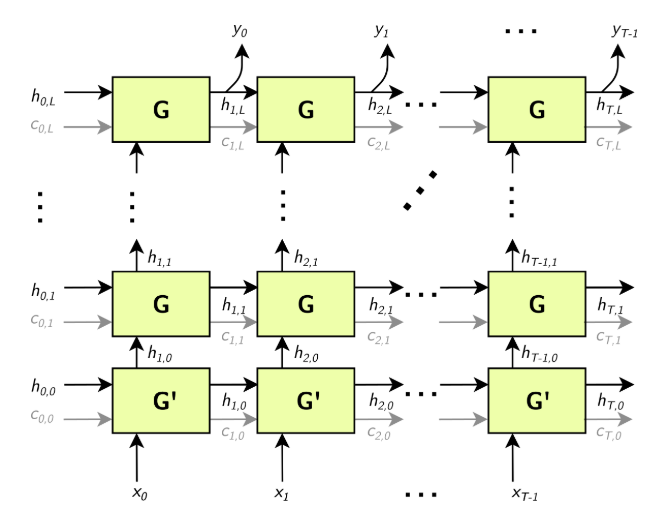

G'是 G 的变体。
进入方框的箭头是函数输入，离开方框的箭头是函数输出。

* $X = [x_0, x_1, ..., x_T]$
* $Y = [y_0, y_1, ..., y_T]$
* $H_i = [h_i, 0, h_i, 1, ..., h_{i, L}]$
* $C_i = [c_i, 0, c_i, 1, ..., c_{i, L}]$

只有当 RNN 对 `G`和 `G'`使用 LSTM 单元时，才会出现灰色的c边缘。

注意：上述结构有L个“子层”（ G的水平行），矩阵$H_i$和$C_i$的维度为 `L`。

可选地，序列长度T可以指定为 RNNv2 层的输入，允许客户端指定一批不同长度的输入序列。

Bidirectional RNNs (BiRNNs):  可以配置为双向的。在这种情况下，每个子层由一个“前向”层和一个“后向”层组成。前向层使用从0到T的$x_i$迭代应用G ，后向层使用从T到0的$x_i$迭代应用G ，如下图所示：


上图中的黑条表示串联。完全隐藏状态$h_t$由前向隐藏状态$h_{tf}$和后向隐藏状态$h_{tb}$的串联定义:

* $h_{t, i} = [h_{tf,i}, h_{tb,i}]$
* $h_t = [h_{t, 0}, h_{t, 1}, ..., h_{t, L}]$

类似地，对于单元状态（未显示），每个$h_{t,i}$都用作下一个子层的输入，如上所示。

RNN 操作： RNNv2 层支持以下单元操作：

* $ReLU: G (x, h, c) := max (W_ix + R_ih + W_b + R_b, 0)  (c not used)$
* $tanh: G (x, h, c) := tanh (W_ix + R_ih + W_b + R_b) (c not used)$
* $GRU: Z := sigmoid (W_zx + R_zh + W_{bz} + R_{bz})$
* $GRU: M := sigmoid (W_rx + R_rh + W_{br} + R_{br})$
* $GRU: G (x, h, c) := tanh (W_hx + M (h + R_{bh}) + * Wbh) (c not used)$
* $LSTM: I := sigmoid (W_Ix + R_Ih + W_{bi} + R_{bi})$
* $LSTM: F := sigmoid (W_fx + R_fh + W_{bf} + R_{bf})$
* $LSTM: O := sigmoid (W_ox + R_oh + W_{bo} + R_{bo})$
* $LSTM: C := tanh (W_cx + R_ch + W_{bc} + R_{bc})$
* $LSTM: C´ := F × C$
* $LSTM: H := O × tanh (C´)$
* $LSTM: G (x, h, c) := {H, C´}$

对于GRU和LSTM，Z 、 M 、 I 、 F的中间计算称为“门”。

在单向情况下， W矩阵的维度对于第一层是 `HxE` ，对于后续层是 `HxH` （除非设置了跳过模式(Skip mode)，请参阅下文）。在双向情况下，第一个前向/后向层的W矩阵的维数为 `HxE` ，后续层的维数为 `Hx2H` 。

R矩阵的维数始终为 `HxH` 。偏差$W_{bx}$和$R_{bx}$具有维度 `H` 。

**Skip mode:** RNNv2 使用的默认模式是“线性模式”。在这种模式下，RNNv2 层的第一个子层使用单元格$G´ ( x , h , c )$ ，它接受大小为E （嵌入大小）的向量x ，以及大小为H （隐藏状态大小）的向量h和c ，并由单元运算公式定义。后续层使用单元格$G ( x , h , c )$，其中x 、 h和c都是大小为H的向量，也由单元运算公式定义。

可选地，RNN 可以配置为在“跳过模式”下运行，这意味着第一层的输入权重矩阵是隐式单位矩阵，并且x的大小预计为H。

**条件和限制**

数据 ( X ) 输入和初始隐藏/单元状态 ( $H_0$和$C_0$ ) 张量至少有两个非批量维度。附加维度被视为批次维度。
，可选的序列长度输入T为0维（标量）。

数据 ( Y ) 输出和最终隐藏/单元状态 ( $H_T$和$C_T$ ) 张量至少有两个非批量维度。附加维度被视为批次维度。如果提供了序列长度输入，则将批次中的每个输出填充到最大序列长度$T_{max}$ 。

IRNNv2Layer支持：

* FP32 和 FP16 数据类型，用于输入和输出、隐藏和单元张量。
* INT32 数据类型仅适用于序列长度张量。

定义网络后，您可以标记所需的输出。未标记为网络输出或用作另一层输入的 RNNv2 输出张量将被丢弃。

```C++
network->markOutput(*pred->getOutput(1));
pred->getOutput(1)->setType(DataType::kINT32);
rnn->getOutput(1)->setName(HIDDEN_OUT_BLOB_NAME);
network->markOutput(*rnn->getOutput(1));
if (rnn->getOperation() == RNNOperation::kLSTM)
{
rnn->getOutput(2)->setName(CELL_OUT_BLOB_NAME);
network->markOutput(*rnn->getOutput(2));
};
```

请参阅[C++ 类IRNNv2Layer](https://docs.nvidia.com/deeplearning/sdk/tensorrt-api/c_api/classnvinfer1_1_1_i_r_n_nv2_layer.html)或[Python 类IRNNv2Layer](https://docs.nvidia.com/deeplearning/sdk/tensorrt-api/python_api/infer/Graph/Layers.html#irnnv2layer) 。

#### A.1.32.1. RNNv2 Layer Setup

网络中的第一层是 RNN 层。这是在 `addRNNv2Layer()`函数中添加和配置的。该层由以下配置参数组成。

**Operation**

这定义了 RNN 单元的操作。目前支持的操作是relu、LSTM、GRU和tanh 。

**Direction**

这定义了 RNN 是单向的还是双向的 (BiRNN)。

**Input mode**

这定义了RNN的第一层是进行矩阵乘法（线性模式），还是跳过矩阵乘法（跳过模式）。

例如，在 `sampleCharRNN` 中使用的网络中，我们使用了一个线性单向 `LSTM`单元，其中包含 `LAYER_COUNT`个层。下面的代码展示了如何创建这个 RNNv2 层。

```C++
auto rnn = network->addRNNv2(*data, LAYER_COUNT, HIDDEN_SIZE, SEQ_SIZE, RNNOperation::kLSTM);
```

注意：对于 RNNv2 层，需要单独设置权重和偏差。有关更多信息，请参[阅RNNv2 层 - 可选输入](https://docs.nvidia.com/deeplearning/tensorrt/developer-guide/index.html#optinputs1)。

有关更多信息，请参阅[TensorRT API 文档](https://docs.nvidia.com/deeplearning/sdk/tensorrt-api/index.html)。

#### A.1.32.2. RNNv2 Layer - Optional Inputs

如果存在需要将隐藏状态和单元状态预初始化为非零值的情况，则可以通过 `setHiddenState`和 `setCellState`调用对其进行预初始化。这些是 RNN 的可选输入。

**C++ code snippet**

```C++
rnn->setHiddenState(*hiddenIn);
if (rnn->getOperation() == RNNOperation::kLSTM)
    rnn->setCellState(*cellIn);
```

**Python code snippet**

```Python
rnn.hidden_state = hidden_in
if rnn.op == trt.RNNOperation.LSTM:
rnn.cell_state = cell_in
```

**空张量**

`IRNNv2Layer`适用于空张量，但在 TensorRT 7.2.1 中已弃用，并在 TensorRT 9.0 中删除。使用循环来合成循环子网络，如[使用循环](https://docs.nvidia.com/deeplearning/tensorrt/developer-guide/index.html#work-with-loops)部分所述。

### A.1.33. IScaleLayer

`IScaleLayer`通过常数值实现每个张量、每个通道或每个元素的仿射变换和取幂。

**层描述**

给定输入张量A ， `IScaleLayer`执行每个张量、每个通道或每个元素的转换，以生成相同维度的输出张量B。每种模式对应的变换是：

**ScaleMode::kUNIFORM tensor-wise transformation**

$B = (A * scale + shift)^{power}$

**ScaleMode::kCHANNEL channel-wise transformation**

$B_I = (A_I * scale_{c(I)} + shift_{c(I)})^{{power}_{c(I)}}$

**ScaleMode::kELEMENTWISE element-wise transformation**

$B_I = (A_I * scale_I + shift_I)^{^{power}I}$

其中I表示张量元素的索引， $c_{(I)}$是 `I `中的通道维度。

**条件和限制**

A在隐式批处理模式下必须至少具有三个维度，在显式批处理模式下必须至少具有四个维度。

如果为 `scale` 、 `shift`或 `power`提供了一个空权重对象，则使用默认值。默认情况下， `scale`的值为1.0 ， `shift`的值为0.0 ， `power` 的值为1.0 。

请参阅[C++ 类IScaleLayer](https://docs.nvidia.com/deeplearning/sdk/tensorrt-api/c_api/classnvinfer1_1_1_i_scale_layer.html)或[Python 类IScaleLayer](https://docs.nvidia.com/deeplearning/sdk/tensorrt-api/python_api/infer/Graph/Layers.html#iscalelayer) 。

### A.1.34. IScatterLayer

`IScatterLayer`具有三个输入张量： Data $D$ , Indices $I$ , and Updates $U$ 、一个输出张量 $S$和一个scatter模式。使用 `kELEMENT`模式时，可选的轴参数可用。

**层描述**

数据张量的秩为$r>= 1$并且具有与输出张量相同的形状。通常，该层根据索引张量将数据张量或更新张量写入输出张量。指数张量和操作模式的解释取决于散射模式。
如果 `mode == kELEMENT` ，对于更新中的每个值，其输出索引由其在维度 != 轴的更新中的索引和维度 = 轴的索引中的相应值指定。

```C++
Pseudocode:
output = data;
for (auto read_idx : Grid(data.extent))
{
	auto write_idx = read_idx[axis];
	write_idx[axis] = indices[read_idx];
	output[write_idx] = updates[read_idx];
}
return output;
```

如果 `mode == kND` ，假设：

* $tensor\ \ \  D\ \ \  of\ \ \  rank\ r >= 1\ \ \  and\ \ \  shape (D) = [k_1...k_r]$ ,
* $indices\ \ \  tensor\ \ \  I \ \ \ of\ \ \  rank\ \ q >= 1 \ \ \ and\ \ \  shape (I) = [k1...kq]$ , and
* $updates\ \ \  tensor\ \ \  U\ \ \  of\ \ \  rank\ \ \  q + r − kq −1$

操作的输出是一个张量G, 它的秩为r和 $shape (G) = [k_1...k_r]$

操作模式由以下等式定义： $G = D$

* $If\ \ \ k_q =r ,\ \  then\ \ \  G (I (ɑ_1 ... ɑ_{q−1})) = U (ɑ_1 ... ɑ_{q−1})$
* $If\ \ \  k_q <r ,\ \  then\ \ \  G (I (ɑ_1 ... ɑ_{q−1}), ɑ_{r−K_q} ... ɑ_r) = U (ɑ_1 ... ɑ_{q−1},ɑ_{r−K_q},..., ɑ_r)$

**条件和限制**

对于两种模式：

* I 中的重复索引会导致未定义的行为，
* 如果使用动态形状，则使用负索引具有未定义的行为，
* 只有数据张量可以具有动态形状。

请参阅[C++ 类IScatterLayer](https://docs.nvidia.com/deeplearning/sdk/tensorrt-api/c_api/classnvinfer1_1_1_i_scatter_layer.html)或[Python 类IScatterLayer](https://docs.nvidia.com/deeplearning/sdk/tensorrt-api/python_api/infer/Graph/Layers.html#iscatterlayer) 。

### A.1.35. ISelectLayer

`ISelectLayer`根据条件返回两个输入中的任何一个。

**层描述**

根据条件张量A返回从输入张量B ( thenInput ) 或C ( elseInput ) 中选择的元素。

**条件和限制**

所有三个输入张量必须具有相同的维数；沿每个轴，每个轴必须具有相同的长度或长度为 1。如果长度为 1，则沿该轴广播张量。应用广播规则后，输出张量具有输入的维度。条件张量必须是布尔类型。其他两个输入可能是 `FP32`、`FP16` 或 `INT32`。

请参阅[C++ 类ISelectLayer](https://docs.nvidia.com/deeplearning/sdk/tensorrt-api/c_api/classnvinfer1_1_1_i_select_layer.html)或[Python 类ISelectLayer](https://docs.nvidia.com/deeplearning/sdk/tensorrt-api/python_api/infer/Graph/Layers.html#iselectlayer) 。

### A.1.36. IShapeLayer

`IShapeLayer`获得张量的形状。

**层描述**

`IShapeLayer`输出其输入张量的维度。输出是 `INT32` 类型的一维张量。

**条件和限制**

输入张量必须至少具有一维。输出张量是一个“形状张量”，它只能用作处理形状张量的层的输入。有关更多信息，请参阅[执行张量与形状张量](https://docs.nvidia.com/deeplearning/tensorrt/developer-guide/index.html#exe_shape_tensors)。

请参阅[C++ 类IShapeLayer](https://docs.nvidia.com/deeplearning/sdk/tensorrt-api/c_api/classnvinfer1_1_1_i_shape_layer.html)或[Python 类IShapeLayer](https://docs.nvidia.com/deeplearning/sdk/tensorrt-api/python_api/infer/Graph/Layers.html#tensorrt.IShapeLayer) 。

### A.1.37. IShuffleLayer

`IShuffleLayer`实现了张量的整形和转置运算符。

**层描述**

`IShuffleLayer`实现了张量的重新洗牌以置换张量或重塑它。通过应用转置来转换尺寸为 a的输入张量A ，然后是具有重塑尺寸r的重塑操作，然后是另一个转置操作以生成尺寸为b的输出数据张量B。

要将转置操作应用于A ，必须指定置换顺序。指定的置换 `p1`用于按以下方式置换A的元素，以产生维度为$c_i = a_{p1 ( i )}$ 和$c_i = A_{p1 ( I )}$用于索引序列$I$ 。默认情况下，假设排列是一个恒等式（输入张量没有变化）。

reshape 操作不会改变元素的顺序并将张量C重塑为形状为$r^I$的张量R ，使得$r^I_i=\{r_i\ \ \ if\ \ \  r_i>0, \ \ c_i\ \ \  if\ \ \  r_i=0, inferred\ \ \  if\ \ \  r_i=−1 \}$ 。只能推断出一个维度，即$∏ r^I_i = ∏ a_i$ 。

$r_i = 0$作为占位符的特殊解释，而不是实际尺寸，可以通过在层上调用方法 `setZeroIsPlaceholder(false)`来关闭。如果使用动态形状，强烈建议关闭0的占位符，因为它会干扰对空张量的正确处理，并且会降低 TensorRT 的优化。例如，考虑一个尺寸为 `[2,x]`的张量C ，需要将其重塑为尺寸为 `[x,2]`的张量R。使用占位符，当x=0时，重塑尺寸扩展到 `[2,2]` ，而不是预期的 `[0,2]` 。

重塑尺寸可以指定为层中的构建时间常数，也可以通过向层提供第二个输入来指定为运行时值，该输入必须是 INT32 类型的一维张量。在运行时出现在第二个输入中的占位符0或通配符-1的解释方式与它们是构建时常量时的解释方式相同。

在整形操作之后应用第二个转置操作。它遵循与第一个转置操作相同的规则，并且需要指定一个排列（比如 `p2` ）。这种排列产生一个维度为b的输出张量B ，使得对于索引序列I的$b_i = r_{p2(I)}$和$B_{p2 ( I )} = R_I$。

**条件和限制**

维度$r^I$的乘积必须等于输入维度a的乘积。

**空张量**

默认情况下， `IShuffleLayer`将 `reshape` 维度中的0视为特殊占位符，而不是零。占位符的意思是“复制相应的输入维度”。保留此默认行为是为了与早期版本的 TensorRT 兼容，但在使用**空张量时会很危险**。

如果您要整形到可能包含零长度尺寸的尺寸，请使用 `IShuffleLayer::setZeroIsPlaceholder`方法禁用零占位符处理。

```C++
IShuffleLayer* s = ...;
s->setZeroIsPlaceholder(false);
```

例如，考虑以下代码，该代码旨在将张量输入重塑为形状张量 `reshapeDims`指定的尺寸。

```C++
IShuffleLayer* s = network.addShuffle(input);
s->setInput(1, reshapeDims);
#if CORRECT
s->setZeroIsPlaceholder(false);
#endif
output = *s->getOutput(0);
```

假设在运行时，输入的维度为 `[3,0] `，第二个输入 `reshapeDims`包含 `[0,0]` 。如果引擎是使用 `CORRECT==0`构建的，则 `reshapeDims`中的零被解释为输入尺寸的占位符，并且输出的尺寸为 `[3,0]` ，而不是预期的 `[0,0]` 。使用 `CORRECT==1`构建片段可确保 `IShuffleLayer`将零视为零。除非您知道需要占位符功能，否则建议使用 `setZeroIsPlaceholder(false)`将其关闭。

在重塑维度中使用 `-1`通配符时，空张量还引入了一种新错误的可能性。通配符表示TensorRT 使用以下等式求解的未知维度x ：

$x * (volume\ \ of\ \  other\ \  reshape \ \ dimension) = volume (\ \ input\ \  tensor\ \ )$

如果其他重塑维度的volume为零，则会出现以下两个错误之一：

* 输入张量的volume为零。那么x是不确定的。
* 输入张量的volume不为零。那么x没有解。

TensorRT 在任何一种情况下都会报告错误，可能在构建时或运行时。

，请参阅[C++ 类IShuffleLayer](https://docs.nvidia.com/deeplearning/sdk/tensorrt-api/c_api/classnvinfer1_1_1_i_shuffle_layer.html)或[Python 类IShuffleLayer](https://docs.nvidia.com/deeplearning/sdk/tensorrt-api/python_api/infer/Graph/Layers.html#ishufflelayer) 。

### A.1.38. ISliceLayer

ISliceLayer实现了Slice 操作的五种变体。

**层描述**

给定一个输入n维张量A ，Slice 层生成一个输出张量B ，其中包含从A中提取的元素。让我们将 a 、 b 、 s 、 o 、 d 、 f分别表示为A中的元素坐标、 B中的元素坐标、步幅、起始偏移量、 A中每个维度的范围和要填充的常数值。步幅可以是正数、负数或零。 A和B的对应映射为：

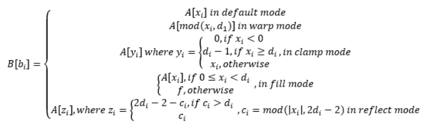

其中: $x_i = b_i * s_i + o_i$

**条件和限制**

B中每个元素的对应A坐标不得超出范围。

**空张量**

`ISliceLayer`对空张量的行为遵循对其语义的严格解释。具体来说，考虑使用参数 start、size 和 stride对长度为L的维度进行切片。

为所有i使用生成的 `start+i*stride`形式的索引为半开区间 `[0,L)`下标，这样 `0 ≤ i < size` 。所有生成的索引都必须在范围内。但是，使用 `size=0`时，不会生成索引，因此不会应用边界检查。因此对于 `size=0` ，`start` 和 `stride` 参数无关紧要，可以是任何值。

相反，如果 `L=0`且 `size≠0` ，则 TensorRT 会报告错误，因为半开区间 `[0,L)`变为空，并且生成的索引本质上是超出范围的。

请参阅[C++ 类ISliceLayer](https://docs.nvidia.com/deeplearning/sdk/tensorrt-api/c_api/classnvinfer1_1_1_i_slice_layer.html)或[Python 类ISliceLayer](https://docs.nvidia.com/deeplearning/sdk/tensorrt-api/python_api/infer/Graph/Layers.html#islicelayer) 。

### A.1.39. ISoftMaxLayer

`ISoftMaxLayer`沿用户指定的输入维度对输入张量应用 `SoftMax` 函数。

**层描述**

给定一个形状为 a的输入张量A和一个输入维度i ，该层在每个切片上应用 SoftMax 函数， $A_{a0, ..., ai−1, :, ai+1, ..., an−1}$沿A 的维度i 。生成的输出张量C与输入张量A具有相同的维度。

切片x的 SoftMax 函数S定义为 $S(x) = exp (x_j)/∑exp (x_j)$

SoftMax 函数重新调整输入，使得输出中的每个值都位于 `[0, 1]`范围内，并且每个切片的值$C_{a0, ..., ai−1, :, ai+1, ..., an−1}$沿C的维度i总和为1 。

**条件和限制**

对于n是a的长度，输入维度i应该是 $i ε [ 0 , n − 1 ]$ 。如果用户没有提供输入维度，那么$i =max (0, n−3)$  。

请参阅[C++ 类ISoftMaxLayer](https://docs.nvidia.com/deeplearning/sdk/tensorrt-api/c_api/classnvinfer1_1_1_i_soft_max_layer.html)或[Python 类ISoftMaxLayer](https://docs.nvidia.com/deeplearning/sdk/tensorrt-api/python_api/infer/Graph/Layers.html#isoftmaxlayer) 。

### A.1.40. ITopKLayer

`ITopKLayer`沿着一个维度查找前K个最大（或最小）元素，返回一个缩减的张量和一个索引位置的张量。

**层描述**

尺寸为 a的输入张量A ，给定一个轴i ，一个为max或min的运算符，以及一个k的值，产生一个值张量V和一个尺寸为v的索引张量，使得$v_j=\{k\ \ \ if\ \ \  i≠j, \ \ and\ \ \  a_i\ \ \  otherwise\}$ 。

输出值为：

* $V_{a0, ..., ai−1, :, ai+1, ..., an−1} = sort (A_{a0, ..., ai−1, :, ai+1, ..., an−1}):K$
* $I_{a0, ..., ai−1, :, ai+1, ..., an−1} = argsort (A_{a0, ..., ai−1, :, ai+1, ..., an−1}):K$

其中sort对于 `operator max`是降序排列，对于 `operator min`是升序排列。

在排序过程中关系被打破，对于运算符max 而言，较低的索引被认为较大，而对于 operator min ，较低的索引被认为较小。

**条件和限制**

K值必须为 3840 或更小。只能搜索一个轴找到前K个最小值或最大值；该轴不能是批次维度。

请参阅C++ 类[ITopKLayer](https://docs.nvidia.com/deeplearning/sdk/tensorrt-api/c_api/classnvinfer1_1_1_i_top_k_layer.html)或[Python 类ITopKLayer](https://docs.nvidia.com/deeplearning/sdk/tensorrt-api/python_api/infer/Graph/Layers.html#itopklayer) 。

#### A.1.40.1. TopK Layer Setup

TopK层用于识别接下来出现的概率最大的字符。

**注意：该层有两个输出。第一个输出是前K个值的数组。第二个是我们更感兴趣的，是这些最大值出现的索引。**

下面的代码设置 `TopK` 层并将 `OUTPUT_BLOB_NAME`分配给该层的第二个输出。

```C++
auto pred =  network->addTopK(*addBiasLayer->getOutput(0),                                     	 	nvinfer1::TopKOperation::kMAX, 1, reduceAxis);
assert(pred != nullptr);
pred->getOutput(1)->setName(OUTPUT_BLOB_NAME);
```

有关详细信息，请参阅[NVIDIA TensorRT API 参考](http://docs.nvidia.com/deeplearning/sdk/tensorrt-api/index.html)。

### A.1.41. ITripLimitLayer

`ITripLimitLayer`指定循环迭代的次数。循环由循环边界层定义。

有关 `ITripLimitLayer`的更多信息，包括循环的工作方式及其限制，请参阅[使用循环](https://docs.nvidia.com/deeplearning/tensorrt/developer-guide/index.html#work-with-loops)。

请参阅[C++ 类ITripLayer](https://docs.nvidia.com/deeplearning/sdk/tensorrt-api/c_api/classnvinfer1_1_1_i_trip_limit_layer.html)或[Python 类ITripLayer](https://docs.nvidia.com/deeplearning/sdk/tensorrt-api/python_api/infer/Graph/Layers.html#itriplimitlayer) 。

### A.1.42. IUnaryLayer

`IUnaryLayer`支持 `PointWise`一元运算。

**层描述**

`IUnaryLayer`对输入张量A执行 `PointWise`操作，从而得到相同维度的输出张量B。支持以下功能：

* $exp: B = e^A$
* $abs: B = |A|$
* $log: B = ln (A)$
* $sqrt: B = \sqrt {A}  \ (rounded\ \ \  to nearest\ \ \  even\ \ \  mode)$
* $neg: B = -A$
* $recip: B = 1 / A \ (reciprocal)\ \ \  in\ \ \  rounded\ \ \  to\ \ \  nearest\ \ \  even\ \ \  mode$
* $sine : B = sin (A)$
* $Cos : B = cos (A)$
* $Tan : B = tan (A)$
* $Tanh : B = tanh (A)$
* $Sinh : B = sinh (A)$
* $Cosh : B = cosh (A)$
* $Asin : B = asin (A)$
* $Acos : B = acos (A)$
* $Atan : B = tan (A)$
* $Asinh : B = asinh (A)$
* $Acosh : B = acosh (A)$
* $Atanh : B = atanh (A)$
* $Ceil : B = ceil (A)$
* $ Floor : B = floor (A) $
* $ERF : B = erf (A)$
* $NOT : B = \~A$
* $Sign : B = If A > 0, 1;\ \ if \ \ A < 0, −1;\ \  if\ \  A == 0, 0.$
* $Round : B = Round\ \  to\ \  nearest\ \  even (A)$

**条件和限制**

输入和输出可以是 0 到 7 维张量。

`IUnaryLayer`层可以接受不同的输入数据类型，具体取决于所使用的操作。 `IUnaryLayer`支持每个操作的以下类型：

| Operation | DataTypes                    |
| --------- | ---------------------------- |
| kEXP      | kFLOAT, kHALF, kINT8         |
| kLOG      | kFLOAT, kHALF, kINT8         |
| kSQRT     | kFLOAT, kHALF, kINT8         |
| kRECIP    | kFLOAT, kHALF, kINT8         |
| kABS      | kFLOAT, kHALF, kINT8         |
| kNEG      | kFLOAT, kHALF, kINT8         |
| kSIN      | kFLOAT, kHALF, kINT8         |
| kCOS      | kFLOAT, kHALF, kINT8         |
| kTAN      | kFLOAT, kHALF, kINT8         |
| kSINH     | kFLOAT, kHALF, kINT8         |
| kCOSH     | kFLOAT, kHALF, kINT8         |
| kASIN     | kFLOAT, kHALF, kINT8         |
| kACOS     | kFLOAT, kHALF, kINT8         |
| kATAN     | kFLOAT, kHALF, kINT8         |
| kASINH    | kFLOAT, kHALF, kINT8         |
| kACOSH    | kFLOAT, kHALF, kINT8         |
| kATANH    | kFLOAT, kHALF, kINT8         |
| kCEIL     | kFLOAT, kHALF, kINT8         |
| kFLOOR    | kFLOAT, kHALF, kINT8         |
| kERF      | kFLOAT, kHALF, kINT8         |
| kNOT      | kBOOL                        |
| kSIGN     | kFLOAT, kHALF, kINT8, kINT32 |
| kROUND    | kFLOAT, kHALF, kINT8         |

请参阅[C++ 类IUnaryLayer](https://docs.nvidia.com/deeplearning/sdk/tensorrt-api/c_api/classnvinfer1_1_1_i_unary_layer.html)或[Python 类IUnaryLayer](https://docs.nvidia.com/deeplearning/sdk/tensorrt-api/python_api/infer/Graph/Layers.html#iunarylayer) 。

# A.2 TensorRT的数据格式定义详解

TensorRT 支持不同的数据格式。有两个方面需要考虑：数据类型和布局。

## A.2.1.数据类型格式

数据类型是每个单独值的表示。它的大小决定了取值范围和表示的精度，分别是 `FP32`（32位浮点，或单精度），`FP16`（16位浮点或半精度），`INT32`（32位整数表示），和 `INT8`（8 位表示）。

## A.2.1.布局格式

布局格式确定存储值的顺序。通常，batch 维度是最左边的维度，其他维度指的是每个数据项的方面，例如图像中的C是通道， H是高度， W是宽度。忽略总是在这些之前的批量大小， C 、 H和W通常被排序为CHW （参见图 1 ）或HWC （参见图 2 ）。

图1. CHW的布局格式：图像分为HxW矩阵，每个通道一个，矩阵按顺序存储；通道的所有值都是连续存储的。

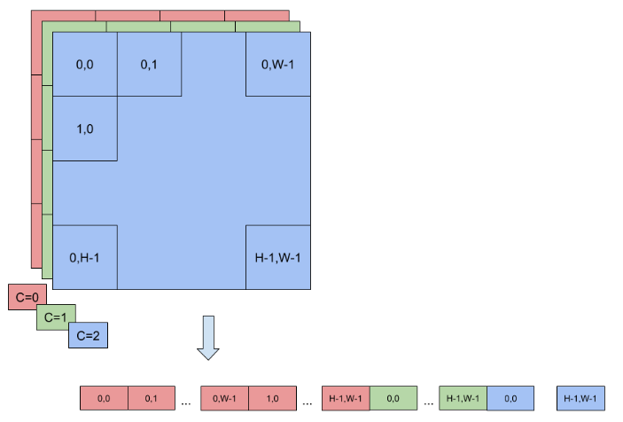

图2. HWC的布局格式：图像存储为单个HxW矩阵，其值实际上是 C 元组，每个通道都有一个值；一个点（像素）的所有值都是连续存储的。

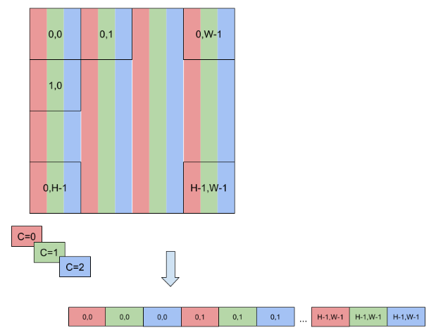

为了实现更快的计算，定义了更多格式以将通道值打包在一起并使用降低的精度。因此，TensorRT 还支持 `NC / 2HW2`和 `NHWC8`等格式。

在 `NC / 2HW2 ( TensorFormat::kCHW2 )` 中，通道值对在每个HxW矩阵中打包在一起（在奇数通道的情况下为空值）。结果是一种格式，其中 `⌈ C/2 ⌉ HxW`矩阵的值是两个连续通道的值对（参见图 3 ）；请注意，如果它们在同一对中，则此排序将维度交错为具有步长1的通道的值，否则将步长为 2xHxW 。

图 3. 一对通道值在每个HxW矩阵中打包在一起。结果是一种格式，其中 `[C/2] HxW`矩阵的值是两个连续通道的值对

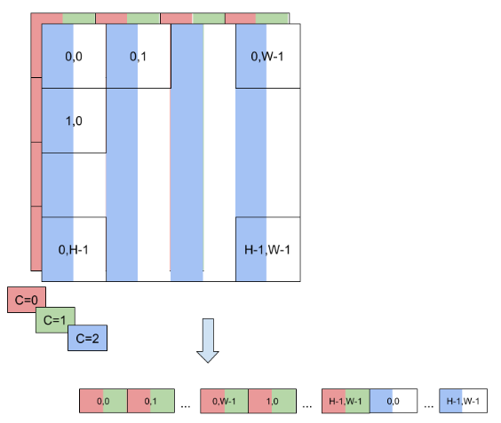

在 `NHWC8 ( TensorFormat::kHWC8 )` 中， HxW矩阵的条目包括所有通道的值（参见图 4 ）。此外，这些值被打包在 `⌈ C/8 ⌉` 8 元组中，并且C向上舍入到最接近的 8 倍数。

图 4. 在这种 `NHWC8`格式中， HxW矩阵的条目包括所有通道的值。
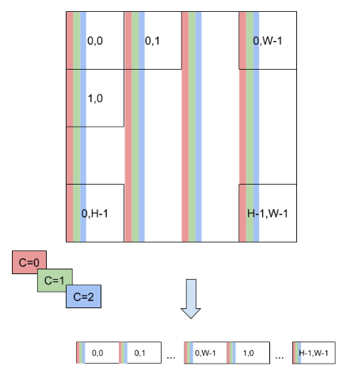

其他TensorFormat遵循与前面提到的 `TensorFormat::kCHW2`和 `TensorFormat::kHWC8`类似的规则。

# A.3 TensorRT的命令行程序

## A.3.1. trtexec

示例目录中包含一个名为 `trtexec`的命令行包装工具。 `trtexec`是一种无需开发自己的应用程序即可快速使用 TensorRT 的工具。

`trtexec`工具有三个主要用途：

* 它对于在随机或用户提供的输入数据上对网络进行基准测试很有用。
* 它对于从模型生成序列化引擎很有用。
* 它对于从构建器生成序列化时序缓存很有用。

### A.3.1.1. Benchmarking Network

如果您将模型保存为 `ONNX` 文件、`UFF` 文件，或者如果您有 `Caffe prototxt` 格式的网络描述，则可以使用 `trtexec`工具测试使用 TensorRT 在网络上运行推理的性能。 `trtexec`工具有许多选项用于指定输入和输出、性能计时的迭代、允许的精度和其他选项。

为了最大限度地提高 GPU 利用率， `trtexec`会提前将一个batch放入队列。换句话说，它执行以下操作：

```C++
enqueue batch 0 
-> enqueue batch 1 
-> wait until batch 0 is done 
-> enqueue batch 2 
-> wait until batch 1 is done 
-> enqueue batch 3 
-> wait until batch 2 is done 
-> enqueue batch 4 
-> ...
```

如果使用多流（ `--streams=N`标志），则 `trtexec`在每个流上分别遵循此模式。

`trtexec`工具打印以下性能指标。下图显示了 `trtexec`运行的示例 `Nsight` 系统配置文件，其中标记显示了每个性能指标的含义。

**Throughput**

观察到的吞吐量是通过将执行数除以 `Total Host Walltime` 来计算的。如果这显着低于 GPU 计算时间的倒数，则 GPU 可能由于主机端开销或数据传输而未被充分利用。使用 CUDA 图（使用 `--useCudaGraph` ）或禁用 H2D/D2H 传输（使用 `--noDataTransfer` ）可以提高 GPU 利用率。当 `trtexec`检测到 GPU 未充分利用时，输出日志提供了有关使用哪个标志的指导。

**Host Latency**

`H2D `延迟、GPU 计算时间和 `D2H` 延迟的总和。这是推断单个执行的延迟。

**Enqueue Time**

将执行排入队列的主机延迟，包括调用 `H2D/D2H` CUDA API、运行主机端方法和启动 CUDA 内核。如果这比 GPU 计算时间长，则 GPU 可能未被充分利用，并且吞吐量可能由主机端开销支配。使用 CUDA 图（带有 `--useCudaGraph` ）可以减少排队时间。

**H2D Latency**

单个执行的输入张量的主机到设备数据传输的延迟。添加 `--noDataTransfer`以禁用 `H2D/D2H `数据传输。

**D2H Latency**

单个执行的输出张量的设备到主机数据传输的延迟。添加 `--noDataTransfer`以禁用 `H2D/D2H` 数据传输。

**GPU Compute Time**

为执行 CUDA 内核的 GPU 延迟。

**Total Host Walltime**

从第一个执行（预热后）入队到最后一个执行完成的主机时间。

**Total GPU Compute Time**

所有执行的 GPU 计算时间的总和。如果这明显短于 `Total Host Walltime`，则 GPU 可能由于主机端开销或数据传输而未得到充分利用。

图 1. 在 `Nsight` 系统下运行的正常 `trtexec`的性能指标（`ShuffleNet`，`BS=16`，best，TitanRTX@1200MHz）

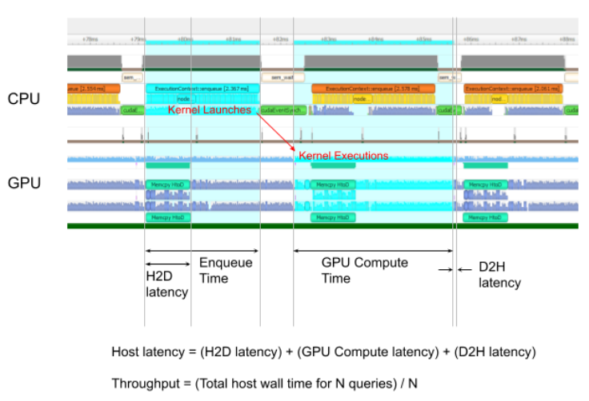

将 `--dumpProfile`标志添加到 `trtexec`以显示每层性能配置文件，这使用户可以了解网络中的哪些层在 GPU 执行中花费的时间最多。每层性能分析也适用于作为 CUDA 图启动推理（需要 `CUDA 11.1` 及更高版本）。此外，使用 `--profilingVerbosity=detailed`标志构建引擎并添加 `--dumpLayerInfo`标志以显示详细的引擎信息，包括每层详细信息和绑定信息。这可以让你了解引擎中每一层对应的操作及其参数。

### A.3.1.2. Serialized Engine Generation

如果您生成保存的序列化引擎文件，您可以将其拉入另一个运行推理的应用程序中。例如，您可以使用[TensorRT 实验室](https://github.com/NVIDIA/tensorrt-laboratory)以完全流水线异步方式运行具有来自多个线程的多个执行上下文的引擎，以测试并行推理性能。有一些警告；例如，如果您使用 `Caffe prototxt` 文件并且未提供模型，则会生成随机权重。此外，在 `INT8` 模式下，使用随机权重，这意味着 `trtexec` 不提供校准功能。

### A.3.1.3. trtexec

如果您向 `--timingCacheFile`选项提供时序缓存文件，则构建器可以从中加载现有的分析数据并在层分析期间添加新的分析数据条目。计时缓存文件可以在其他构建器实例中重用，以提高构建器执行时间。建议仅在相同的硬件/软件配置（例如，`CUDA/cuDNN/TensorRT` 版本、设备型号和时钟频率）中重复使用此缓存；否则，可能会出现功能或性能问题。

### A.3.1.4. 常用的命令行标志

该部分列出了常用的trtexec命令行标志。

**构建阶段的标志**

* `--onnx=<model>` ：指定输入 ONNX 模型。
* `--deploy=<caffe_prototxt>` ：指定输入的 Caffe `prototxt `模型。
* `--uff=<model> `：指定输入 UFF 模型。
* `--output=<tensor>` ：指定输出张量名称。仅当输入模型为 UFF 或 Caffe 格式时才需要。
* `--maxBatch=<BS> `：指定构建引擎的最大批量大小。仅当输入模型为 UFF 或 Caffe 格式时才需要。如果输入模型是 ONNX 格式，请使用 `--minShapes` 、 `--optShapes` 、 `--maxShapes`标志来控制输入形状的范围，包括批量大小。
* `--minShapes=<shapes>` , `--optShapes=<shapes>` , `--maxShapes=<shapes>` ：指定用于构建引擎的输入形状的范围。仅当输入模型为 ONNX 格式时才需要。
* `--workspace=<size in MB>` ：指定策略允许使用的最大工作空间大小。该标志已被弃用。您可以改用 `--memPoolSize=<pool_spec>`标志。
* `--memPoolSize=<pool_spec>` ：指定策略允许使用的工作空间的最大大小，以及 DLA 将分配的每个可加载的内存池的大小。
* `--saveEngine=<file>` ：指定保存引擎的路径。
* `--fp16` 、 `--int8` 、 `--noTF32` 、 `--best` ：指定网络级精度。
* `--sparsity=[disable|enable|force]` ：指定是否使用支持结构化稀疏的策略。

  * `disable `：使用结构化稀疏禁用所有策略。这是默认设置。
  * `enable` ：使用结构化稀疏启用策略。只有当 ONNX 文件中的权重满足结构化稀疏性的要求时，才会使用策略。
  * `force` ：使用结构化稀疏启用策略，并允许 `trtexec` 覆盖 `ONNX` 文件中的权重，以强制它们具有结构化稀疏模式。请注意，不会保留准确性，因此这只是为了获得推理性能。
* `--timingCacheFile=<file>` ：指定要从中加载和保存的时序缓存。
* `--verbose` ：打开详细日志记录。
* `--buildOnly` ：在不运行推理的情况下构建并保存引擎。
* `--profilingVerbosity=[layer_names_only|detailed|none]` ：指定用于构建引擎的分析详细程度。
* `--dumpLayerInfo , --exportLayerInfo=<file>` ：打印/保存引擎的层信息。
* `--precisionConstraints=spec` ：控制精度约束设置。

  * `none` ：没有限制。
  * `prefer` ：如果可能，满足 `--layerPrecisions / --layerOutputTypes`设置的精度约束。
  * `obey`：满足由 `--layerPrecisions / --layerOutputTypes`设置的精度约束，否则失败。
* `--layerPrecisions=spec` ：控制每层精度约束。仅当PrecisionConstraints设置为服从或首选时才有效。规范是从左到右阅读的，后面的会覆盖前面的。 “ * ”可以用作layerName来指定所有未指定层的默认精度。

  * 例如： `--layerPrecisions=*:fp16`,`layer_1:fp32`将所有层的精度设置为 `FP16` ，除了 `layer_1` 将设置为 `FP32`。
* `--layerOutputTypes=spec` ：控制每层输出类型约束。仅当 `PrecisionConstraints`设置为服从或首选时才有效。规范是从左到右阅读的，后面的会覆盖前面的。 “ * ”可以用作 `layerName`来指定所有未指定层的默认精度。如果一个层有多个输出，则可以为该层提供用“ + ”分隔的多种类型。

  * 例如： `--layerOutputTypes=*:fp16`,`layer_1:fp32+fp16`将所有层输出的精度设置为 `FP16` ，但 `layer_1` 除外，其第一个输出将设置为 `FP32`，其第二个输出将设置为 `FP16`。

**推理阶段的标志**

* `--loadEngine=<file>` ：从序列化计划文件加载引擎，而不是从输入 ONNX、UFF 或 Caffe 模型构建引擎。
* `--batch=<N>` ：指定运行推理的批次大小。仅当输入模型为 UFF 或 Caffe 格式时才需要。如果输入模型是 ONNX 格式，或者引擎是使用显式批量维度构建的，请改用 `--shapes` 。
* `--shapes=<shapes>` ：指定要运行推理的输入形状。
* `--warmUp=<duration in ms> `, `--duration=<duration in seconds>` , `--iterations=<N>` : 指定预热运行的最短持续时间、推理运行的最短持续时间和推理运行的迭代。例如，设置 `--warmUp=0 --duration=0 --iterations`允许用户准确控制运行推理的迭代次数。
* `--useCudaGraph` ：将推理捕获到 CUDA 图并通过启动图来运行推理。当构建的 TensorRT 引擎包含 CUDA 图捕获模式下不允许的操作时，可以忽略此参数。
* `--noDataTransfers` ：关闭主机到设备和设备到主机的数据传输。
* `--streams=<N>` ：并行运行多个流的推理。
* `--verbose` ：打开详细日志记录。
* `--dumpProfile, --exportProfile=<file> `：打印/保存每层性能配置文件。

有关所有受支持的标志和详细说明，请参阅 `trtexec --help` 。

有关如何构建此工具及其使用示例的详细信息，请参阅[GitHub：trtexec/README.md](https://github.com/NVIDIA/TensorRT/tree/main/samples/trtexec)文件。
